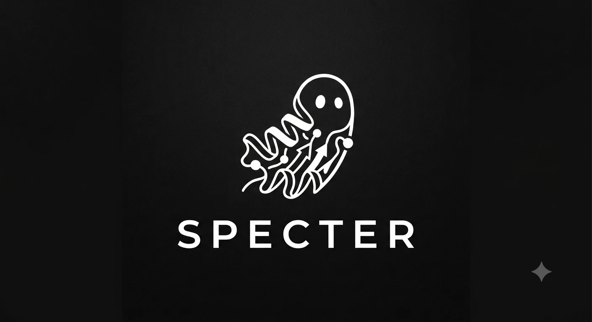

<p align="center">
  
</p>

# SPECTER
### Scattering & Propagation of Electrons in Cryo-EM: Twin Emulator & Reconstruction

[](https://joelyeois.github.io/specter/)

**SPECTER** is a Python package for simulating cryo-electron microscopy (cryo-EM) images with physics-based models.  
It supports aberrations, scattering, detector effects, and integrates with PyTorch for GPU acceleration.

> **Early development notice**  
> SPECTER is under active development. APIs and behaviour may change without notice between releases — including breaking changes. It is not yet recommended for production workflows. Feedback and bug reports are welcome via [GitHub Issues](https://github.com/joelyeois/specter/issues).

---

## Installation and running the notebooks
Clone the repository:
```bash
git clone https://github.com/joelyeois/specter.git
cd specter
```
You must install dependencies **and** the `specter` package itself.

### Option 1. Using [uv](https://github.com/astral-sh/uv) (recommended)
This will create a virtual environment and install all dependencies listed in `pyproject.toml.`
```bash
uv sync
```
Activate the environment with:
```bash
source .venv/bin/activate
```
Install `specter`:
```bash
uv pip install -e .
```
Run the notebooks:
```bash
uv run --with jupyter jupyter lab
```

### Option 2. Conda and pip
Create an environment and install the dependencies.
```bash
conda create -n specter python=3.11
conda activate specter
pip install -r requirements.txt
```
Install `specter`:
```bash
pip install -e .
```
Run the notebooks (you must install jupyter yourself):
```bash
jupyter lab
```

---

## Demo scripts

Ready-to-run CLI scripts are in `demo-scripts/`. Activate the environment first (`source .venv/bin/activate`), or you may also run the scripts via `uv run <script name>.py`.

### `generate_particle_stack.py`

Simulate a particle stack with randomly sampled poses and CTF parameters. Defocus, dose, and coincidence radius are each independently randomisable per particle by specifying a `_min`/`_max` range. Omitting `_max` (or setting it equal to `_min`) uses a fixed value for all particles.

Parameters are loaded from a TOML config file (`configs/particle.toml` by default); any flag below overrides a single field without editing the file.

```bash
python demo-scripts/generate_particle_stack.py \
    --config configs/particle.toml \
    --pdb_code 6bdf \
    --n_particles 1000 \
    --num_pixels 256 \
    --pixel_size 1.056 \
    --energy 300 \
    --dose_min 40 \
    --dose_max 60 \
    --defocus_min 5000 \
    --defocus_max 15000 \
    --cs 2.7 \
    --alpha 0.07 \
    --noise_model poisson \
    --coincidence_radius_min 1.5 \
    --coincidence_radius_max 2.5 \
    --ice_model gd \
    --normalize_particles True \
    --device cuda:0 \
    --batchsize 5 \
    --output_dir ./output/ \
    --filename my_stack
```

| Argument | Default | Description |
|---|---|---|
| `--pdb_code` | *(required)* | PDB accession code or path to local `.cif`/`.pdb` file |
| `--assembly` | `True` | Fetch biological assembly |
| `--pdb_savefolder` | `../pdb-data/` | Folder to cache downloaded PDB files |
| `--n_particles` | `20` | Number of particles to simulate |
| `--num_pixels` | `256` | Box size in pixels |
| `--pixel_size` | `1.0` | Pixel size in Å |
| `--energy` | `300.0` | Beam energy in keV |
| `--dose_min` | `20.0` | Minimum dose in e⁻/Ų; used as fixed dose if `--dose_max` is not set |
| `--dose_max` | `None` | Maximum dose in e⁻/Ų; if set, dose is sampled uniformly per particle |
| `--num_frames` | `int(mean dose)` | Number of frames |
| `--cs` | `2.0` | Spherical aberration in mm |
| `--alpha` | `0.1` | Amplitude contrast ratio |
| `--convergence_angle` | `None` | Beam convergence semi-angle in mrad; enables the Cs (spatial coherence) envelope |
| `--cc` | `None` | Chromatic aberration coefficient in mm; enables the Cc (temporal coherence) envelope |
| `--energy_spread` | `0.7` | FWHM of beam energy spread in eV, used by the Cc envelope |
| `--deltaV_V` | `0.06e-6` | Relative high-voltage instability, used by the Cc envelope |
| `--deltaI_I` | `0.01e-6` | Relative objective-lens current instability, used by the Cc envelope |
| `--dose_envelope` | `False` | Apply the Grant & Grigorieff (2015) cumulative-dose envelope |
| `--defocus_min` | `5000` | Minimum defocus in Å; used as fixed value if `--defocus_max` is not set |
| `--defocus_max` | `15000` | Maximum defocus in Å; if set, defocus is sampled uniformly per particle |
| `--shift` | `2.0` | Max in-plane shift in Å (uniform ±shift) |
| `--scattering_model` | `multislice` | `multislice` \| `firstborn` \| `projection` \| `ctf` |
| `--aberration_model` | `holography` | `holography` \| `ctf` |
| `--noise_model` | `poisson` | `poisson` \| `none` |
| `--coincidence_radius_min` | `1.8` | Minimum coincidence radius in pixels; used as fixed value if `--coincidence_radius_max` is not set |
| `--coincidence_radius_max` | `None` | Maximum coincidence radius in pixels; if set, sampled uniformly per particle |
| `--potential_scale_min` | `1.0` | Minimum potential scale factor; used as fixed value if `--potential_scale_max` is not set |
| `--potential_scale_max` | `None` | Maximum potential scale factor; if set, sampled uniformly per particle. Values < 1 approximate thicker ice (weaker particle signal) |
| `--ice_model` | `gd` | `gd` (samples from the pre-generated `IceBank` cache) \| `random` (instant, cheap `RandomIcemaker` placement) \| `none` |
| `--ice_cache_dir` | `None` | Directory of cached ice configs for `ice_model='gd'`. Defaults to the bundled `ice-data/ice_cache` |
| `--ice_thickness` | `0.0` | Ice thickness in Å; `0` = minimum (particle box size) |
| `--crowd_min_distance` | `pdb.max_diameter` | Min distance between crowded molecules in Å; `0` disables crowding |
| `--crowd_max_distance_z` | `None` | Max z-separation between crowded molecules in Å |
| `--pad_fft` | `True` | Pad volume to avoid FFT edge artefacts |
| `--detector_model` | `none` | `none` \| `perfect` \| `k3_300kv` \| `k3_200kv` |
| `--normalize_particles` | `True` | Normalise to zero mean and unit std |
| `--save_exitwaves` | `False` | Also save exit wave magnitude and phase as `.mrcs` |
| `--save_clean_exitwaves` | `False` | Save clean (no-ice) exit wave magnitude and phase; runs scattering twice per batch |
| `--device` | `cpu` | `cpu` \| `cuda` \| `cuda:0` \| `0,1,2,3` (multi-GPU) |
| `--batchsize` | `5` | Particles per forward pass |
| `--output_dir` | `./output/` | Output directory |
| `--filename` | `particles` | Base name for output files (no extension) |

---

### `generate_particle_stack_from_csfile.py`

Simulate a particle stack using poses and CTF parameters from a CryoSPARC `.cs` file. Energy, pixel size, and amplitude contrast are read directly from the file — no need to specify them manually.

```bash
python demo-scripts/generate_particle_stack_from_csfile.py \
    --cs_path /path/to/particles.cs \
    --pdb_code 6bdf \
    --n_particles 1000 \
    --num_pixels 256 \
    --dose 53 \
    --noise_model poisson \
    --coincidence_radius 2.1 \
    --ice_model gd \
    --normalize_particles True \
    --device 0,1,2,3 \
    --batchsize 5 \
    --output_dir ./output/ \
    --filename my_stack_from_cs
```

| Argument | Default | Description |
|---|---|---|
| `--cs_path` | *(required)* | Path to CryoSPARC `.cs` file |
| `--pdb_code` | *(required)* | PDB accession code or path to local `.cif`/`.pdb` file |
| `--assembly` | `True` | Fetch biological assembly |
| `--pdb_savefolder` | `../pdb-data/` | Folder to cache downloaded PDB files |
| `--dose` | *(required)* | Fixed electron dose in e⁻/Ų applied to all particles (check the EMDB Experiment tab) |
| `--n_particles` | all in file | Number of particles to simulate |
| `--num_pixels` | `256` | Box size in pixels |
| `--num_frames` | `int(dose)` | Number of frames |
| `--scattering_model` | `multislice` | `multislice` \| `firstborn` \| `projection` \| `ctf` |
| `--aberration_model` | `holography` | `holography` \| `ctf` |
| `--noise_model` | `poisson` | `poisson` \| `none` |
| `--convergence_angle` | `None` | Beam convergence semi-angle in mrad; enables the Cs (spatial coherence) envelope |
| `--cc` | `None` | Chromatic aberration coefficient in mm; enables the Cc (temporal coherence) envelope |
| `--energy_spread` | `0.7` | FWHM of beam energy spread in eV, used by the Cc envelope |
| `--deltaV_V` | `0.06e-6` | Relative high-voltage instability, used by the Cc envelope |
| `--deltaI_I` | `0.01e-6` | Relative objective-lens current instability, used by the Cc envelope |
| `--dose_envelope` | `False` | Apply the Grant & Grigorieff (2015) cumulative-dose envelope |
| `--coincidence_radius` | `2.1` | Fixed coincidence radius in pixels applied to all particles; `0` for standard Poisson |
| `--ice_model` | `gd` | `gd` (samples from the pre-generated `IceBank` cache) \| `random` (instant, cheap `RandomIcemaker` placement) \| `none` |
| `--ice_cache_dir` | `None` | Directory of cached ice configs for `ice_model='gd'`. Defaults to the bundled `ice-data/ice_cache` |
| `--ice_thickness` | `0.0` | Ice thickness in Å; `0` = minimum (particle box size) |
| `--crowd_min_distance` | `pdb.max_diameter` | Min distance between crowded molecules in Å; `0` disables crowding |
| `--crowd_max_distance_z` | `None` | Max z-separation between crowded molecules in Å |
| `--pad_fft` | `True` | Pad volume to avoid FFT edge artefacts |
| `--detector_model` | `none` | `none` \| `perfect` \| `k3_300kv` \| `k3_200kv` |
| `--normalize_particles` | `True` | Normalise to zero mean and unit std |
| `--save_exitwaves` | `False` | Also save exit wave magnitude and phase as `.mrcs` |
| `--save_clean_exitwaves` | `False` | Save clean (no-ice) exit wave magnitude and phase; runs scattering twice per batch |
| `--device` | `cpu` | `cpu` \| `cuda` \| `cuda:0` \| `0,1,2,3` (multi-GPU) |
| `--batchsize` | `5` | Particles per forward pass |
| `--output_dir` | `./output/` | Output directory |
| `--filename` | `particles` | Base name for output files (no extension) |

---

### Output files (particle stack scripts)

| File | Description |
|---|---|
| `<filename>.mrcs` | Particle image stack |
| `<filename>.star` | RELION-compatible metadata (poses, CTF, pixel size, voltage) with per-particle `specterDosePerAngstrom`, `specterCoincidenceRadius`, and `specterPotentialScale` columns |
| `<filename>_exitwave_magnitude.mrcs` | Exit wave magnitude (`--save_exitwaves True` only) |
| `<filename>_exitwave_phase.mrcs` | Exit wave phase (`--save_exitwaves True` only) |
| `<filename>_clean_exitwave_magnitude.mrcs` | Clean exit wave magnitude (`--save_clean_exitwaves True` only) |
| `<filename>_clean_exitwave_phase.mrcs` | Clean exit wave phase (`--save_clean_exitwaves True` only) |

### Multi-GPU (particle stack scripts only)

Pass a comma-separated list of GPU IDs to `--device` to use Lightning DDP:

```bash
--device 0,1,2,3   # multi-GPU
--device cuda:0    # single GPU
--device cpu       # CPU
```

---

### `generate_micrograph.py`

Simulate full-size cryo-EM micrographs. The particle volume, ice, and crowding are assembled once at initialisation; each forward pass applies a different randomly drawn defocus.

```bash
python demo-scripts/generate_micrograph.py \
    --pdb_code 6bdf \
    --n_micrographs 10 \
    --num_pixels 256 \
    --pixel_size 1.056 \
    --micrograph_size 4096 \
    --energy 300 \
    --dose_min 53 \
    --defocus_min 5000 \
    --defocus_max 15000 \
    --cs 2.7 \
    --alpha 0.07 \
    --scattering_model multislice \
    --aberration_model holography \
    --noise_model poisson \
    --coincidence_radius_min 2.1 \
    --ice_model gd \
    --ice_thickness 500 \
    --chunk_size 8 \
    --device cuda:0 \
    --output_dir ./output/ \
    --filename micrographs
```

| Argument | Default | Description |
|---|---|---|
| `--pdb_code` | *(required)* | PDB accession code or path to local `.cif`/`.pdb` file |
| `--assembly` | `True` | Fetch biological assembly |
| `--pdb_savefolder` | `../pdb-data/` | Folder to cache downloaded PDB files |
| `--n_micrographs` | `1` | Number of micrographs to simulate |
| `--num_pixels` | `256` | Particle box size in pixels (for potential building) |
| `--pixel_size` | `1.0` | Pixel size in Å |
| `--micrograph_size` | `4096` | Micrograph size in pixels (square) |
| `--energy` | `300.0` | Beam energy in keV |
| `--dose_min` | `20.0` | Minimum dose in e⁻/Ų; used as fixed dose if `--dose_max` is not set |
| `--dose_max` | `None` | Maximum dose in e⁻/Ų; if set, dose is sampled uniformly per micrograph |
| `--num_frames` | `int(mean dose)` | Number of frames |
| `--cs` | `2.0` | Spherical aberration in mm |
| `--alpha` | `0.1` | Amplitude contrast ratio |
| `--convergence_angle` | `None` | Beam convergence semi-angle in mrad; enables the Cs (spatial coherence) envelope |
| `--cc` | `None` | Chromatic aberration coefficient in mm; enables the Cc (temporal coherence) envelope |
| `--energy_spread` | `0.7` | FWHM of beam energy spread in eV, used by the Cc envelope |
| `--deltaV_V` | `0.06e-6` | Relative high-voltage instability, used by the Cc envelope |
| `--deltaI_I` | `0.01e-6` | Relative objective-lens current instability, used by the Cc envelope |
| `--dose_envelope` | `False` | Apply the Grant & Grigorieff (2015) cumulative-dose envelope |
| `--defocus_min/max` | `5000/15000` | Defocus range in Å |
| `--scattering_model` | `multislice` | `multislice` \| `firstborn` \| `projection` \| `ctf` |
| `--aberration_model` | `holography` | `holography` \| `ctf` |
| `--noise_model` | `poisson` | `poisson` \| `none` |
| `--coincidence_radius_min` | `1.8` | Minimum coincidence radius in pixels; used as fixed value if `--coincidence_radius_max` is not set |
| `--coincidence_radius_max` | `None` | Maximum coincidence radius in pixels; if set, sampled uniformly per micrograph |
| `--potential_scale_min` | `1.0` | Minimum potential scale factor; used as fixed value if `--potential_scale_max` is not set |
| `--potential_scale_max` | `None` | Maximum potential scale factor; if set, sampled uniformly per micrograph. Values < 1 approximate thicker ice |
| `--ice_model` | `gd` | `gd` (samples from the pre-generated `IceBank` cache) \| `random` (instant, cheap `RandomIcemaker` placement) \| `none` |
| `--ice_cache_dir` | `None` | Directory of cached ice configs for `ice_model='gd'`. Defaults to the bundled `ice-data/ice_cache` |
| `--ice_thickness` | `500.0` | Ice thickness in Å |
| `--crowd_min_distance` | `pdb.max_diameter` | Min distance between crowded molecules in Å; `0` disables crowding |
| `--crowd_max_distance_z` | `None` | Max z-separation between crowded molecules in Å |
| `--water_air_interface` | `True` | Simulate water-air interface |
| `--pad_fft` | `False` | Pad volume to avoid FFT edge artefacts |
| `--chunk_size` | `None` | Slice chunk size for specimen generation; set (e.g. `8`) if GPU memory is limited |
| `--detector_model` | `none` | `none` \| `perfect` \| `k3_300kv` \| `k3_200kv` |
| `--normalize_micrographs` | `False` | Normalise each micrograph to zero mean and unit std |
| `--save_exitwaves` | `False` | Save icy exit wave magnitude and phase as `.mrcs` |
| `--save_clean_exitwaves` | `False` | Save iceless (no-ice) exit wave magnitude and phase; runs scattering twice per micrograph |
| `--device` | `cpu` | `cpu` \| `cuda` \| `cuda:0` |
| `--output_dir` | `./output/` | Output directory |
| `--filename` | `micrographs` | Base name for output files (no extension) |

### Output files (micrograph script)

| File | Description |
|---|---|
| `<filename>.mrcs` | Micrograph stack |
| `<filename>.star` | Per-micrograph metadata (defocus, voltage, pixel size, amplitude contrast) with `specterDosePerAngstrom`, `specterCoincidenceRadius`, and `specterPotentialScale` columns |
| `<filename>_exitwave_magnitude.mrcs` | Icy exit wave magnitude (`--save_exitwaves True` only) |
| `<filename>_exitwave_phase.mrcs` | Icy exit wave phase (`--save_exitwaves True` only) |
| `<filename>_clean_exitwave_magnitude.mrcs` | Iceless exit wave magnitude (`--save_clean_exitwaves True` only) |
| `<filename>_clean_exitwave_phase.mrcs` | Iceless exit wave phase (`--save_clean_exitwaves True` only) |

---

### `generate_tilt_series.py`

Simulate a cryo-ET tilt series from a pre-built tomogram volume (e.g. from Polnet or `TomogramGenerator`). Ice is generated via `IceBank` (drawn from the bundled pre-optimised cache) or `RandomIcemaker`, and blended in before simulation.

```bash
python demo-scripts/generate_tilt_series.py \
    --mrc_path /path/to/tomo.mrc \
    --voxel_size 3.0 \
    --micrograph_size 2100 \
    --energy 300 \
    --dose_per_tilt 3.0 \
    --min_tilt_angle -45 \
    --max_tilt_angle 45 \
    --n_tilts 61 \
    --defocus 22000 \
    --cs 2.7 \
    --alpha 0.1 \
    --tilt_axis y \
    --scattering_model multislice \
    --noise_model poisson \
    --coincidence_radius 1.5 \
    --num_frames 10 \
    --add_ice True \
    --ice_method gd \
    --tomo_to_ice_ratio 0.75 \
    --save_exitwaves True \
    --device cuda:0 \
    --output_dir ./output/ \
    --filename tilt_series
```

| Argument | Default | Description |
|---|---|---|
| `--mrc_path` | *(required)* | Path to input MRC volume (Z, Y, X) |
| `--voxel_size` | `3.0` | Voxel size in Å |
| `--micrograph_size` | volume XY size | Output image size in pixels (square) |
| `--energy` | `300.0` | Beam energy in keV |
| `--dose_per_tilt` | `3.0` | Dose per tilt angle in e⁻/Ų |
| `--num_frames` | `10` | Number of movie frames per tilt |
| `--cs` | `2.0` | Spherical aberration in mm |
| `--alpha` | `0.1` | Amplitude contrast ratio |
| `--convergence_angle` | `None` | Beam convergence semi-angle in mrad; enables the Cs (spatial coherence) envelope |
| `--cc` | `None` | Chromatic aberration coefficient in mm; enables the Cc (temporal coherence) envelope |
| `--energy_spread` | `0.7` | FWHM of beam energy spread in eV, used by the Cc envelope |
| `--deltaV_V` | `0.06e-6` | Relative high-voltage instability, used by the Cc envelope |
| `--deltaI_I` | `0.01e-6` | Relative objective-lens current instability, used by the Cc envelope |
| `--dose_envelope` | `False` | Apply the Grant & Grigorieff (2015) cumulative-dose envelope |
| `--defocus` | `22000.0` | Defocus in Å (positive = underfocus) |
| `--min_tilt_angle` | `-45.0` | Minimum tilt angle in degrees |
| `--max_tilt_angle` | `45.0` | Maximum tilt angle in degrees |
| `--n_tilts` | `61` | Number of tilt angles (evenly spaced) |
| `--tilt_axis` | `y` | `x` \| `y` |
| `--scattering_model` | `multislice` | `multislice` \| `firstborn` \| `projection` \| `ctf` |
| `--noise_model` | `poisson` | `poisson` \| `none` |
| `--coincidence_radius` | `1.5` | Coincidence radius in Å for direct-detector modelling |
| `--add_ice` | `True` | Generate and blend amorphous ice |
| `--ice_method` | `gd` | `gd` (samples from the pre-generated `IceBank` cache) \| `random` (instant, cheap `RandomIcemaker` placement) |
| `--ice_cache_dir` | `None` | Directory of cached ice configs for `ice_method='gd'`. Defaults to the bundled `ice-data/ice_cache` |
| `--tomo_to_ice_ratio` | `0.75` | Scale factor for tomogram intensity relative to ice |
| `--normalize` | `False` | Normalise each tilt image to zero mean and unit std |
| `--save_exitwaves` | `False` | Save exit wave magnitude and phase as `.mrcs` |
| `--device` | `cuda` | `cpu` \| `cuda` \| `cuda:0` |
| `--output_dir` | `./output/` | Output directory |
| `--filename` | `tilt_series` | Base name for output files (no extension) |

### Output files (tilt series script)

| File | Description |
|---|---|
| `<filename>.mrcs` | Tilt series stack `(n_tilts, H, W)` |
| `<filename>_exitwave_magnitude.mrcs` | Icy exit wave magnitude per tilt (`--save_exitwaves True`, `--add_ice True`) |
| `<filename>_exitwave_phase.mrcs` | Icy exit wave phase per tilt (`--save_exitwaves True`, `--add_ice True`) |
| `<filename>_clean_exitwave_magnitude.mrcs` | Iceless exit wave magnitude per tilt (`--save_exitwaves True`, `--add_ice False`) |
| `<filename>_clean_exitwave_phase.mrcs` | Iceless exit wave phase per tilt (`--save_exitwaves True`, `--add_ice False`) |

