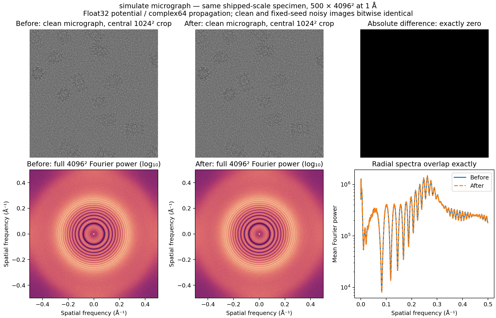
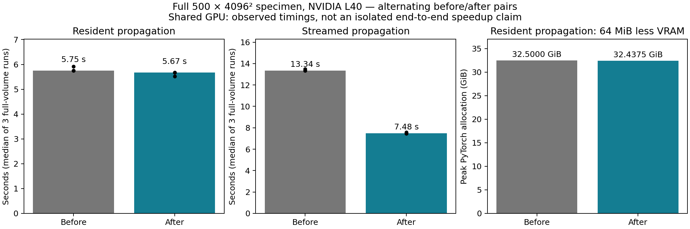

# Micrograph identity-slice views

`simulate micrograph` now reads each unrotated plane as a view instead of
advanced-indexing it into a new tensor. On-device propagation avoids a
64 MiB GPU allocation/copy per 4096² float32 plane. Host-streamed propagation
avoids the 64 MiB CPU indexing copy before transferring the plane. The device
transfer still occurs when required. Slice order, padding, potential values,
float32/complex64 arithmetic, propagation steps, detector and noise are unchanged.
Rotated interpolation and gradient-checkpointed chunk fetching are unchanged.
The shared propagator also benefits unrotated calls from other generators.

## Production scale

Both complete CLI runs used every setting in `configs/micrograph.toml`, with
only seed 93, device and output directory specified: 6BDF biological assembly,
256³ template, **500 × 4096 × 4096** specimen at **1 Å**, GD ice, Poisson-disk
crowding and water-air-interface bias, 300 kV, dose 20, 500 multislice steps,
alpha 0.1, Poisson noise, detector `none`, no FFT padding. No smaller canvas,
thinner ice, disabled ice/crowding or reduced slice count was used.
The specimen is 31.25 GiB. Both automatic placements selected the GPU.

Measurements used NVIDIA L40 (46,068 MiB), PyTorch 2.5.1+cu121, four CPU
threads. Other jobs used the GPUs throughout the measurement session. These
are **observed shared-GPU timings**, not isolated-device performance guarantees.

## Before and after

Three alternating before/after pairs reused the **identical fully assembled
shipped-scale specimen**. The middle pair ran after/before. FFT plans were
warmed at 4096². Timing synchronizes CUDA at both boundaries. Peak memory is
PyTorch allocated memory, not total driver usage including unrelated processes.

| Same-specimen propagation | Before | After | Change |
|---|---:|---:|---|
| GPU-resident, median | 5.752 s | 5.675 s | Essentially unchanged; ~1.3% observed reduction is too small to claim a dependable speedup under contention |
| GPU-resident peak allocation | 32.5000 GiB | 32.4375 GiB | **64 MiB less**, 0.19% |
| Host-streamed, median | 13.344 s | 7.480 s | **1.78× observed speedup**, 44% less propagation time |
| Host-streamed peak allocation | 1.2500 GiB | 1.2500 GiB | No GPU-memory change |

Host-streamed before runs: 13.339, 13.500, 13.344 s. After: 7.480, 7.445,
7.572 s. All three pairs showed the large transfer-path benefit. Streaming
is an existing fallback; these stage tests explicitly kept the same specimen
on CPU to exercise it. The shipped CLI selected resident propagation on the
available L40; it does not receive the streaming speedup in that case.
No pinned-memory slabs or extra staging buffers were added.

| Complete CLI with newly generated ice/crowding | Before | After |
|---|---:|---:|
| Total, excluding baseline specimen capture | 146.984 s | 141.633 s |
| Specimen assembly | 130.147 s | 125.060 s |
| Volume upload | 6.029 s | 7.294 s |
| Propagation | 6.778 s | 5.740 s |
| Detector | 0.136 s | 0.022 s |
| Peak GPU allocation | 33.0425 GiB | 32.9800 GiB |

These are single complete runs on a shared GPU. Most of the elapsed time is
assembly, which this change does not alter. **Do not attribute the total-time
difference to this optimization.** The baseline additionally saved the 31.25 GiB
specimen for replay; its 50.446 s capture is explicitly excluded. Both runs
also retained CPU copies of waves/intensity for comparison.

## Precision and figures

All six pairs (three resident, three streamed) have **bitwise-identical complex
exit waves** across all 16,777,216 pixels: maximum absolute error and relative
L2 error are zero. This checks the entire 500-step recursion, not just a crop.
Full CLI replay on the retained specimen uses the same configuration and detector
seed 193: **clean and Poisson-noisy micrographs are bitwise identical**. Full-field
Fourier power spectra and radial spectra are identical. There is no measured
precision loss and no physics approximation. Freshly assembled CLI runs are
completion checks; exact scientific comparison uses a shared specimen to avoid
confounding it with atomic GPU accumulation or stochastic specimen generation.





PNG and PDF versions are available beside this report. `pairs.json` records
individual timings, allocation peaks and precision; `cli_before.json` and
`cli_after.json` record complete runs; `precision.json` records image comparison.

## Validation and reproduction

Focused CPU scattering, forward-model, exposure and absorption checks:
101 passed, 3 GPU-dependent skips. Real GPU scattering suite plus original
view checks: 66 passed. Expanded CPU/GPU view, reversed-order, padded-crop,
gradient and absorption checks: 22 passed. Ruff lint/format and source type
checking pass. The new view checks verify equality with indexed fetching and
storage sharing only where no padding/device transfer is needed.

The reproducer scripts live in `docs-figures/`. Example (substitute checkout
paths, an available GPU, and a scratch directory with at least 32 GiB free):

```sh
uv run python docs-figures/micrograph_slice_views_benchmark.py \
  --checkout /path/to/baseline --output /scratch/validation/baseline \
  --device cuda:0 --capture-volume
uv run python docs-figures/micrograph_slice_views_benchmark.py \
  --checkout /path/to/candidate --output /scratch/validation/candidate \
  --device cuda:0
uv run python docs-figures/micrograph_slice_views_pairs.py \
  --checkout /path/to/candidate --baseline /path/to/baseline \
  --volume /scratch/validation/baseline/volume.pt \
  --output /scratch/validation/pairs --device cuda:0
```

For image figures run the CLI benchmark once per checkout with `--replay-from
/scratch/validation/baseline`, writing `replay_before` and `replay_after`, then
run `micrograph_slice_views_figures.py --data /scratch/validation --output
/scratch/figures`. Baseline is commit `5e8d39c`; source in the candidate is the
view-based version. Run from the repository's environment. The benchmark imports
the checkout's source explicitly. Raw 32 GiB specimen and image stacks are kept
in scratch, not committed.
