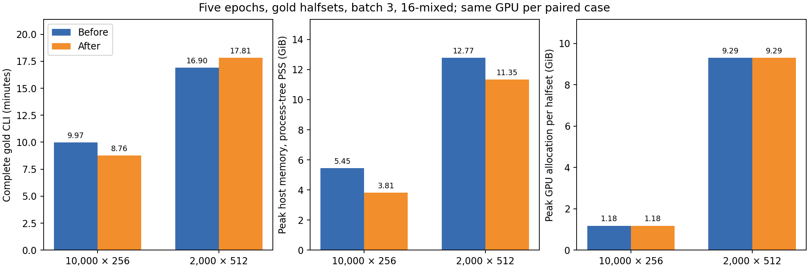
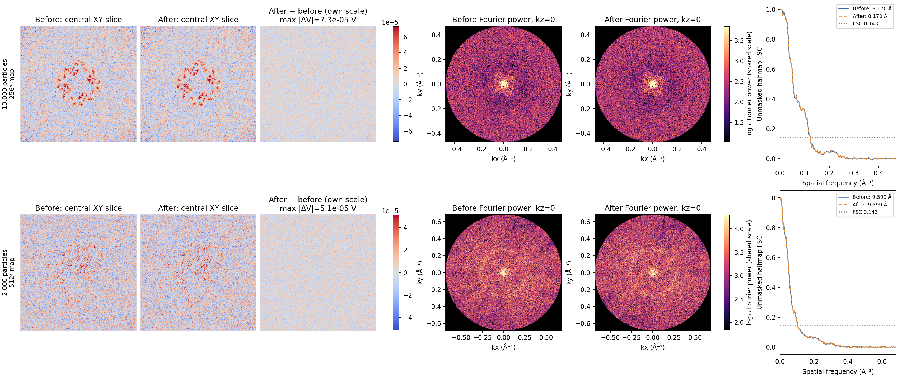

# Bound particle reconstruction input memory

`reconstruct particle` (also exposed as `ghostbuster particle`) converts
normalized particle images into counts in blocks of 64, reusing its privately
owned image stack. Its row-ordered loader no longer copies the result of NumPy
integer-list indexing a second time: that indexing already owns writable
storage independent of the source mmap. Integer and counts inputs preserve
their existing conversion path. The shared conversion helper and tomogram
reconstruction are unchanged.

The CLI and shipped `configs/reconstruct.toml` now default to zero DataLoader
workers. Images are already resident in RAM; eight workers add process startup
and batch transfers without doing image I/O or transforms. Explicit worker
counts still work. The Python API already defaulted to zero workers.

No changes were made to the optimizer, loss, forward model, batch size, image
resolution, volume resolution, dtypes or mixed-precision setting.

## Production comparison

Baseline: commit `88152c3`. Both versions ran the actual CLI with the shipped
TOML: five complete epochs, sequential gold halfsets, batch size 3, 16-mixed,
LambdaLR, C1, real-space rotations, Rytov scattering, negative Ewald curvature
and no 2-D mask. Only dataset paths, real fluence, device and output directory
were supplied. No test-run binning, shorter epochs or duplicated particles
were used. Each halfset used seed 123 or 124 and four CPU threads.

* EMPIAR-10254: 10,000 distinct real 256-pixel particles from 900 source stacks,
  1.059 Å/pixel, dose 64 e/Ų. This matches the shipped 10,000-particle example.
  J9 ab-initio metadata originally assigns every particle to split 0. A frozen
  balanced random split, seed 10254, enables the implementation comparison.
  Its halfmap FSC measures agreement between implementations and does not
  independently certify the upstream poses. The same frozen, full-image
  normalized stack was supplied to both versions.
* EMPIAR-11377: 2,000 distinct real ribosome images in the existing 512-pixel
  model-frame export, 0.731 Å/pixel, dose 40 e/Ų, original gold splits
  (1,005/995). The existing export was cropped from a 560-pixel stack before
  this work. Both versions use that identical export without further cropping
  or binning. Its aligned 8b0x reference is evaluated after reconstruction,
  outside the timed CLI.

Hardware: NVIDIA L40, PyTorch 2.5.1+cu121. Each paired comparison uses the same
GPU: GPU 1 for 256 pixels and GPU 3 for 512 pixels. These are one complete
before/after pair per box, not a repeated throughput estimate. Other machine
jobs continued independently. A duplicate 256-pixel candidate encountered
another job on its GPU and was stopped; its timings are excluded.

## Before and after

| Complete gold CLI | Before | After | Observed change |
|---|---:|---:|---|
| 10,000 × 256: elapsed | 598.426 s | 525.308 s | **1.139×; 12.2% less time** |
| 10,000 × 256: peak host PSS | 5.450 GiB | 3.812 GiB | **1.638 GiB less; 30.1%** |
| 10,000 × 256: GPU allocation | 1.184 GiB | 1.184 GiB | Unchanged |
| 2,000 × 512: elapsed | 1013.727 s | 1068.439 s | **5.4% longer in this pair** |
| 2,000 × 512: peak host PSS | 12.774 GiB | 11.346 GiB | **1.427 GiB less; 11.2%** |
| 2,000 × 512: GPU allocation | 9.294 GiB | 9.294 GiB | Unchanged |

The complete 512-pixel pair does not establish a speedup. GPU batch event
medians were 200.47 versus 214.07 ms; candidate half A's first three epochs
had mean events around 271–274 ms, settling to 202 ms in its last epoch.
Half B's candidate and baseline means were both around 202 ms. Thus its
full-run timing contains compute variation despite unchanged GPU code.
The observed 5.4% slowdown is retained in the table and figure.

A controlled loader-only training comparison then alternated **0, 8, 8, 0**
workers on the same full 512³ model, 1,005 real half-A images, batch 3,
16-mixed and shipped optimizer/physics settings. Each run made 300 updates;
20 warm-up batches were excluded. The remaining 280 batches averaged
**217.27 / 219.87 / 219.92 / 218.38 ms** wall time, with median GPU events
**199.69 / 200.39 / 200.34 / 200.76 ms**. GPU allocation was identical.
These alternating runs do not reproduce a sustained loader regression;
zero workers were about 0.7–1.2% quicker in this diagnostic. It excludes
worker startup, epoch maps, disk output and FSC, so it does not replace the
complete CLI timings or establish an end-to-end 512-pixel speedup.
`loader-512.json` contains all four results.

GPU reservation is unchanged at 1.346/9.764 GiB for 256/512. Sampled driver
memory is unchanged at 1.854/10.271 GiB. This change saves host memory, not
GPU memory. The all-particles loading probes reduce peak RSS from
**10.431 to 5.547 GiB (46.8%)** for 10,000 × 256 and
**8.473 to 4.567 GiB (46.1%)** for 2,000 × 512. The gold runs load one half
at a time; their worker loading peaks fall from 5.550 to 3.259 GiB and from
4.587 to 2.685 GiB respectively. Later map/plot/FSC stages can dominate
whole-command host memory, especially for 512³ volumes.



## Precision and scientific output

All **1,179,648,000 preprocessed pixels**, poses, translations, CTF parameters,
scales and anisomagnification values hash identically across the two versions.
Data remain float32; training retains the shipped 16-mixed setting. The loader
regression preserves five epochs of shuffled indices and the next parent RNG
values. No numerical approximation was introduced.

Full-volume halfmap comparisons at 256³ give relative L2 differences
**1.3704e-5 / 1.3693e-5** (A/B) and maximum differences
**1.0920e-4 / 1.1748e-4 V**. Repeating the unchanged GPU physics yields
**1.3703e-5 / 1.3700e-5**, with maxima **1.0633e-4 / 1.1301e-4 V**.
At 512³ the before/after relative L2 differences are
**7.0021e-6 / 6.9788e-6**, with maxima **8.8215e-5 / 7.2479e-5 V**.
The 512-pixel unchanged-physics repeat gives **7.0020e-6 / 6.9786e-6**,
with maxima **7.5459e-5 / 7.5817e-5 V**; its initial run included extra
reference reporting, which does not enter training. The maps are not bitwise
identical between independent GPU runs. Conversion is bitwise identical,
and both box sizes' map differences match unchanged-physics repeat spread.

Halfmap FSC 0.143 resolution is **8.170 Å before and after** at 256 pixels and
**9.599 Å before and after** at 512 pixels. The largest FSC differences through
Nyquist are **7.451e-7** and **5.662e-7**. Post-hoc 512-pixel map-to-reference
FSC 0.5 gives **36.944 Å before and after**. That low absolute reference
agreement is retained here: these runs validate equivalent implementations,
not high-resolution reconstruction quality or upstream pose/frame correctness.
The 256-pixel ab-initio split limitation described above also applies.



Real-space panels use central XY slices of the mean of both complete halfmaps.
Fourier panels use the mean-Z projection over the entire map, equivalent to
the kz=0 Fourier plane up to shared normalization, with DC removed only for
display. Before/after real-space panels and before/after logarithmic Fourier
power use shared limits. Spectral display limits are computed within the
Nyquist disk; unsampled corners are black. The difference panel uses its own
magnified scale, in volts. FSC uses the full 3-D halfmaps; resolution and delta
are restricted to Nyquist rather than the Fourier cube's aliased corner tail.


## Measurement boundaries

CLI elapsed time includes loading, gold-worker startup, all training epochs,
epoch maps/plots, final maps and halfmap FSC. Benchmark-module import/setup is
excluded in both versions, so these are not cold console startup measurements.
The benchmark adds callbacks and per-halfset seeding, without replacing the
CLI or its training implementation. It keeps Lightning/reconstruction imports
out of nested DataLoader spawn workers. An initial worker-instrumented baseline
was excluded from timing; its maps provide the unchanged-physics repeat control.
Worker-side transforms are absent; disabling Lightning's optional worker-seed
initializer preserves the same batches and parent RNG sequence, checked by a
five-epoch loader regression.

Host memory is process-tree PSS sampled every 0.5 seconds, counting shared
pages once. Individual-process loading RSS is also recorded. A separate
all-particles loading probe measures the larger `halfset=all` preprocessing
peak, without training. That peak is not the entire gold CLI memory saving.
PyTorch GPU allocation/reservation peaks are exact allocator counters; driver
memory is sampled for our worker PID every 0.3 seconds and can miss short peaks.
Median GPU batch event timings exclude the post-update Fourier mask; complete
CLI elapsed time includes it. The GPU compute work is unchanged.

## Validation and reproduction

Pipeline and CLI reconstruction tests: 60 passed. Config/default checks:
28 passed. Golden reconstruction, CTF backend and forward-model parity checks:
61 passed, 2 CUDA-dependent skips. Those two CUDA parameter-binding/gradient
checks subsequently passed on the L40. The new multiprocessing loader-order/RNG
regression passed separately. Tests cover float32, float16 and integer stacks,
all/A/B selection, the final partial preprocessing block, ownership after the
mmap closes and preservation of the source file. Ruff lint/format and mypy on
the two modified source modules pass. The complete GPU CLI runs above check
both gold halves at production dimensions.

Reproduction scripts live in `docs-figures/`. Source datasets are existing
local CryoSPARC data, not bundled fixtures; their paths can be overridden in
the preparation script. Raw particle stacks and reconstructed volumes are not
committed. Input hashes, measurements, figures and summary accompany this report.

```sh
uv run python docs-figures/reconstruction_input_memory_prepare.py \
  --output /scratch/reconstruction-validation/data
uv run python docs-figures/reconstruction_input_memory_benchmark.py \
  --checkout /path/to/baseline \
  --output /scratch/reconstruction-validation/before-256-123-clean \
  --cs-file /scratch/reconstruction-validation/data/empiar10254-10000.cs \
  --mrc-file /scratch/reconstruction-validation/data/empiar10254-10000.mrcs \
  --dose 64 --device cuda:0
uv run python docs-figures/reconstruction_input_memory_benchmark.py \
  --checkout /path/to/candidate \
  --output /scratch/reconstruction-validation/after-256-123 \
  --cs-file /scratch/reconstruction-validation/data/empiar10254-10000.cs \
  --mrc-file /scratch/reconstruction-validation/data/empiar10254-10000.mrcs \
  --dose 64 --device cuda:0
```

Repeat for the prepared `empiar11377-2000` pair, dose 40, with output names
`before-512-123-clean` and `after-512-123`. Use distinct output directories and
an idle GPU. Repeat pairs with alternating order to estimate throughput
variability on a different machine. Run `reconstruction_input_memory_loading.py`
for each checkout/data pair to reproduce the all-particles loading/hash JSONs
(`--checkout`, `--cs-file`, `--mrc-file`, `--dose`, and `--output
/scratch/reconstruction-validation/loading-before-256.json`, etc.). Use
`reconstruction_input_memory_compare.py BEFORE AFTER --output comparison.json`
for bounded full-voxel comparisons or the unchanged-physics repeat controls.
Then run `reconstruction_input_memory_figures.py --data
/scratch/reconstruction-validation --output /scratch/figures` to compare full
maps and recreate the figures. Use `--reference-512` to supply the aligned reference on another machine.

The controlled loader diagnostic can be reproduced with:

```sh
uv run python docs-figures/reconstruction_loader_probe.py \
  --config configs/reconstruct.toml \
  --cs-file /scratch/reconstruction-validation/data/empiar11377-2000.cs \
  --mrc-file /scratch/reconstruction-validation/data/empiar11377-2000.mrcs \
  --dose 40 --device 0 --output loader-512.json
```
