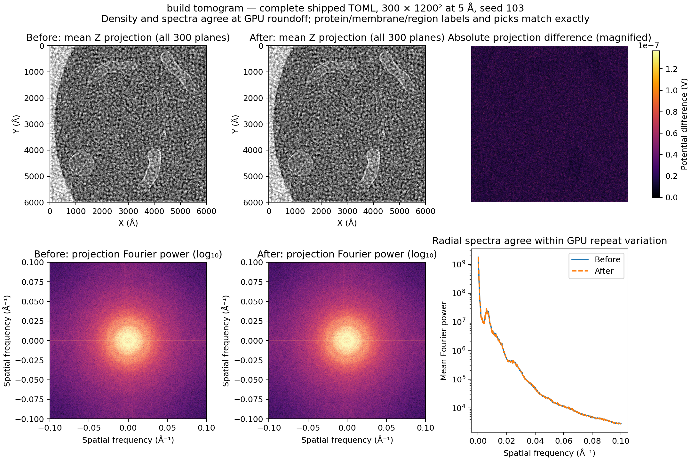
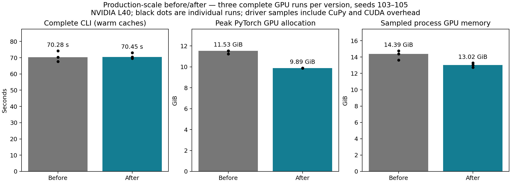

# Release completed tomogram geometry

`build tomogram` releases each membrane's dense field once its density and
transmembrane proteins have been generated. It also drops two local references
to density/label tensors before the next membrane is built. Previously those
references kept completed instances in GPU memory through later iterations.
A skipped membrane's field and unused density are released too.

The Python generator gains `retain_membrane_fields=True`, preserving its
existing field-inspection behavior by default. The CLI opts out. A subsequent
`generate()` rebuilds the fields normally. There is no change to numerical
operations, dtypes, resolution, placement, instance order, output files or RNG.

## Full production configuration

Every measured run used the complete `configs/tomogram.toml`, specifying only
GPU, output directory and seed: **300 × 1200 × 1200 at 5 Å**, all six target
species at 15 copies each, Pei2016 cytosol filler, lumen filler, three spherical
harmonic membranes, three swept-spline membranes, bacteriorhodopsin, 20 actin
filaments, five microtubules, carbon film, picks and segmentation.
`accumulator_device=auto` selected the GPU; `render_workers=auto` and chunk
size 64 were preserved. Every run placed all six membranes and all 90 targets.

The shipped generator already caps large membrane working grids and upsamples
their density; this comparison preserves those exact choices, including the
464³ working grids reported for the largest shapes. No additional coarsening,
lower precision or reduced scene complexity was introduced.

Hardware: NVIDIA L40, PyTorch 2.5.1+cu121, four CPU threads. GPU 3 was available
for the production runs; other host/GPU jobs continued independently. Three
complete runs per version used seeds 103, 104 and 105, alternating pair order
(before/after, after/before, before/after). All structure caches were warmed.
The first 86.17 s cache-priming baseline, with 16.75 s of structure loading,
is excluded from the timing summary. Counting that cache gain as a code
speedup would be misleading.

## Before and after

| Median over three full CLI runs | Before | After | Result |
|---|---:|---:|---|
| CLI invocation | 70.282 s | 70.447 s | Effectively unchanged; no dependable speedup |
| Peak PyTorch GPU allocation | 11.528 GiB | 9.887 GiB | **1.641 GiB less, 14.2%** |
| Sampled total process GPU memory | 14.393 GiB | 13.021 GiB | About **1.371 GiB less, 9.5%** |

Before times: 74.236, 67.604, 70.282 s. After: 70.447, 73.064, 69.497 s.
The direction varies between pairs; this is a memory improvement, not a
supported throughput improvement. PyTorch peak reductions were 1.641,
1.641 and 1.347 GiB across the three seeds (12.0–14.2%). Completed geometry
fields also no longer occupy roughly 1.12 GiB during packing/saving.

PyTorch counters measure allocation by its allocator. CuPy has a separate
pool, so the total-process figure comes from sampling this benchmark's PID
with `nvidia-smi` every ~0.3 s. It includes CUDA overhead and both allocator
pools, but can miss short-lived peaks. CuPy retained 1,361,280,512 bytes in
its pool at the end of each run; this was unchanged. Host RAM is not exchanged
for the saved fields: they are discarded rather than copied to CPU.

## Numerical and scientific checks

Every density and segmentation voxel was compared in all three seed pairs:
432 million voxels per volume. Density relative L2 differences were
**1.284e-7, 1.271e-7 and 1.283e-7**; maximum absolute differences were
9.537e-6, 9.537e-6 and 1.240e-5 V. Repeating the unchanged baseline gives
relative L2 differences of **1.274e-7 and 1.258e-7** and maximum differences
of 1.097e-5 and 1.144e-5 V. The independent-build density differences are
at the existing GPU accumulation roundoff scale; no numerical approximation
was added.

Membrane and region label volumes are bitwise identical in every seed.
All pick files, instance counts, positions and orientations are bitwise
identical. Protein labels have 0, 1 and 5 differing boundary voxels across
seeds 103–105, respectively, out of 432,000,000 voxels in each comparison.
The differing seed-104 voxel is `(z=256, y=1063, x=451)`, label 2560 versus
background. The unchanged-baseline seed-104 repeat keeps that label, so
it does **not** establish baseline label nondeterminism at this voxel.
Density roundoff can cross a binary footprint threshold even when placements
match; this inference is checked separately with common numeric inputs below.

The production comparison also captures baseline-rendered protein templates
and carbon density and reuses their exact numeric values in both versions
at seed 104. Both versions still generate membranes, pack the full scene,
rotate/insert all instances and write all outputs. This control removes the
atomic-accumulation variation in initial components; it is a correctness
check and its capture/replay times are excluded from performance results.
Its density, all three segmentation volumes, MRC statistics and all 28 pick
files are **bitwise identical**, with zero voxel differences and zero density
error. The change itself loses no precision on common inputs. Its full-volume
results are recorded in `frozen_precision_104.json`.



The Fourier comparison uses mean-Z projections over all 300 planes, not
a selected 2-D slice. The difference panel is magnified and uses volts;
the images and spectra use shared display limits. `projection_precision.json`
records projection and Fourier-power relative errors.
For seed 103 they are 1.619e-8 and 2.305e-9, respectively.



## Validation and reproduction

CPU tomogram generation, regions, parallel rendering and lifetime checks:
63 passed, 2 GPU-dependent skips. Pipeline membrane checks: 17 passed.
Final CPU/GPU field retention, regeneration, skipped-instance, transmembrane
and accumulator checks: 8 passed. Ruff lint/format and type checking of the
three modified source modules pass. Python callers retain fields by default;
the retention tests explicitly exercise that default.

`docs-figures/tomogram_memory_benchmark.py` runs the actual CLI and records
stage timing, instance counts, allocator peaks, driver samples and host RSS.
`tomogram_memory_compare.py` compares all voxels and pick bytes in bounded
slabs. `tomogram_memory_figures.py` reproduces the figures. Baseline source is
commit `fada257`; scratch MRC volumes are not committed.

```sh
uv run python docs-figures/tomogram_memory_benchmark.py \
  --checkout /path/to/baseline --output /scratch/validation/warm_before_103 \
  --device cuda:0 --seed 103
uv run python docs-figures/tomogram_memory_benchmark.py \
  --checkout /path/to/candidate --output /scratch/validation/warm_after_103 \
  --device cuda:0 --seed 103
uv run python docs-figures/tomogram_memory_compare.py \
  --before /scratch/validation/warm_before_103 \
  --after /scratch/validation/warm_after_103 \
  --output /scratch/validation/precision_103.json
```

Warm the cache first; repeat for seeds 104 and 105 with alternating order.
Use `--capture-components /scratch/components_104` on the baseline and
`--replay-components /scratch/components_104` on both versions to reproduce
the common-component control at seed 104. Use distinct output directories.
Then run the figure script with `--data /scratch/validation --output
/scratch/figures`. All figure and comparison JSON files accompany this report.
