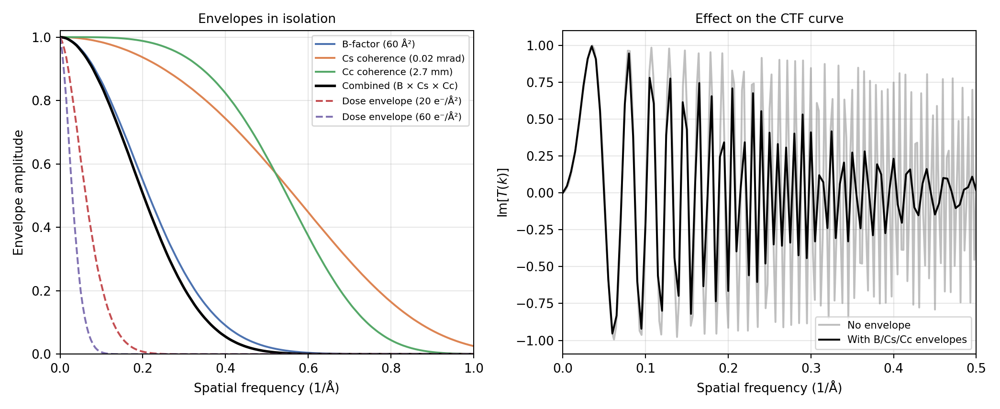

# Aberrations

The second stage of [forward simulation](forward-simulation.md) applies
the microscope's optical transfer function to the exit wave produced by
[scattering](scattering/index.md): defocus, spherical aberration,
astigmatism, higher-order aberration terms, and the envelope functions
that set a practical information limit. `Aberration` builds the total
wavefront aberration phase \(\chi(k)\) term by term from a per-image
`ctf_params` dict, following the conventions of Kirkland and Penczek.

!!! info "Source"
    `specter.aberrations._functions` (per-term \(\chi(k)\) contributions),
    `_aberration.Aberration` (composes them into a transfer function), and
    `_envelopes` (the multiplicative amplitude envelopes). The opt-in
    `torch_ctf` backend covered below lives in `specter.ctf`
    (`_legacy.LegacyAberrationAdapter`, `_parameters.CTFParameters`,
    `_transfer.TransferFunction`). Figures are produced by
    `docs-figures/aberrations.py`, which calls `Aberration.transfer_function`
    and the `_envelopes` functions directly.

## The transfer function

`Aberration` applies a single complex-valued transfer function in Fourier
space,

\[
\psi_{\mathrm{aberrated}} = \mathcal{F}^{-1}\!\big[\mathcal{F}[\psi]\cdot T(k)\big],
\qquad
T(k) = \exp(-i\chi(k))
\]

where \(\chi(k)\) is the sum of whichever terms appear in the
`ctf_params` dict you pass to `forward()`. Leave a key out and that
term contributes nothing, so you only pay for (and only need to supply)
the aberrations your use case needs. Every term below is a pure function
of a frequency-grid tensor and physical parameters, defined in
`aberrations/_functions.py`, with no dependence on any class state
other than the precomputed \(k\)-grid.

### Defocus and astigmatism

\[
\chi_{\mathrm{defocus}} = -\pi\lambda k^2 \cdot
\tfrac{1}{2}\Big[d_u + d_v + (d_v - d_u)\cos\big(2(\theta + \phi)\big)\Big]
\]

\(d_u\), \(d_v\) are the defocus along two orthogonal axes (Å,
positive = underfocus, the standard cryo-EM convention) and \(\phi\)
(`dfang`) is the astigmatism angle in degrees, converted to radians
internally. Isotropic defocus is the special case \(d_u = d_v\), where
the \(\cos\) term vanishes and \(\chi\) depends only on \(|k|\).
`dfv` defaults to `dfu` when omitted, so if you want isotropic defocus
with no astigmatism, you only ever need to supply `dfu`.

The plane these values are measured from depends on the scattering model,
and a propagated exit wave requires a midplane correction; see
[Conventions](conventions.md#the-defocus-reference-plane).

### Spherical aberration

\[
\chi_{\mathrm{cs}} = \tfrac{\pi}{2}\lambda^3 k^4 C_s
\]

the \(k^4\) term responsible for the CTF's envelope-like falloff at high
resolution even before any explicit envelope is applied, and for coupling
to defocus in the Scherzer-condition optimum.

### Higher-order, non-rotationally-symmetric terms

Beam tilt, trefoil (3-fold astigmatism), and tetrafoil (a combination of
4-fold astigmatism, \(n{=}4,\ m{=}{\pm}2\), and true 4-fold tetrafoil,
\(n{=}4,\ m{=}{\pm}4\); spherical aberration itself is the \(m{=}0\)
member of the same \(n{=}4\) family, and `fn.cs` handles it separately)
break the radial symmetry defocus and Cs share on their own:

\[
\chi_{\mathrm{tilt}} = -2\pi\lambda^2 C_s k^2\big(\sin\phi_y\, k_y + \sin\phi_x\, k_x\big)
\]
\[
\chi_{\mathrm{trefoil}} = t_1 k^3 \sin(3\theta) + t_2 k^3 \cos(3\theta)
\]
\[
\chi_{\mathrm{tetrafoil}} = q_1 k^4\cos(2\theta) + q_2 k^4\sin(2\theta) + q_3 k^4\cos(4\theta) + q_4 k^4\sin(4\theta)
\]

The figure below isolates each rotationally-asymmetric term against
isotropic defocus, plotting \(\mathrm{Im}[T(k)]\) (the phase-contrast
transfer, i.e. what makes a Thon ring pattern in a power spectrum) over
the full 2D frequency plane:

![Im[T(k)] over the 2D frequency plane for isotropic defocus, astigmatism, trefoil, and tetrafoil, each isolated.](../assets/images/aberrations-modes-2d.png){ width="900" style="display:block;margin:1.2em auto;" }
///caption
Im[T(k)] over the 2D frequency plane for isotropic defocus, astigmatism, trefoil, and tetrafoil, each isolated.
///

Isotropic defocus gives concentric rings; astigmatism stretches them into
ellipses (its cross section along `dfang` and perpendicular to it are
`dfu` and `dfv` respectively); trefoil folds the pattern into a
threefold, and tetrafoil a fourfold, lobed shape. All three break the
assumption (valid for defocus and Cs alone) that the CTF depends only
on \(|k|\).

### Phase shift and amplitude contrast

A constant phase offset, e.g. from a Volta phase plate, enters as
\(\chi_{\mathrm{phaseshift}} = -\phi_0\). For `aberration_model="linear"`
with `specimen_absorption=False` (see below), amplitude contrast is also
represented here rather than in the exit wave itself, as
\(-\arccos(\alpha)\) added to \(\phi_0\), matching CryoSPARC's
convention (`phase_shift - arccos(amp_contrast)`).

### The isotropic 1D curve

Putting defocus and Cs together at typical 300 kV single-particle values
(2 µm defocus, 2.7 mm \(C_s\)) gives the familiar oscillating CTF curve:

![Re[T(k)] and Im[T(k)] vs. spatial frequency, at 2 um defocus and 2.7 mm Cs, 300 kV. Dotted lines mark the first several zero crossings of Im[T(k)].](../assets/images/aberrations-ctf-1d.png){ width="700" }
///caption
Re[T(k)] and Im[T(k)] vs. spatial frequency, at 2 um defocus and 2.7 mm Cs, 300 kV. Dotted lines mark the first several zero crossings of Im[T(k)].
///

\(\mathrm{Im}[T(k)] = -\sin\chi(k)\) is the phase-contrast transfer
function: its zero crossings are the spatial frequencies at which a
power spectrum's Thon rings pass through zero, and the frequency spacing
between crossings decreases with \(k\) because \(\chi(k)\) is quadratic
in \(k\) near \(k=0\) (defocus-dominated) and quartic further out
(\(C_s\)-dominated).

## `nonlinear` vs. `linear` aberration models

`aberration_model` controls two things: how the phaseshift term folds in
amplitude contrast (above), and how `forward()`'s output is interpreted.
`"nonlinear"` (the default) returns the complex aberrated exit wave
unchanged, matching every `scattering_model` except `"ctf"`, which
returns a real-valued exit wave with no absorptive component of its own.
Amplitude contrast has nowhere else to live, so `Aberration` folds it
into \(\chi\) via `specimen_absorption=False`. `"linear"` instead takes the
real part of the aberrated field, matching `Scattering.ctf`'s projected
potential input -- a weak-phase-object, linear-in-potential image
formation model, as opposed to `"nonlinear"`'s full wave-optics
propagation (`image = |exitwave|^2` is nonlinear in the specimen
potential; `image = 1 + 2 \cdot \mathrm{CTF} \otimes \mathrm{potential}` is
linear in it). `specimen_absorption=True` (default) assumes amplitude
contrast is already baked into the exit wave upstream, via
`potential.apply_amplitude_contrast`, so applying it again here would double
count it. This is why `BaseImager._init_optics` sets
`specimen_absorption=self.scattering_model != "ctf"` rather than a fixed
value.

`aberration_model` is not an independent, user-facing setting: every
caller above `Aberration`/`Detector`/`TransferFunction` themselves
(`ImageGenerator`, `MicrographGenerator`, `TiltSeriesGenerator`,
`Reconstructor`, `TomogramReconstructor`, and their config/CLI surface)
derives it from `scattering_model` via
`aberrations.aberration_model_for_scattering` -- `"linear"` for
`scattering_model="ctf"`, `"nonlinear"` for every other scattering model.
The two must agree, since the aberration/detector stage would otherwise
misinterpret the exit wave it is given; only code building `Aberration`,
`Detector`, or `TransferFunction` directly still passes
`aberration_model` explicitly.

## Envelopes

You can layer four independent multiplicative amplitude envelopes onto
the transfer function, each damping high-resolution signal for a
different physical reason (`aberrations/_envelopes.py`, ported from
[teamtomo](https://github.com/teamtomo)'s
[`torch_fourier_filter.envelopes`](https://github.com/teamtomo/torch-fourier-filter)):

| Envelope | Physical cause | Parameter |
|---|---|---|
| B-factor | Specimen/detector-side blurring, lumped into one empirical Gaussian | `bfactor` (Ų) |
| Spatial coherence | Finite beam convergence semi-angle | `convergence_angle` (mrad) |
| Temporal coherence | Chromatic aberration from energy spread, HT and lens-current instability | `cc` (Å), `energy_spread`, `deltaV_V`, `deltaI_I` |
| Dose | Cumulative radiation damage (Grant & Grigorieff 2015) | `dose_envelope=True`, per-image `dose` |

\[
E_B = e^{-B k^2/4}, \qquad
E_{C_s} = \exp\!\Big[-\big(\tfrac{\pi\,\alpha_c}{\lambda}\big)^2\big(C_s\lambda^3 k^3 + \lambda\, \bar{d}\, k\big)^2\Big], \qquad
E_{C_c} = \exp\!\Big[-\tfrac12\big(\pi\lambda\, \Delta f\, k^2\big)^2\Big]
\]

where \(\alpha_c\) is the convergence semi-angle, \(\bar d\) the mean
defocus, and \(\Delta f = C_c\sqrt{(\Delta E/U)^2 + (\Delta V/V)^2 + (2\Delta I/I)^2}\)
the effective focus spread from energy spread and HT/lens instabilities.
The dose envelope instead follows Grant & Grigorieff's empirically fitted
critical-dose curve and is exactly 1 below their fitted \(c=2.81\)
e⁻/Ų threshold.

{ width="900" style="display:block;margin:1.2em auto;" }
///caption
Left: the four envelopes in isolation, plus their product (B x Cs x Cc). Right: the same isotropic CTF curve from above, with and without the combined B/Cs/Cc envelope applied.
///

Each envelope sets a different practical resolution limit. The combined
envelope (their product) damps the CTF's outer oscillations to near
zero: the "information limit" a real micrograph's Thon rings fade out
at, well inside the detector's Nyquist frequency, even for an
instrument with zero defocus and no aberrations.

`bfactor` is the one term with a constructor-level convenience:
`Aberration(..., bfactor=...)` overrides any `"bfactor"` key already in
`ctf_params`, since it is usually a single calibration value shared
across a whole batch rather than a per-particle quantity (the same
convenience `dose_per_angstrom` gets one level up, on `BaseImager`).
Every other `ctf_params` key listed above is per-image and therefore
only ever set through the dict, never as a constructor argument.
`Aberration.__init__` raises `TypeError` if you pass one by mistake.

## `aberration_backend`: `"legacy"` vs. `"torch_ctf"`

!!! note "Not a configurable option"

    `"torch_ctf"` is a second implementation under development, intended to
    replace `"legacy"` once it is complete. It is reachable only from the
    Python API: there is no TOML field and no CLI flag, and every SPECTER
    command uses `"legacy"`. This section describes where the work stands,
    not a choice you are being offered.

`BaseImager.aberration_backend` selects which engine computes the
transfer function above: `"legacy"` (the default, and the only setting
SPECTER itself uses) is `Aberration` as described on this page;
`"torch_ctf"` swaps in
`ctf.LegacyAberrationAdapter`, a [torch-ctf](https://github.com/teamtomo/torch-ctf)-backed
implementation verified term-by-term against `"legacy"` and against a
real multi-particle CryoSPARC `.cs` file (`tests/test_ctf_legacy_adapter.py`). Both share the
same `forward(exitwave, ctf_params)` call signature, so no other code
needs to know which is in use, and both apply the same B-factor/Cs/Cc/dose
envelopes described above.

`LegacyAberrationAdapter` still takes the same CryoSPARC-convention
`ctf_params` dict as `"legacy"` and converts it internally to
`CTFParameters`, the parameter container `TransferFunction` (this
backend's `Aberration` equivalent) consumes. `CTFParameters`'
own units differ from that dict (defocus in micrometers, spherical
aberration in millimeters, angles in degrees, Zernike coefficients
dimensionless) and there is no converter from RELION's convention; see
[Limitations](#limitations). Full API detail for both classes is in
[specter.ctf](../api/ctf.md).

`torch_ctf` also exposes a laser-phase-plate model (`lpp_params`), a
`LegacyAberrationAdapter` constructor argument rather than a `ctf_params`
key, since it describes one shared instrument configuration rather than a
per-particle quantity; `"legacy"` has no equivalent.

## Limitations

- **`torch_ctf` cannot express tetrafoil.** `LegacyAberrationAdapter` has no
  `tetrafoil1`-`tetrafoil4` mapping. Passing a nonzero one raises
  `NotImplementedError` naming the terms, rather than dropping them: a
  CryoSPARC `.cs` file carries tetrafoil, and silently ignoring it would give
  a plausible image at the wrong transfer function. A zero-valued term is
  accepted, since it has no effect either way.
- **`torch_ctf` has no native-units entry point.** A caller with
  parameters already in torch-ctf's own units, or in RELION's convention,
  can only reach `CTFParameters` by constructing it directly; there is no
  `LegacyAberrationAdapter`-style wrapper for those conventions yet.

## References

- Kirkland, E. J. (2010). *Advanced Computing in Electron Microscopy*,
  2nd Edition. Springer.
- Penczek, P. A. (2010). Image Restoration in Cryo-Electron Microscopy.
  *Methods in Enzymology*, 482, 35-72.
- Yeo, J., & Loh, N. D. (2026). Pursuing the physics of cryo-EM image
  formation. In *Current Approaches to Cryo-Electron Microscopy*,
  *Progress in Molecular Biology and Translational Science*. Elsevier.
  [doi:10.1016/bs.pmbts.2026.05.001](https://doi.org/10.1016/bs.pmbts.2026.05.001)
- Grant, T., & Grigorieff, N. (2015). Measuring the optimal exposure for
  single particle cryo-EM using a 2.6 Å reconstruction of rotavirus VP6.
  *eLife*, 4, e06980. [doi:10.7554/eLife.06980](https://doi.org/10.7554/eLife.06980)
