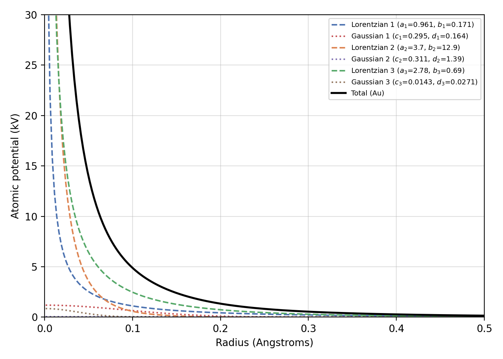
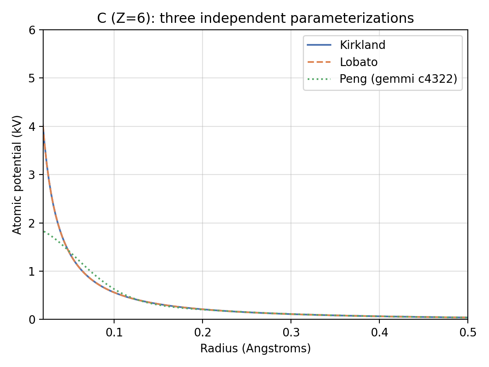
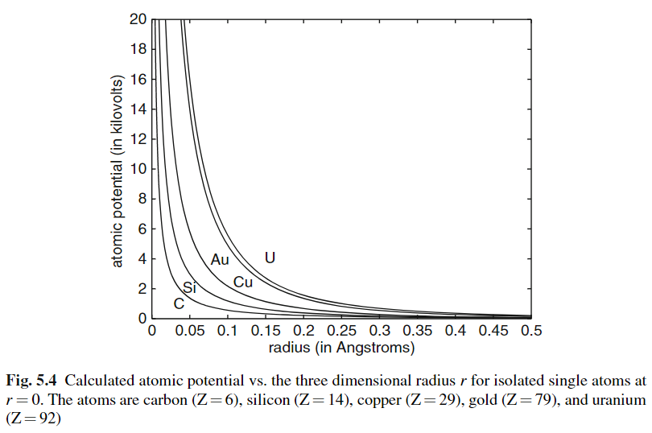
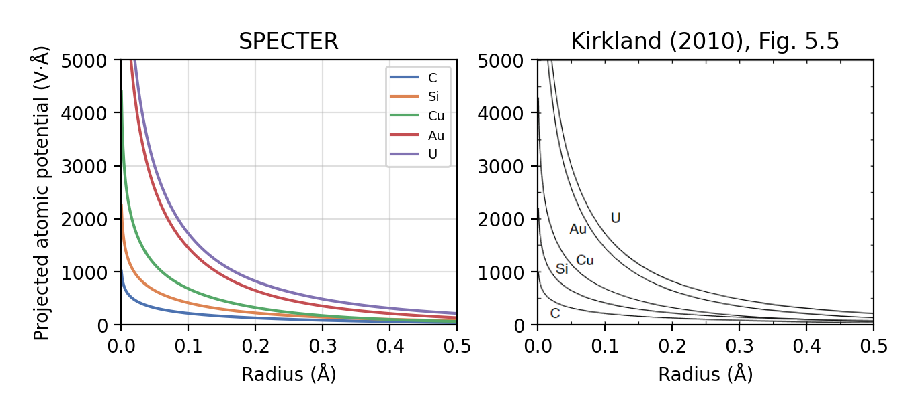
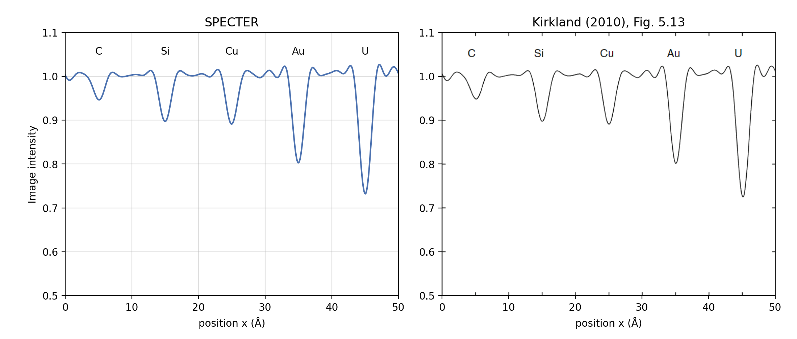

# Atomic potentials

Every SPECTER simulation starts from the electrostatic potential of the
atoms in the structure: `PotentialBuilder` places a per-element (or
per-bonded-species) potential kernel at every atom's coordinates to build
the 3D volume that `Scattering` then propagates the electron wave through.
This page covers where those single-atom kernels come from, the math
behind SPECTER's three parameterizations (Kirkland, Lobato, Shtyrov), and
how the Kirkland ones are validated against the worked examples in
Kirkland's *Advanced Computing in Electron Microscopy*.

!!! info "Source"
    Walks through `specter.atom.atomic_potentials` and
    `specter.potential`. Figures are produced by
    `docs-figures/atomic_potentials.py`, which calls the same public
    functions as the real code path and mirrors
    `compare-atomic-potentials-with-kirkland.ipynb`.

## Parameterizing an atom's scattering factor

An isolated atom's electron scattering factor \(f_e(k)\) (as a function of
spatial frequency \(k\), Å⁻¹) is tabulated numerically from relativistic
Hartree-Fock calculations, not available in closed form. To use it inside
a differentiable simulator, SPECTER relies on published analytic fits that
express \(f_e(k)\) as a small sum of terms with known inverse Fourier
transforms. The same handful of fitted coefficients therefore gives both
the Fourier-space transfer factor and a real-space potential kernel, for
every element up to Z=103. The three parameterizations below differ only in
which elementary functions they sum:

| Parameterization | Fourier-space term | Real-space term |
|---|---|---|
| Kirkland | Lorentzian \(a/(k^2+b)\) **and** Gaussian \(c\,e^{-dk^2}\) | screened Coulomb (Yukawa) **and** Gaussian |
| Lobato | rational \(a(2+bk^2)/(1+bk^2)^2\) | modified Bessel \(K_0\), \(K_1\) |
| Shtyrov / Peng | Gaussian \(a\,e^{-bk^2/4}\) only | Gaussian only |

## Kirkland: Lorentzian + Gaussian sum

Kirkland's fit (`load_kirkland_parameters`, `kirkland_atomic_potential_*`)
uses three Lorentzian terms plus three Gaussian terms in Fourier space:
12 parameters \((a_i, b_i, c_i, d_i)\) per element.

\[
f_e(k) = \sum_{i=1}^{3} \frac{a_i}{k^2 + b_i} \;+\; \sum_{i=1}^{3} c_i\, e^{-d_i k^2}
\]

(`kirkland_atomic_potential_3d_fourier`, Kirkland Eq. C.15.) Each
Lorentzian term is literally a [Lorentzian
lineshape](https://en.wikipedia.org/wiki/Cauchy_distribution) in \(|k|\);
its inverse Fourier transform is a screened Coulomb / [Yukawa
potential](https://en.wikipedia.org/wiki/Yukawa_potential), the
\(a/r\cdot e^{-r}\) form that dominates close to the nucleus. The Gaussian
terms are self-dual under the Fourier transform (Gaussian in, Gaussian
out) and contribute a softer correction. Inverse-transforming term by term
gives the real-space potential (`kirkland_atomic_potential_3d`, Kirkland
Eq. C.19):

\[
V(r) = 2\pi^2 a_0 e \sum_{i=1}^{3} \frac{a_i}{r}\, e^{-2\pi r \sqrt{b_i}}
     \;+\; 2\pi^{5/2} a_0 e \sum_{i=1}^{3} \frac{c_i}{d_i^{3/2}}\, e^{-\pi^2 r^2 / d_i}
\]

with \(a_0 = 0.529\) Å (Bohr radius) and \(e = 14.4\) V·Å (Kirkland's
electron-charge unit, chosen so \(V(r)\) comes out directly in volts). The
2D projected form used by the faster `projection` scattering path
(`kirkland_atomic_potential_2d`) replaces the Lorentzian terms' real-space
partner with the modified Bessel function \(K_0\) (the 2D projection of a
3D Yukawa potential):

\[
V_{\mathrm{2D}}(r) = 4\pi^2 a_0 e \sum_{i=1}^{3} a_i\, K_0\!\big(2\pi r \sqrt{b_i}\big)
     \;+\; 2\pi^2 a_0 e \sum_{i=1}^{3} \frac{c_i}{d_i}\, e^{-\pi^2 r^2 / d_i}
\]

The figure below decomposes gold's (Z=79) fitted potential into its
individual Lorentzian and Gaussian terms. The Lorentzian terms dominate
entirely: their coefficients are one to two orders of magnitude larger
than the Gaussians', and they carry the near-singular behavior close to
\(r=0\) (physically expected, since an atomic nucleus is a point charge at
this scale). The Gaussian terms only matter as a small, smooth correction
across the whole range.

{ width="700" }

## Lobato: a rational Fourier form

Lobato & Van Dyck (2014) fit five terms of a different rational form,
enforcing physical constraints (correct behavior as \(k\to0\) and at large
angle) more tightly than Kirkland's Lorentzian+Gaussian sum:

\[
f_e(k) = \sum_{i=1}^{5} a_i\, \frac{2 + b_i k^2}{(1 + b_i k^2)^2}
\]

(`lobato_atomic_potential_3d_fourier`, Lobato Eq. 56.) This rational form's
real-space inverse transform has no elementary closed form. It comes out
in terms of the modified Bessel functions \(K_0\) and \(K_1\)
(`lobato_atomic_potential_3d`, Lobato Eq. 15):

\[
V(r) = \frac{\pi^2}{\kappa} \sum_{i=1}^{5} \frac{a_i}{b_i^{3/2}}
       \left(\frac{\sqrt{b_i}}{\pi r} + 1\right) e^{-2\pi r/\sqrt{b_i}},
\qquad \kappa = \frac{1}{2\pi a_0 e}
\]

`ice/_kernels.py` and `PotentialBuilder` treat Kirkland and Lobato as
interchangeable, equally-validated element-indexed parameterizations;
`atomic-potential-parameterization-comparison.png` below confirms they
agree closely in practice.

## Shtyrov: bonded-species Gaussian sum

Kirkland and Lobato both fit *bare, unbonded* elements, computed ab initio
from relativistic Hartree-Fock atomic structure. At cryo-EM resolutions,
most atoms sit in covalent or hydrogen-bonded environments (the oxygen in
a water molecule, a carbon in a peptide backbone) whose local electron
density differs measurably from an isolated atom's. Shtyrov et al. (2026)
take a different approach entirely: rather than computing scattering
factors ab initio, they infer them empirically, via a Bayesian approach,
directly from high-resolution cryo-EM electrostatic-potential
maps (catalase reconstructions plus a broader public training set), then
fit a pure five-term Gaussian sum per *bonded species descriptor* (e.g.
`"O(HH)"`, `"C(HHHC)"`, as produced by `PDB.get_atom_species`) rather than
per element, as implemented by their [`sffit`](https://github.com/as2875/sffit)
tool:

\[
f_e(k) = \sum_{i=1}^{5} a_i\, e^{-b_i k^2 / 4}
\]

Being a pure Gaussian sum, both directions are elementary
(`shtyrov_atomic_potential_3d_fourier_by_species` /
`shtyrov_atomic_potential_3d_by_species`):

\[
V(r) = 2\pi e\, a_0 \sum_{i=1}^{5} a_i \left(\frac{4\pi}{b_i}\right)^{3/2} e^{-4\pi^2 r^2 / b_i}
\]

Atoms whose bonded species isn't in the bundled table fall back to
`peng_atomic_potential_3d`, gemmi's built-in per-element independent-atom
scattering factors (Peng et al. 1996). This is evaluated with the same
closed form, so it combines coherently (same units, same functional form)
with matched-species Shtyrov kernels in one potential volume. `PotentialBuilder`
and `MicrographSpecimenGenerator`/`TomogramSpecimenGenerator` default to
`parameterization="shtyrov"` for this reason.

How often that fallback fires depends on hydrogen. Twenty of the forty-two
tabulated species name a hydrogen neighbour, and a species descriptor is built
from the atoms actually present in the model, so a methyl carbon in a
structure without hydrogens is described as `C(C)` rather than `C(HHHC)` and
matches nothing. Deposited structures rarely carry hydrogens, and supplying
them requires a Monomer Library (see
[Installation](../installation.md#monomer-library-for-shtyrov-scattering-factors)).
Without one, around 44% of a protein's atoms fall back to Peng — measured on
myoglobin, where coverage rises from 56% to 99% once a library is available.
The atoms that still resolve are those whose neighbours are all heavy:
carbonyl and carboxyl carbons and oxygens, aromatic ring junctions, proline's
nitrogen, disulfides, and the nucleic-acid phosphate backbone.

{ width="600" }

Kirkland and Lobato, both fit directly to the same tabulated bare-carbon
scattering factors, agree to within 0.1% everywhere in this plot. Peng's
independently-fit model tracks both closely for \(r \gtrsim 0.05\) Å (within
a few %, briefly overshooting by ~15-20% around \(r\approx0.08\)-0.1 Å), but
undershoots by more than 2x at \(r = 0.02\) Å, well inside where any real
bonding environment would matter. This is consistent with it being a
coarser, independently-fit reference used only as a per-element fallback
for bonded species missing from the Shtyrov table.

### Hydrogen coordinates

A species descriptor is built from the bond graph, not from coordinates, so
the fitted factors apply whichever positions a hydrogen occupies. What
`readd_hydrogens` controls is only whether hydrogen *density* is added, and
from ideal or deposited geometry.

The default, `"auto"`, follows the file: hydrogens a structure already carries
are left exactly where they are, and hydrogens are added only to a structure
that has none. Deposited positions are information the file provides, so
nothing is gained by moving them.

| | atoms | H | typed |
|---|---:|---:|---:|
| **1A6M** — no deposited H, no library | 1,445 | 0 | 56% |
| 1A6M — `"auto"` (adds them) | 2,668 | 1,223 | 99.6% |
| **7a4m** — deposited H, `"auto"` (keeps them) | 2,862 | 1,341 | 99.4% |
| 7a4m — `readd_hydrogens=True` (replaces them) | 2,848 | 1,327 | 99.9% |

The two explicit settings remain available:

```python
PDB("7a4m", compute_atom_species=True, readd_hydrogens=True)   # ideal geometry
PDB("1a6m", compute_atom_species=True, readd_hydrogens=False)  # add none
```

`True` always re-adds from ideal geometry, the configuration the factors were
fitted in. `False` never re-adds: hydrogens the file lacks become
zero-occupancy atoms that inform their neighbours' species without being
rendered, which on 1A6M lifts typing from 56% to 99.2% while leaving the atom
set untouched at 1,445.

A partially hydrogenated structure counts as carrying them, so `"auto"` keeps
what is there rather than replacing the lot; pass `True` to complete it.

## From a single atom to a potential volume

The formulas above give one atom's potential on a continuous radial
coordinate. `PotentialBuilder` turns a full structure's coordinates into a
voxel grid two ways:

- **Supersample-then-pool** (`compute_supersampling_parameters`,
  `build_potential_volume_fftconvolve_3d`/`_2d`): each element's kernel is
  sampled on a finely-spaced grid (0.1 Å by default, fine enough to
  resolve the near-\(r=0\) peak), then average-pooled down to the main
  volume's voxel size. Atom positions are splatted onto the main grid with
  `soft_voxelize_coordinates` (trilinear, differentiable) and FFT-convolved
  with the pooled kernel, once per unique element.
- **Analytic scatter-add** (`build_potential_volume_analytic_scatter`,
  the default for `parameterization="shtyrov"`): rather than supersampling
  and pooling, each atom's Gaussian terms are analytically integrated
  (closed-form, via `erf`) over every voxel they overlap in a small local
  window, then scatter-added into the volume. This needs no FFT, no
  precomputed kernel, and supports genuinely per-atom (per-bonded-species)
  coefficients without grouping atoms by shared element.

Both give the exact voxel *average* of the potential rather than a point
sample at the nearest grid point. The underlying potential is sharply
peaked at the atom center, so a point sample would swing wildly with
sub-voxel atom position.

## Worked example: reproducing Kirkland's textbook figures

The atomic potential and imaging code are validated against the worked
examples in Kirkland Ch. 5, for the standard five-element test row (C, Si,
Cu, Au, U). `demo-notebooks/compare-atomic-potentials-with-kirkland.ipynb`
walks through the same four steps as `docs-figures/atomic_potentials.py`:

1. **3D atomic potential vs. radius** (Kirkland Fig. 5.4):
   `kirkland_atomic_potential_3d` evaluated on a radial grid.
2. **2D projected potential vs. radius** (Kirkland Fig. 5.5):
   `kirkland_atomic_potential_2d`.
3. **Transmission function** \(t(x,y) = e^{i\sigma V_{\mathrm{2D}}(x,y)}\)
   for all five atoms placed in a row (Kirkland Fig. 5.11), where
   \(\sigma\) is the interaction parameter at 200 kV.
4. **Coherent bright-field phase-contrast image** (Kirkland Fig. 5.12): the
   transmission function propagated through a Scherzer-condition CTF
   (\(C_s=1.3\) mm, \(\Delta f=700\) Å, 10.37 mrad aperture), and its line
   scan through the atom centers (Kirkland Fig. 5.13).

{ width="600" }

{ width="600" }

The line scan below places SPECTER's own output directly above a scan of
Kirkland's Fig. 5.13 for comparison. The dip depth and width at every
element match to within plotting resolution.

{ width="600" }

## References

- Kirkland, E. J. (2010). *Advanced Computing in Electron Microscopy*, 2nd
  Edition. Springer. Appendix C, Chapter 5.
- Lobato, I., & Van Dyck, D. (2014). An accurate parameterization for
  scattering factors, electron densities and electrostatic potentials for
  neutral atoms that obey all physical constraints. *Acta Crystallographica
  Section A: Foundations and Advances*, 70(6), 636-649.
  [doi:10.1107/S205327331401643X](https://doi.org/10.1107/S205327331401643X)
- Shtyrov, A., Wilson, H., Slowik, D., Yamashita, K., Li, J., Wojdyr, M.,
  Chen, S., McMullan, G., Short, J. M., Russo, C. J., Henderson, R., &
  Murshudov, G. N. (2026). Measurement of atomic scattering factors by
  cryoelectron microscopy. *Proceedings of the National Academy of
  Sciences*, 123(19), e2528758123.
  [doi:10.1073/pnas.2528758123](https://doi.org/10.1073/pnas.2528758123).
  Bonded-species parameterization used here as implemented by
  [`sffit`](https://github.com/as2875/sffit).
- Peng, L.-M., Ren, G., Dudarev, S. L., & Whelan, M. J. (1996). Robust
  parameterization of elastic and absorptive electron atomic scattering
  factors. *Acta Crystallographica Section A*, 52(2), 257-276. (gemmi's
  `c4322` table, used as SPECTER's per-element fallback.)
