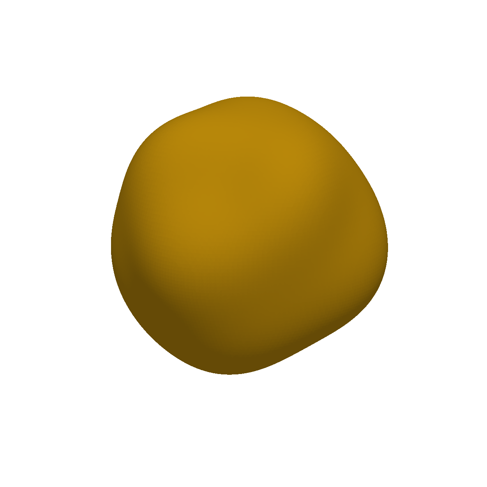
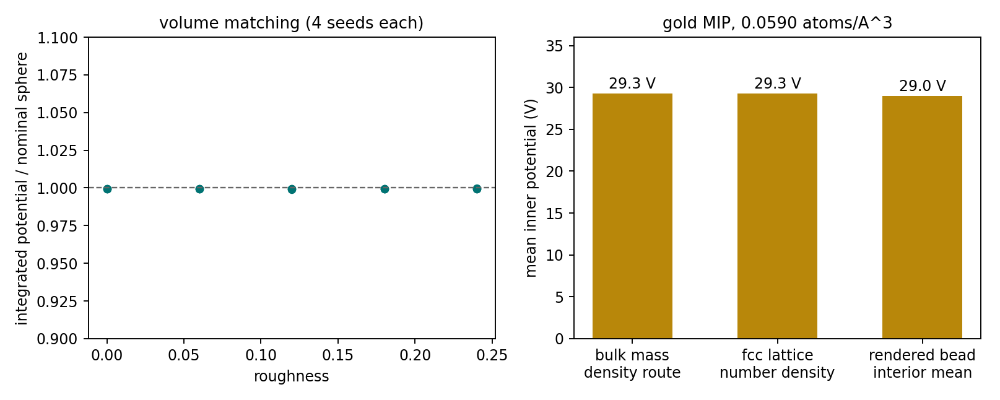
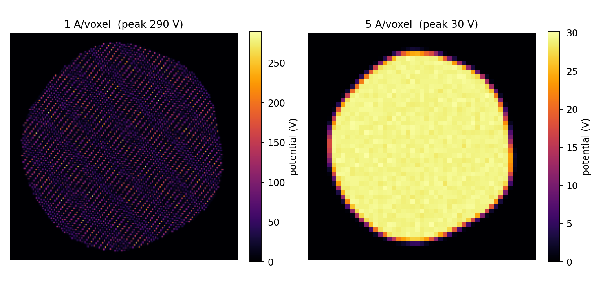
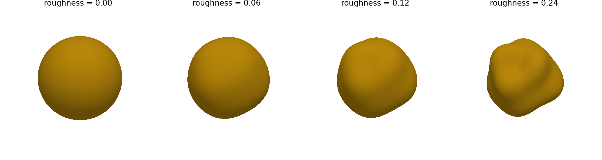

# Gold fiducial beads

{ width="380" }

Fiducial beads are the one component with no PDB behind them. There is no
atomic structure to hand `PotentialBuilder`, so the density has to come
from bulk material physics instead: gold's bulk mass density → number
density → per-atom potential integral, using specter's own atomic
potential parameterizations.

Each bead is then built from **real fcc gold atoms** — randomly oriented,
Debye-Waller jittered, splatted through the atomic potential kernel —
inside an irregular, volume-matched boundary.

!!! info "Source"
    `specter.specimen._grid` (`BeadGenerator`, `_BeadShape`), placed by
    `MembraneTomogramGenerator._stamp_beads`. Figures are produced by
    `docs-figures/cryoet_specimen_beads.py`.

## Getting to volts

The bead's absolute scale is set without a single free parameter:

\[
V_0 = n \int V_{\text{atom}}(\mathbf{r})\,d^3r,
\qquad
n = \frac{\rho\,N_A}{M}
\]

with \(\rho = 19.3\ \text{g/cm}^3\) and \(M = 196.97\ \text{g/mol}\) for
gold. The volume integral of one atom's real-space potential is its
\(k = 0\) Fourier component — the same physics `PotentialBuilder` uses per
atom, just summed to a bulk mean instead of kept per position. It is
resolution-independent, which matters: CTS's own approach injected a raw
atom count, which is dimensionally inconsistent with V·Å-unit output and
unphysically dependent on voxel size.

{ width="900" style="display:block;margin:1.2em auto;" }

The right panel is worth reading as a consistency check rather than a
result. Bulk mass density and the fcc lattice's own number density
(\(4/a^3\) with \(a = 4.0782\) Å) are unrelated routes to the same
material, and they agree to 0.2%. The rendered bead's interior mean lands
on the same value, ≈29 V — the literature ballpark for gold.

## Atoms, not a gas

The bead is a crystal, not a cloud. Atoms sit on an fcc lattice with
Debye-Waller jitter (\(u_{\text{RMS}} = 0.087\) Å, from \(B \approx 0.6\)
Ų near room temperature) and are convolved with the real atomic potential
kernel:

{ width="900" style="display:block;margin:1.2em auto;" }

Each bead draws its own crystal orientation uniformly over SO(3), so no
two fiducials show their fringes running the same way.

An earlier `fill="gas"` option reproduced CTS's model — atoms scattered
uniformly at bulk number density and binned into voxels — and was removed
rather than kept as a knob. A Poisson gas carries per-voxel shot noise a
crystalline solid does not have (~10% of the projected signal at a 5 Å
voxel against ~3% for the lattice, rising to ~22% at 2 Å) and collapses
each atom's whole potential integral into a single voxel. There was no
voxel size at which it was more accurate.

## The boundary

Commercial cryo-ET fiducials are citrate-reduced colloidal gold:
multiply-twinned, irregular particles. Neither of the obvious idealisations
describes them — an exact sphere is not a shape gold forms, and fcc gold's
equilibrium truncated octahedron describes an annealed single crystal. Both
were offered at one point and both were removed; a Wulff solid in
particular gave a population no shape variety at all, only pose variety.

What ships instead is a band-limited spherical-harmonic modulation of the
radius, reusing the [membrane backend's](../membrane-shape/spherical-harmonics.md)
own harmonic machinery:

\[
R(\hat{u}) = s\,\bigl(1 + a\,f(\hat{u})\bigr),
\qquad
s = \frac{r_{\text{nominal}}}{\bigl\langle (1 + a f)^3 \bigr\rangle^{1/3}}
\]

\(f\) has zero mean and unit RMS over the sphere by Parseval, and \(a\) is
`roughness`. The scale factor \(s\) **volume-matches** every realisation to
a sphere of the nominal radius — which is what the left panel of the
calibration figure above shows: total integrated potential, and therefore
projected signal, never depends on how lumpy a particular bead came out.

{ width="900" style="display:block;margin:1.2em auto;" }

Below about 0.06 a bead is visually indistinguishable from a sphere while
still costing the harmonic machinery; 0.12–0.20 reads as a genuinely
irregular particle; 0.0 gives a clean sphere.

The band limit (\(\ell_{\max} = 6\)) and spectrum (flat, equal power per
mode) are deliberately **not** exposed. \(\ell_{\max} = 6\) puts the finest
lumps at ~30° of arc, roughly a quarter of the bead across, which is the
scale colloidal gold irregularity actually shows. The flat spectrum is a
deliberate departure from the membrane backend's \(\propto \ell^{-2}\)
default: that encodes the Helfrich thermal bending spectrum of a lipid
bilayer, which has no analogue in a metal nanoparticle — a bead's
irregularity comes from growth and twinning, not bending modes. Neither is
known well enough to fit, so exposing them would only invite tuning an
uncalibrated model until an image looked right. `roughness` stays exposed
because its amplitude is the one property you could plausibly measure off
EM of a real bead prep.

## Placement and polydispersity

Beads are packed with the same
[RSA backend](packing.md#rsa-hard-sphere-packing) as everything else,
right after filaments. They avoid the membrane shell, the carbon film, and
already-placed filaments and beads; the protein-fill stage that follows
then avoids them.

They are **not** region-gated. A fiducial sits in the ice, not in a
cytosol or lumen compartment, so `TomogramBeadSpec` has no `location`
field the way a protein spec does.

`radius` accepts a `[low, high]` pair, drawn fresh per instance — real
colloidal gold is not monodisperse (a "10 nm" prep typically spans roughly
8.5–11.5 nm). Radii are drawn *before* packing, so each bead's collision
test uses its own size. `bead_roughness` takes a range the same way: with
a single number every bead is a *different* lumpy shape but the *same*
degree of lumpy, whereas a range mixes near-round and badly misshapen
particles the way a real prep does.

All beads are written to a single `gold-bead` pick file regardless of
size.

## Parameters at a glance

| Parameter | Meaning | Default |
|---|---|---|
| `radius` | Nominal bead radius, Å; scalar or `[low, high]` per instance | — |
| `count` (`n_copies` in TOML) | Instances in this population | 1 |
| `bead_roughness` | RMS radius modulation as a fraction of radius; scalar or `[low, high]` | 0.12 |
| `parameterization` | Atomic potential model for gold: `kirkland` or `lobato` | `kirkland` |

`shtyrov` is not available here — the bundled species table has no
unbonded elemental gold entry.

Fixed by the material rather than exposed: `GOLD_FCC_A` (4.0782 Å),
`GOLD_U_RMS` (0.087 Å), `GOLD_DENSITY_G_CM3` (19.3), and the roughness
band limit and spectrum.

## Limitations

- **The roughness model is phenomenological.** Its amplitude is
  measurable; its spectrum is a guess that reproduces the right feature
  scale, not a growth model.
- **No twinning geometry.** Real multiply-twinned particles have flat
  facets and re-entrant grooves; a smooth harmonic modulation does not.
- **One crystal per bead.** A polycrystalline fiducial's grain boundaries
  aren't represented.

## References

- Purnell, C., et al. (2023). Rapid synthesis of cryo-ET data for training
  deep learning models. *bioRxiv* 2023.04.28.538636.
  [CTS source](https://github.com/carsonpurnell/cryotomosim_CTS).
