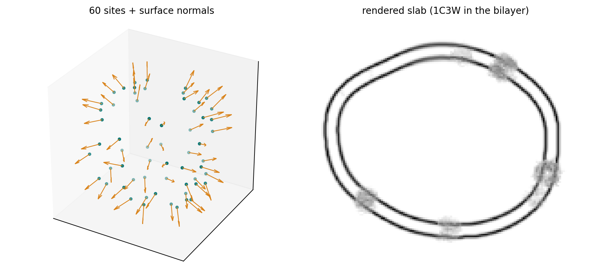
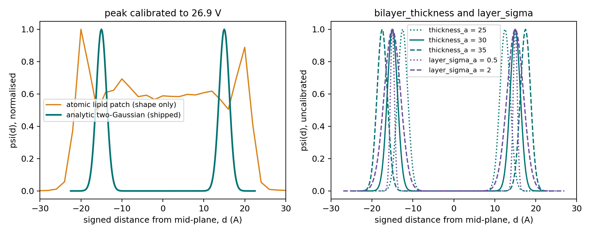
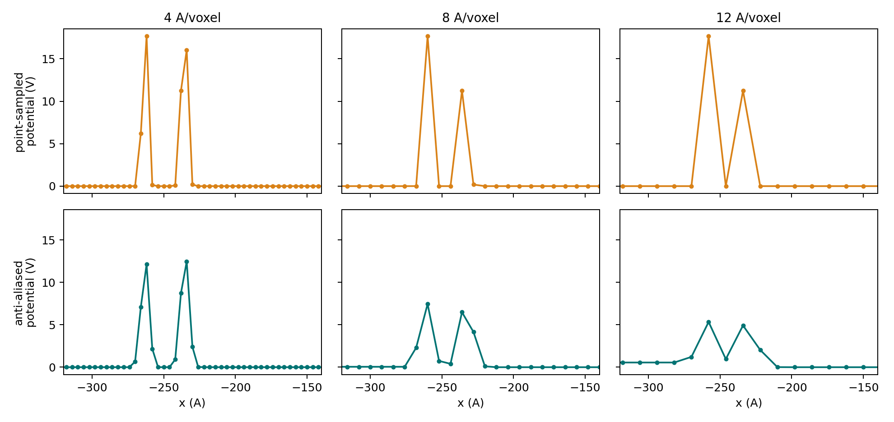

# Bilayer profile & transmembrane proteins

{ width="880" style="display:block;margin:1.2em auto;" }
///caption
A vesicle's sampled transmembrane sites with their surface normals, and the rendered slab with bacteriorhodopsin embedded in the bilayer.
///

[Membrane shape](../membrane-shape/index.md) produces a signed field
\(\phi\): the geometry. This page covers everything between that field
and a rendered volume: the 1D potential profile \(\psi(d)\) that turns
distance-from-the-mid-plane into volts, the anti-aliased resampling onto
the output grid, and how proteins get embedded in the resulting bilayer.

!!! info "Source"
    `specter.specimen.membrane._profile`, `._raster`, `._placement`.
    Figures are produced by
    `docs-figures/cryoet_specimen_bilayer.py`.

## From shape to potential

Every membrane voxel's density is \(\psi(\phi(\mathbf{x}))\): a single 1D
lookup applied to the signed distance field. The atomic-resolution work
happens once, not everywhere.

\(\psi(d)\) itself is two Gaussians, one per leaflet:

\[
\psi(d) = A\left[
  e^{-\frac{(d - t/2)^2}{2\sigma^2}} + e^{-\frac{(d + t/2)^2}{2\sigma^2}}
\right]
\]

with \(t\) = `bilayer_thickness` (phosphate-to-phosphate) and \(\sigma\) =
`bilayer_layer_sigma_a`. This is polnet's shell-then-blur construction
reduced to 1D: since \(\psi\) is always evaluated against a signed
distance anyway, a Gaussian at each leaflet's offset *is* the
cross-section of a thin shell blurred by \(\sigma\).

{ width="900" style="display:block;margin:1.2em auto;" }
///caption
Left, the atomic lipid patch's own profile against the shipped analytic profile. Right, the effect of bilayer_thickness and layer_sigma_a.
///

The alternative, deriving the profile's *shape* by building a schematic
atomic lipid patch, jittering it and rendering it, is still in the
codebase (`compute_bilayer_profile`, the orange curve above) and is not
what ships. It is more physically motivated and considerably more
fragile: keeping the acyl-chain region featureless relative to the
phosphate peaks means fighting per-cluster jitter scales against emergent
Gaussian-sum interference, with no guarantee a different lipid count or
seed doesn't reintroduce a competing hump between the leaflets. Because
\(\sigma\) is far smaller than the leaflet separation, the two-Gaussian
construction cannot do that, by construction, not by tuning.

## Amplitude: calibrating against real atoms

The *shape* is analytic; the *scale* is not. `amplitude` comes from
rendering each unique atomic species in the reference lipid template as a
**single isolated atom** and taking the tallest raw peak, typically the
phosphate phosphorus. That puts the bilayer in the same units as a
`PotentialBuilder`-rendered protein template, so a membrane and an
inserted transmembrane protein sit on a physically consistent scale in the
same volume.

Calibrating instead from the *laterally averaged* peak of the full
rendered lipid patch would be wrong: measured directly, that dilutes the
true single-atom peak by ~20× (97.5 → 4.8 V), with no physical
justification, since a real bilayer's phosphate atoms don't scatter more
weakly than the same atom in a protein.

A general principle recurs here: **the smoothness real cryo-ET membranes
show comes from the microscope's resolution limits, applied to the ground
truth after it is built** (CTF, multislice, detector MTF; see
[Forward simulation](../forward-simulation.md)), not from pre-averaging
the ground truth itself.

`membrane_scale_range` then draws a per-instance contrast multiplier and
folds it into the amplitude *before* the profile is built, rather than
applying it as a post-hoc multiply on the rendered volume. This keeps
the compositing occupancy threshold, itself derived from the profile's
peak, automatically consistent with whatever scale was drawn.

## Anti-aliased rasterization

The field lives on its own fine working grid; the output volume usually
does not. Resampling between them is where a real, previously observed
failure mode lives.

{ width="900" style="display:block;margin:1.2em auto;" }
///caption
The same membrane field rasterized at 4, 8 and 12 Å voxels, point-sampled on top and anti-aliased below, along a line through the vesicle wall.
///

Point-sampling the fine density directly (top row) keeps the two leaflets
sharp and full height at *every* voxel size. The peaks just land wherever
the sample grid happens to catch them, so the apparent leaflet separation
wanders with voxel size. The physical peak-to-peak spacing is fixed, so
that variation is pure aliasing.

Low-pass filtering first (bottom row), a Gaussian matched to the output
voxel footprint, \(\sigma = 0.5 \times\) the output spacing, gives the
physically correct behaviour instead: the leaflets lose amplitude and
merge into one broad peak as resolution drops, which is what a real
bilayer does when you stop resolving it.

## Transmembrane placement

Because \(\phi\) is a dense signed field defined everywhere rather than a
mesh, the local surface normal at any point is just its gradient: exact,
and available without a mesh or a KD-tree. Placement uses that directly:

1. **Project onto the surface.** Newton iteration on the field:
   \(\mathbf{x} \leftarrow \mathbf{x} - \phi(\mathbf{x})\,\nabla\phi(\mathbf{x})\).
2. **Reject crowded sites**, enforcing `min_transmembrane_spacing`
   centre-to-centre.
3. **Orient.** Align the protein's canonical axis to the local normal,
   then apply a free random spin about that same axis (the two-step
   construction CTS and polnet both use).
4. **Set the depth.** Translate along the aligned axis so the
   transmembrane span's midpoint sits at the bilayer mid-plane. Never
   rescale: hydrophobic mismatch between a protein's real span and the
   local bilayer thickness is a genuine biophysical effect, not something
   to hide by stretching the structure.

"Canonical axis" means the structure's **longest principal axis of
inertia**, not its file z-axis. A deposited structure's native axes are an
artifact of how it was solved; for a membrane protein with a large
asymmetric extramembrane domain, that domain's real spatial extent is the
physically meaningful "sticks out of the membrane" direction. Confirmed
empirically on a real structure: its principal axis diverged substantially
from its native z-axis, and depth-centering along the wrong one left the
extramembrane domain pointing off at an angle. The *sign* of that axis is
not resolved. With no topology information (cytoplasmic vs. extracellular)
to break the symmetry, which end becomes \(+z\) is an arbitrary but
deterministic PCA-sign choice.

Species are chosen per site by weighted random draw on `frequency`. The
requested site count is a request, not a guarantee: if the surface is too
small for that many well-spaced sites, or the working grid is too coarse
for reliable surface projection, the generator warns and places what it
found.

## Parameters at a glance

| Parameter | Meaning | Default |
|---|---|---|
| `bilayer_thickness` | Phosphate-to-phosphate leaflet spacing \(t\), Å | 30.0 |
| `bilayer_layer_sigma_a` | Per-leaflet Gaussian width \(\sigma\), Å | 1.25 |
| `membrane_scale_range` | Per-instance contrast multiplier, drawn uniformly | (0.5, 1.0) |
| `min_transmembrane_spacing` | Minimum centre-to-centre site spacing, Å | 40.0 |
| `transmembrane_occupancy_fraction` | Surface occupancy target for site sampling | 0.05 |
| `frequency` (per spec) | Relative weight among transmembrane species | 1 |
| `tm_span_mask` (per spec) | Atom mask selecting the membrane-spanning region | None (full z-extent) |

Defaults for \(t\) and \(\sigma\) are polnet's own midpoints (its
`MB_THICK_RG` 25–35 Å and `MB_LAYER_S_RG` 0.5–2.0 Å).

## Limitations

- **The reference lipid template is schematic.** Per-leaflet atom
  z-offsets from bilayer structural biology plus jitter, not a relaxed or
  MD-equilibrated structure. It only sets the calibration amplitude now,
  but swapping in a real coordinate set is still on the list.
- **No leaflet asymmetry.** \(\psi(d)\) is symmetric about the mid-plane;
  real membranes are not.
- **No lipid composition.** One profile per membrane instance, with no
  notion of rafts, cholesterol, or local thickness variation.
- **Transmembrane instances get no voxel labels.** Their density is in the
  volume and their placements are recorded, but they don't appear in
  `instance_labels`.
- **Depth alignment defaults to the full z-extent** when no `tm_span_mask`
  is given, which is wrong for a protein with a large soluble domain on
  one side only.

## References

- Martinez-Sanchez, A., Lamm, L., Jasnin, M., & Phelippeau, H. (2024).
  Simulating the cellular context in synthetic datasets for cryo-electron
  tomography. *IEEE TMI* 43(11), 3742–3754.
  [polnet source](https://github.com/anmartinezs/polnet).
- Purnell, C., et al. (2023). Rapid synthesis of cryo-ET data for training
  deep learning models. *bioRxiv* 2023.04.28.538636.
