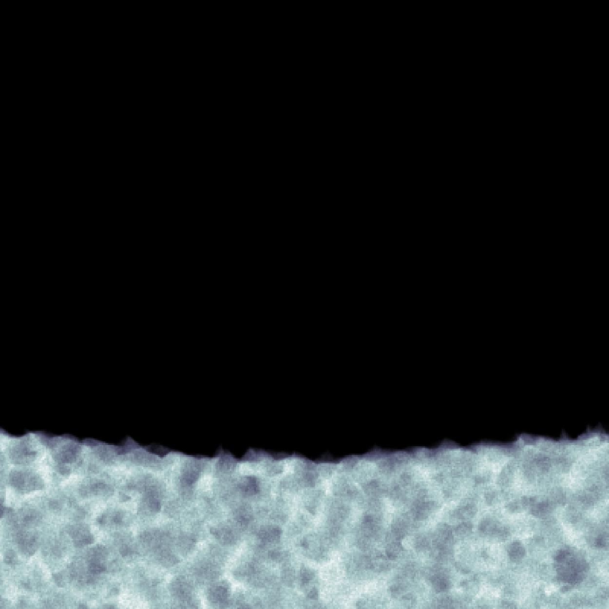
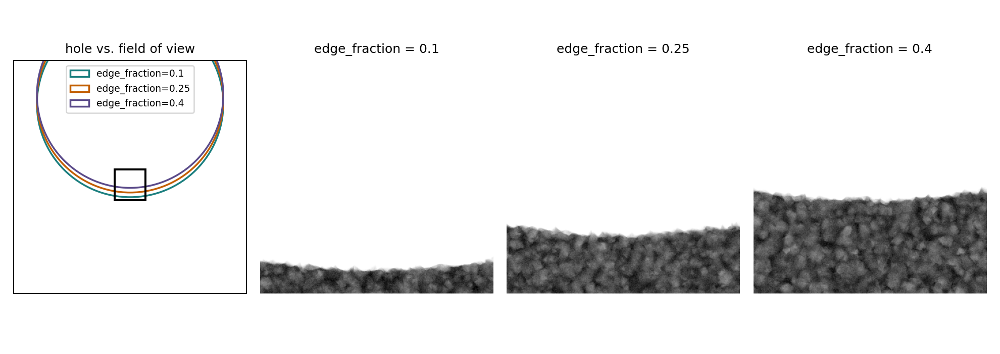
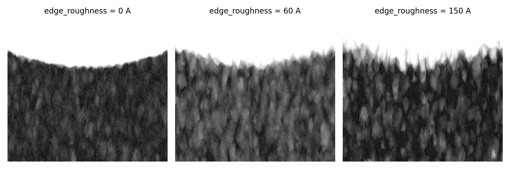
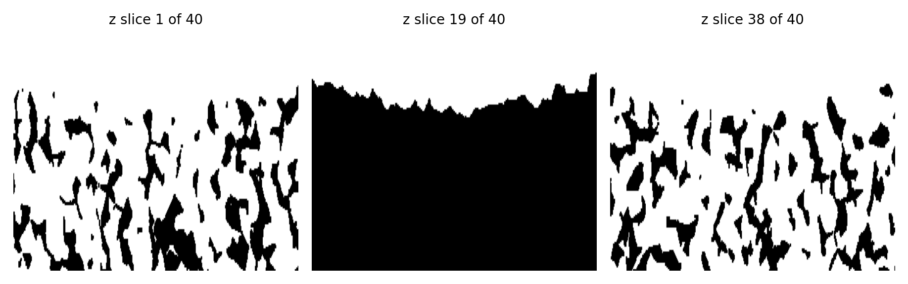
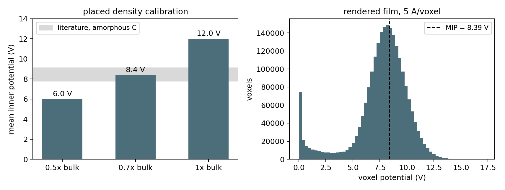

# Carbon support film

{ width="620" style="display:block;margin:1.2em auto;" }
///caption
A carbon film summed along Z: a strip of film intruding from the bottom edge of the frame, with a rough, granular rim.
///

The support film is a roughly planar slab of amorphous carbon with a
circular hole cut through it. `CarbonFilmGenerator` paints it into the
canvas before anything else, so everything you place afterwards works
around it.

Its geometry comes from an **alpha shape** over a jittered 3D point
cloud instead of an analytic boundary. That gives the rim a shape that
differs from z-slice to z-slice, with islands and overhangs, rather
than a swept 2D outline.

!!! info "Source"
    `specter.specimen._carbon` (`CarbonFilmGenerator`, `edge_hole_center`),
    a from-scratch replication of CryoTomoSim's `gen_carbon.m`/
    `carbonshape`. `docs-figures/cryoet_specimen_carbon_film.py`
    produces the figures.

## Why the hole is bigger than the picture

A Quantifoil R1.2/1.3 grid (the standard for high-resolution
single-particle and cryo-ET collection) has 1.2 µm holes: a **6000 Å
radius**, far larger than any single tomogram's field of view. In
practice you get one of three cases: entirely inside a hole (no carbon
at all), entirely on the carbon, or catching one hole's edge near a
frame border. A small hole fully contained within the frame does not
happen.

{ width="900" style="display:block;margin:1.2em auto;" }
///caption
Left: three hole circles drawn to scale against the field of view. Right: the resulting film at three edge_fraction values.
///

Placing that by hand means solving for where a huge circle's boundary
has to sit so a strip of a specific width lands at a specific frame
edge. `edge_hole_center` does that solve for you: give it
`edge_fraction` (the fraction of the frame that ends up carbon) and
`edge_side`, and it returns the `hole_center` to pass alongside the
real `hole_radius`. At real Quantifoil scale, the boundary crossing the
frame reads as close to a straight edge, matching what you see in real
data.

`edge_fraction` also accepts a `(low, high)` range, drawn per run: real
images don't all catch the same amount of a hole's edge. The shipped
default is `(0.02, 0.05)`.

## The rim

`CarbonFilmGenerator` seeds points uniformly across the frame's
footprint (plus a 50 Å pad, so the rough boundary doesn't clip visibly
at the frame's own edge) and through the film's thickness, at a fixed
physical seed **density**: `_SEED_VOLUME_PER_POINT` = 18000 ų/point,
about 26 Å mean spacing. It drops points inside the hole radius, then
displaces every survivor by an isotropic 3D vector whose magnitude is
drawn uniformly from \([0, \texttt{edge\_roughness}]\). An alpha shape
(α = 40 Å) over the result gives the film's solid.

Because the jitter is large relative to the seed spacing, points
shuffle past their neighbours, and the alpha complex turns that into a
boundary correlated at the seed scale and topologically nontrivial:

{ width="900" style="display:block;margin:1.2em auto;" }
///caption
Rim detail at edge_roughness 0, 60 and 150 Å.
///

At the shipped default of 60 Å, the boundary's radial standard
deviation comes out to roughly a third of that, ~20 Å. Even
`edge_roughness = 0` doesn't give a clean circle: the seeds form a
Poisson cloud, so the alpha shape is already ragged at the seed
spacing.

The boundary is a genuine 3D construction, not a per-angle function of
the outline, so it differs at different heights in the slab:

{ width="900" style="display:block;margin:1.2em auto;" }
///caption
Three z-slices through the same film, showing different boundaries, detached islands and overhanging lips.
///

A simpler analytic construction, jittering a circle's radius per angle
and interpolating, can't produce this: it gives flat top and bottom
faces, a spatially constant density, and a rim that is a pure function
of angle, so every z-slice would share the same outline. It would also
need a fixed point count, which degrades to sparse speckle as the
volume grows. Scaling the point count with a physical seed density
instead keeps it from thinning out at larger volumes or finer grids.

## Density

`CarbonFilmGenerator` samples carbon atoms uniformly inside the alpha
shape's tetrahedra and deposits them with a **trilinearly split flat
weight**, not a per-atom scattering calculation. The weight is
`atom_potential_integral / voxel_size**3`, one atom's real, physical
potential integral spread over one voxel's volume, so by the mean-field
relation \(V_0 = n \int V_{\text{atom}}\), the bulk result is correct
at any placed density and any voxel size. What it lacks is per-atom
radial structure, which nothing downstream resolves in a support film
anyway. A real per-atom physics path, prototyped separately, measured
~40× more expensive at equal atom count for no difference in the bulk
answer.

{ width="900" style="display:block;margin:1.2em auto;" }
///caption
Left: mean inner potential at three placed-density fractions against the literature range for amorphous carbon. Right: the rendered film's own voxel histogram.
///

`CarbonFilmGenerator` places atoms at **0.7× bulk number density**, not
bulk. That's a calibration, not an appearance fudge factor: the
independent-atom model carries no bonding correction, so depositing
full bulk density overshoots the 7.8–9.1 V mean inner potential
reported for amorphous carbon. 0.7× lands at ≈8.4 V, matching a real
per-atom-physics measurement of 8.56 ± 1.4 V to within noise.

## Interaction with everything else

`CarbonFilmGenerator` paints the film first, into an empty canvas.
Downstream:

- **Membranes and filaments** are placed carbon-aware. Membrane
  placement rejects candidates using a bounding-sphere approximation,
  so an irregular organelle's true rendered shape can still graze the
  film in practice. As a safety net, SPECTER zeros whatever part of an
  instance's density would land on carbon anyway, right before merging,
  so the volume and that instance's own shell label exclude it
  consistently. It drops filament monomers landing inside the film
  after the fact (see [Filaments](filaments.md)).
- **Beads and protein fill** avoid it for free: the region classifier
  reads carbon's high density as `shell`, the same bucket a bilayer
  occupies, and nothing gets packed into `shell`.

Hole *placement* is deterministic and controllable: `edge_hole_center`
solves directly for the required `hole_center` instead of sampling one.

## Parameters at a glance

| Parameter | Meaning | Default |
|---|---|---|
| `thickness` | Film thickness, Å | 150.0 |
| `hole_radius` | Real physical hole radius, Å | 6000.0 (Quantifoil R1.2/1.3) |
| `edge_fraction` | Fraction of the frame that ends up carbon; scalar or `[low, high]` | (0.02, 0.05) |
| `edge_side` | Which frame edge the carbon enters from: `left`/`right`/`top`/`bottom`/`random` | `random` |
| `edge_roughness` | Rim jitter magnitude, Å | 60.0 |

Fixed rather than exposed: the alpha radius (40 Å), the seed density,
the lateral pad, and the 0.7× placed-density fraction. Each is either a
measured calibration or a description of the algorithm, not of a
specimen.

You get at most one `[[carbon_film]]` table per run.

## Limitations

- **No graphene or gold-foil supports**, and no fenestrated or lacey
  carbon: one circular hole in an amorphous slab.
- **The slab is flat.** Real films buckle and wrinkle; the only z
  structure here is the seed-cloud jitter.
- **No filament steering.** As above, SPECTER drops monomers inside
  the film rather than routing them around it.
- **Deposition has no per-atom radial structure**, by design.

## References

- Purnell, C., et al. (2023). Rapid synthesis of cryo-ET data for training
  deep learning models. *bioRxiv* 2023.04.28.538636.
  [CTS source](https://github.com/carsonpurnell/cryotomosim_CTS).
- [Quantifoil circular holes](https://www.quantifoil.com/products/quantifoil/quantifoil-circular-holes):
  the R1.2/1.3 hole spec.
