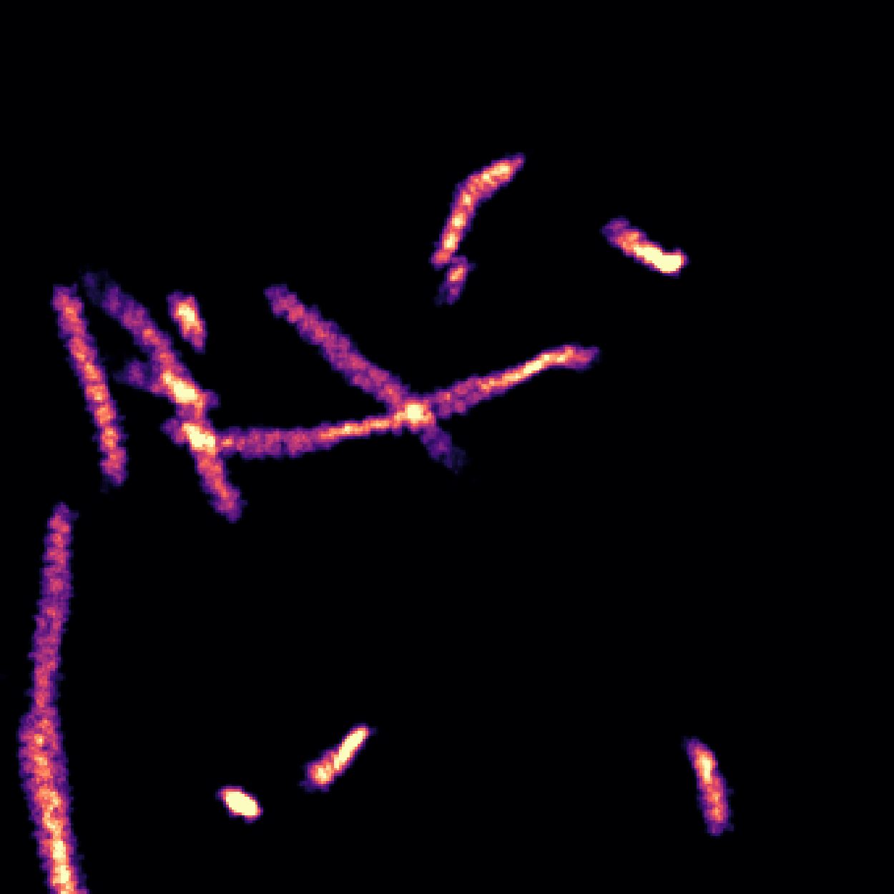
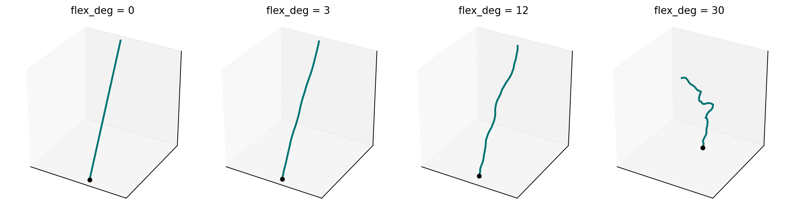
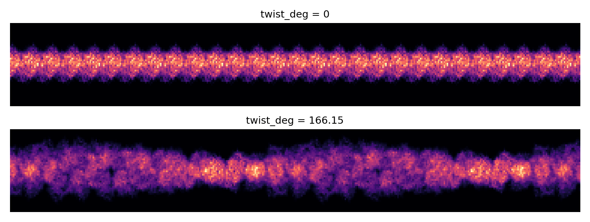
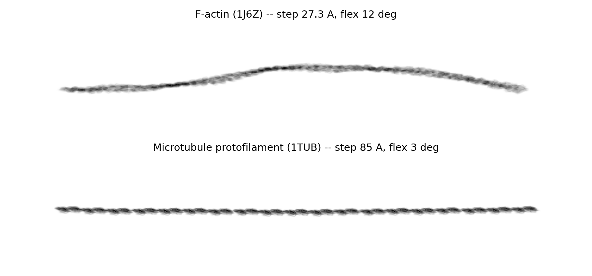

# Filaments

{ width="420" }

A filament species is one monomer structure repeated along a random walk.
`specter build tomogram` places each instance's monomers as independent
rigid copies of a single rendered template, so a 60-monomer F-actin
filament costs one `PotentialBuilder` render plus 60 rotations — not 60
renders.

Two presets ship: `ACTIN_SPEC` (F-actin) and `MICROTUBULE_SPEC` (a single
microtubule protofilament). Anything else is a hand-written
`FilamentSpec`.

!!! info "Source"
    `specter.specimen.filament` (`_path`, `_placement`, `_generator`),
    stamped by `TomogramSpecimenGenerator._stamp_filaments`. Figures are
    produced by `docs-figures/cryoet_specimen_filaments.py`, which calls
    the same functions the real code path does.

## The path: a persistent random walk

Each filament's monomer centres come from a walk that advances a fixed
distance `step` (the monomer's axial rise) along the current direction,
then turns that direction by a random angle drawn uniformly from
\([0, \texttt{flex\_deg}]\) about a random axis perpendicular to it:

\[
p_{i+1} = p_i + s\,d_i, \qquad
d_{i+1} = R(\hat{a}_i,\ \theta_i)\,d_i, \quad
\theta_i \sim U(0, \texttt{flex\_deg}),\ \hat{a}_i \perp d_i
\]

Curvature is bounded *per step* and unbounded *cumulatively* — the
worm-like-chain flavour, and a port of CryoTomoSim's own
`filament_polym_linear_script.m` walk.

{ width="900" style="display:block;margin:1.2em auto;" }

All four paths above have identical contour length; only the tangling
differs. That is what makes `flex_deg` the persistence knob: raise it and
the same amount of polymer occupies a smaller end-to-end span.

Note this is a *different* construction from the
[swept-spline membrane backend](../membrane-shape/swept-spline.md)'s path,
which blends the previous direction with a fresh random one at a fixed
weight. Here the turn is a bounded rotation of the previous direction, so
`flex_deg` caps how sharply a filament can kink over one monomer — the
physically meaningful quantity for a stiff polymer.

## Orientation: tangent alignment plus screw twist

Each monomer's rotation composes two steps, the same screw symmetry real
helical polymers use:

1. **Align to the tangent.** Rotate the monomer's canonical \(+Z\) onto
   the local path tangent (monomer \(i\) → monomer \(i+1\); the last
   monomer reuses its predecessor's tangent).
2. **Spin about that axis.** Apply an accumulated twist of
   \(i \cdot \texttt{twist\_deg}\).

The "canonical \(+Z\)" is established earlier, when the template is built:
the monomer's coordinates are pre-rotated so its **longest principal axis**
points along \(+Z\). This is an approximation and worth being explicit
about — a real protofilament or actin docking axis comes from inter-subunit
contact geometry, not from a monomer's own inertia tensor. A fetched PDB's
native axes have no relationship to its stacking direction either, so some
choice has to be made; this one is at the fidelity level CTS's own filament
code aimed for, not a validated structural docking.

`twist_deg` is what separates a helical polymer from a plain stack:

{ width="900" style="display:block;margin:1.2em auto;" }

Without twist every monomer presents the same face and the strand reads as
a uniform ridge. With F-actin's measured 166.15° per subunit, the
projection picks up the crossover pattern a real F-actin filament shows.

## Presets

{ width="900" style="display:block;margin:1.2em auto;" }

| Preset | `code` | `step` (Å) | `flex_deg` | `twist_deg` | `n_monomers` |
|---|---|---|---|---|---|
| `ACTIN_SPEC` | 1J6Z (G-actin) | 27.3 | 12.0 | 166.15 | (20, 60) |
| `MICROTUBULE_SPEC` | 1TUB (αβ-tubulin dimer) | 85.0 | 3.0 | 0.0 | (10, 30) |

`step` and `twist_deg` are real measured values (F-actin's helical repeat
from Holmes/Egelman; tubulin's 85 Å dimer repeat). `flex_deg` is CTS's own
tuned value in both cases, not a persistence-length measurement.
`twist_deg = 0` for the protofilament is correct: a single protofilament
doesn't itself twist. Its 13-protofilament tube geometry and small
supertwist are out of scope — `MICROTUBULE_SPEC` gives you one
protofilament, not a microtubule.

## Placement

Every instance starts at a uniformly random point in the volume, walking
in a uniformly random initial direction. There is no rejection sampling
and no obstacle awareness:

- A filament that wanders **outside the volume** is truncated at render
  time, the same edge behaviour placed particles already get.
- A monomer landing **inside the carbon film** is dropped after the fact,
  leaving a gap rather than a redirected walk.
- Filaments do **not** avoid the membrane shell, or each other. They are
  also not region-gated: a filament may cross a vesicle wall and continue
  through its lumen.

They *are* avoided by everything placed after them — beads and the whole
protein-fill stage read placed filament voxels as obstacles.

## Parameters at a glance

| Parameter | Meaning | Default |
|---|---|---|
| `code` | PDB ID or local file for the monomer | — |
| `step` | Axial rise per monomer, Å | — |
| `flex_deg` | Maximum per-step turn, degrees | — |
| `twist_deg` | Helical twist per monomer, degrees | 0.0 |
| `n_copies` | Independent filament instances of this species | 1 |
| `n_monomers` | Monomers per instance; an int, or a `(min, max)` drawn per instance | (10, 30) |

In a TOML config these are `[[filaments]]` tables, or `actin = true` for
the `ACTIN_SPEC` preset — see
[Build a tomogram specimen](../../user-guide/build-tomogram.md).

## Limitations

- **No branching.** Each filament is a single path; Y-junctions and
  networks aren't representable.
- **No real microtubule.** One protofilament only, as above.
- **No collision avoidance during the walk.** Adding one is a genuinely
  bigger algorithmic change than dropping monomers after the fact, and
  hasn't been done.
- **The stacking axis is a principal-axis approximation**, as described
  above.

## References

- Purnell, C., et al. (2023). Rapid synthesis of cryo-ET data for training
  deep learning models. *bioRxiv* 2023.04.28.538636.
  [CTS source](https://github.com/carsonpurnell/cryotomosim_CTS).
