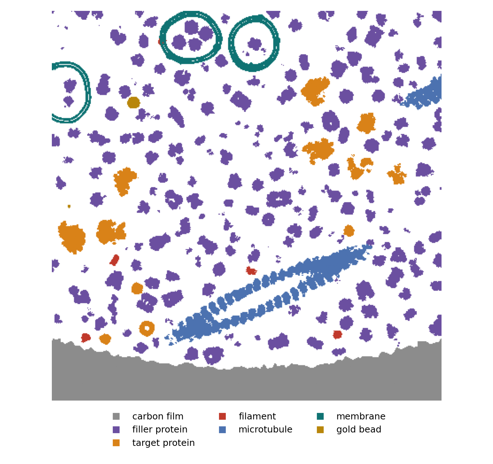
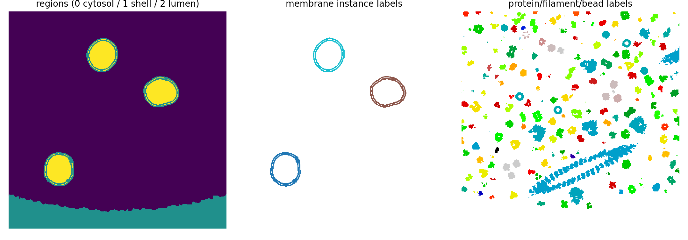

# Cryo-ET specimen assembly

{ width="700" style="display:block;margin:1.2em auto;" }
///caption
A simulated cryo-ET specimen, summed along Z: crowded cytosolic protein, three vesicles, actin filaments, two long flexible microtubules crossing the field of view, gold fiducial beads, and a carbon film edge along the bottom.
///

`TomogramSpecimenGenerator` is the single specimen generator behind
[`specter build tomogram`](../../user-guide/build-tomogram.md). It
composites a cryo-ET-scale potential volume out of six independent
components, then hands back a density volume plus the ground-truth labels
that describe it.

Every component is optional. A run needs at least one of them; any
combination is valid.

!!! info "Source"
    `specter.specimen.tomogram`, plus the per-component modules
    linked below. `docs-figures/cryoet_specimen_overview.py` produces the
    figures: it drives the real generator once and draws every panel from
    that one run's own outputs.

## The components

| Component | What it is | Module |
|---|---|---|
| [Carbon support film](carbon-film.md) | A holey-grid film with a rough 3D rim | `specimen._carbon` |
| [Membrane shape](../membrane-shape/index.md) | Organelle geometry: vesicles or wandering tubes | `specimen.membrane._field_*` |
| [Bilayer & transmembrane proteins](bilayer.md) | Turning that geometry into calibrated potential, and embedding proteins in it | `specimen.membrane._profile`, `._raster`, `._placement` |
| [Filaments](filaments.md) | Random-walk polymers (F-actin, single protofilaments) | `specimen.filament` |
| [Microtubules](microtubules.md) | Closed 13-protofilament tubes, lumen and A-lattice seam | `specimen.filament` |
| [Gold fiducial beads](beads.md) | Real fcc gold at real bulk density | `specimen._grid` |
| [Regions & protein packing](packing.md) | Cytosol/lumen classification, shape- and sphere-based RSA placement, crowding tables | `specimen.packing`, `specimen.tomogram._regions`, `specimen` (the crowding tables) |

Amorphous ice is **not** one of them. A `specter build tomogram` volume is
the specimen alone; you add ice downstream, when you image the volume.
See [Ice structure](../ice.md) and
[Generate a tilt series](../../user-guide/tilt-series.md).

## Assembly order

Generation is strictly sequential, and each stage is only aware of the
stages before it:

```
carbon film → membranes → filaments/microtubules → gold beads → targets → filler
```

The generator never re-places anything once accepted. If a candidate
position doesn't work, it rejects the position and moves on rather than
backtracking. That's why order matters: each stage runs with less
placement freedom than the one before it.

Each stage checks a different set of obstacles, and skips the rest:

| Stage | Avoids | Doesn't avoid |
|---|---|---|
| Carbon film | — (painted first, into an empty canvas) | — |
| Membranes | Carbon, other membranes | — |
| Filaments | Carbon (monomers landing in it are dropped) | Membrane shell, other filaments |
| Microtubules | Carbon (dimers landing in it are dropped) | Membrane shell, filaments, other microtubules |
| Gold beads | Membrane shell, carbon, filaments/microtubules, other beads | Nothing (not region-gated: fiducials sit in the ice) |
| Targets | Membrane shell, carbon, filaments/microtubules, beads; restricted to their `location` region | — |
| Filler | All of the above, plus already-placed targets | — |

Two consequences matter when you read a rendered volume:

- **The carbon film has no placement-awareness in reverse.** The
  generator paints it first, and everything else works around it.
  Membrane collision-avoidance against it is a bounding-sphere
  approximation, so an irregular organelle's true rendered shape can
  still graze it. The generator zeroes whatever density would land on
  carbon just before compositing, so the volume and that instance's own
  shell label stay consistent with each other.
- **Filaments have no obstacle-avoiding random walk.** A walk that runs
  into the film loses the monomers that land inside it, leaving a gap in
  that filament rather than steering around the obstacle.

## Regions

{ width="620" style="display:block;margin:1.2em auto;" }
///caption
The same specimen as the hero image, a thin mid-Z slab, painted by component from the run's own ground-truth label volumes.
///

Once every membrane has been composited, the generator classifies the
volume once, on the composite, into three disjoint regions: `shell`
(bilayer material), `lumen` (any enclosed compartment), and `cytosol`
(everything reachable from the volume's own boundary). Protein species
declare which of the latter two they belong to; the packer places them
only there.

This is topology, not geometry: it works for one vesicle, several disjoint
ones, or none at all without special-casing. The carbon film lands in
`shell` too, since it is dense material that nothing should be packed
into, which is what `shell` means to the packing stage. See
[Regions & protein packing](packing.md).

## Ground truth

A run writes more than a density volume. The generator records every
placement, and the label volumes below are what make a generated
tomogram usable as training data:

{ width="900" style="display:block;margin:1.2em auto;" }
///caption
Region map, per-instance membrane labels, and per-instance protein/filament/bead labels, all from the same mid-Z slice.
///

- `regions`: `0` cytosol, `1` shell, `2` lumen.
- `membrane_labels`: which membrane instance a shell voxel belongs to.
  The first write wins where two instances overlap.
- `instance_labels`: one id per placed filament monomer, bead, target and
  filler instance.
- Picks: copick-style `.ndjson` per species, positions and orientations.
  The generator exports targets by default, but not filler particles.

Membranes deliberately have no picks entry: a surface has no single
natural "position" the way a protein does, so `membrane_labels` and
`regions` are its ground truth instead.

## Limitations

- **Transmembrane proteins get no per-instance voxel labels.** Their
  density is present in the volume, and the generator records their
  placements, but they do not appear in `instance_labels`. This is a
  documented gap, not an oversight.
- **Collision is voxel-quantized.** Protein placement tests each
  molecule's real rotated footprint against an occupancy grid, so the
  grid resolves a molecule's position only to the packing voxel size.
  The generator still places gold fiducials and membrane instances as
  bounding spheres, exact for a bead and approximate for a membrane.
- **Instances contact but never overlap.** Real surface loops and
  hydration shells interdigitate slightly; the generator deliberately
  doesn't model that, since it would make instance labels ambiguous at
  contacts.
- **RSA jams well below close packing.** `filler_occupancy_fraction` is a
  budget, not a promise; see [the packing page](packing.md) for where the
  ceiling sits.

## Provenance

Both [CryoTomoSim](https://github.com/carsonpurnell/cryotomosim_CTS)
(CTS) and [Polnet](https://github.com/anmartinezs/polnet) inspired
`TomogramSpecimenGenerator`. Two components descend directly from CTS,
both generic bulk-material simulations with no placement logic of their
own: the [gold beads](beads.md) (`gen_beads.m`) and the
[carbon film](carbon-film.md) (`gen_carbon.m`/`carbonshape`). SPECTER
adapts the [transmembrane placement](bilayer.md) construction from
Polnet, as it does the bilayer's two-Gaussian profile.

## References

- Purnell, C., et al. (2023). Rapid synthesis of cryo-ET data for training
  deep learning models. *bioRxiv* 2023.04.28.538636.
- Martinez-Sanchez, A., Lamm, L., Jasnin, M., & Phelippeau, H. (2024).
  Simulating the cellular context in synthetic datasets for cryo-electron
  tomography. *IEEE TMI* 43(11), 3742–3754.
