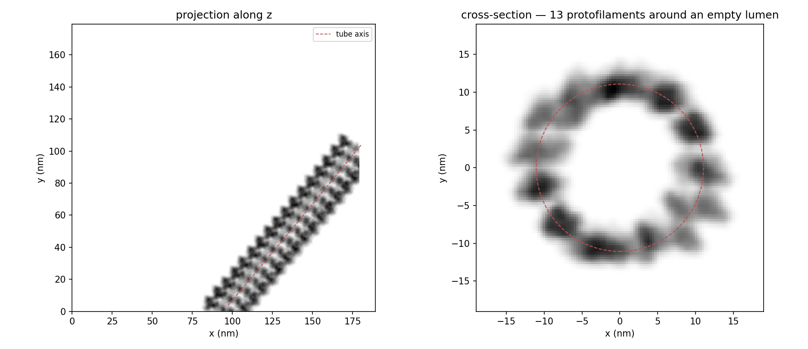
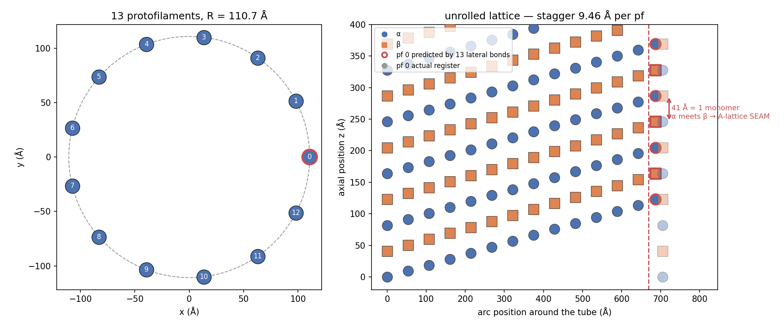
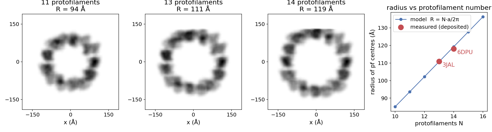
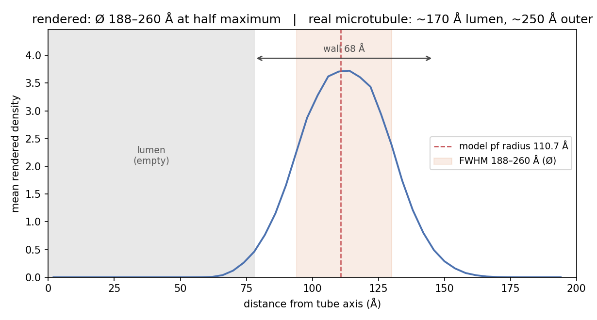
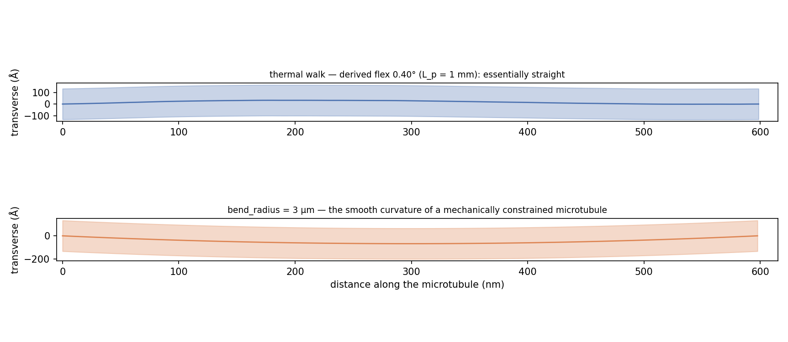

# Microtubules

<div class="grid" markdown>

{ width="900" style="grid-column: 1 / -1;" }
///caption
A rendered microtubule: projection along z, and a cross-section perpendicular to the tube showing 13 protofilaments around an empty lumen.
///

</div>

A microtubule is a closed tube of 13 protofilaments, each a stack of
αβ-tubulin dimers, wrapped so the lateral tubulin–tubulin bonds form a
3-start helix. `specter build tomogram` builds a microtubule as many
rigid copies of a single tubulin dimer, the same machinery
[filaments](filaments.md) use, so a microtubule costs one
`PotentialBuilder` render plus one rotation per dimer.

`PROTOFILAMENT_SPEC` is different: it gives you a **single**
protofilament, one strand, no tube, no lumen, no seam.

!!! info "Source"
    `specter.specimen.filament` (`_lattice`, `_frames`, `_tube`, `_tubulin`),
    stamped by `TomogramSpecimenGenerator._stamp_microtubules`.
    `docs-figures/cryoet_specimen_microtubules.py` produces the
    figures, calling the same functions the real code path does and
    measuring the annotated numbers off the rendered volume.

## The lattice

Two relations set the geometry, both consequences of closing the tube:

\[
R = \frac{N \, a_\mathrm{lat}}{2\pi},
\qquad
s = \frac{n_\mathrm{start} \, r}{N}
\]

\(R\) is the radius of the protofilament centres, \(a_\mathrm{lat}\)
the lateral spacing between protofilaments, \(r\) the monomer rise and
\(s\) the axial stagger between adjacent protofilaments' registers.

{ width="900" style="display:block;margin:1.2em auto;" }
///caption
The 13-protofilament cross-section, and the unrolled lattice showing the stagger and the seam.
///

### The seam is not a special case

Walking once around the tube accumulates \(N s = n_\mathrm{start} r\)
of axial offset: three monomers, i.e. **1.5 dimers**. Since the
repeating unit is the dimer, following 13 lateral bonds back around to
protofilament 0 lands half a dimer away from where protofilament 0
starts. That half-dimer is one monomer, so an α ends up
against a β: the A-lattice **seam**, with the other twelve junctions
B-lattice.

The code carries no special case for it. Because the stagger derives
from \(N\), the same arithmetic produces a seam at every protofilament
number.

## Protofilament number

{ width="900" style="display:block;margin:1.2em auto;" }
///caption
Rendered cross-sections at 11, 13 and 14 protofilaments, and radius versus protofilament number against deposited structures.
///

`n_protofilaments` changes the radius, since the same lateral spacing
has to fit around a longer circumference. The right-hand panel checks
the model against the two deposited reconstructions its constants come
from.

### Lattice constants

Measured off deposited microtubule reconstructions
(`measure_source_lattice`), not taken from a textbook:

| | [3JAL](https://www.rcsb.org/structure/3JAL) (13 pf) | [6DPU](https://www.rcsb.org/structure/6DPU) (14 pf) | across N |
|---|---|---|---|
| radius of pf centres | 111.1 Å | 118.5 Å | scales with N |
| lateral spacing | 53.8 Å | 53.3 Å | ~constant |
| monomer rise | 40.9 Å | 41.4 Å | ~constant |
| lateral stagger | 9.43 Å | 9.00 Å | tracks \(n_\mathrm{start} r / N\) |

The last row is the one that matters. The stagger isn't a fixed
property of the lateral bond: a lattice with a different protofilament
number accommodates it by sliding the lateral bond, which keeps the
protofilaments close to parallel with the tube axis at every \(N\).

!!! warning "No supertwist"
    Non-13-protofilament microtubules do supertwist slightly, and
    SPECTER does not model it. The residual implied by deposited
    helical parameters is ~0.1°, and those parameters aren't precise
    enough to pin it down: two 14-protofilament entries report 25.7°
    vs 25.75° per subunit, which alone moves the implied skew by
    ~0.15°. Modelling it properly needs direct moiré-period
    measurements as a source, not PDB metadata.

## The dimer template

The wall only comes out right if **two** of the dimer's axes are
pinned: its protofilament axis, and the face that points radially
outwards. `align_principal_axis_to_z` (used for filament monomers and
membrane proteins) fixes only the first, leaving the roll about it
arbitrary.

Rather than calibrate that roll, SPECTER takes it from a structure that
already has it. Deposited microtubule reconstructions are solved in the
microtubule frame, with protofilaments running as columns of monomers
at constant \((x, y)\), and their asymmetric unit is a small
multi-protofilament patch. `extract_mt_dimer` fits the tube axis from
those neighbouring protofilaments, lifts out one αβ dimer, and
re-expresses it with \(+Z\) along the protofilament (α → β, the
plus-end direction) and \(+X\) pointing outwards. It caches the result
next to the downloaded structure.

The default source is **3JAL**, a 13-protofilament GMPCPP-microtubule;
extraction drops its two bound EB3 chains. The commoner
kinesin-decorated microtubule structures
([6DPU](https://www.rcsb.org/structure/6DPU),
[3JAT](https://www.rcsb.org/structure/3JAT)) are 14-protofilament
lattices, so their dimer sits at the wrong radius for the
13-protofilament default.

{ width="760" style="display:block;margin:1.2em auto;" }
///caption
Radial density profile of the rendered tube.
///

The rendered wall peaks at the predicted protofilament radius, and the
lumen stays empty. Its full width at half maximum runs a little broader
than a real microtubule's, since the tubulin dimer is a real structure
with a soft rendered edge, not a shell of zero thickness.

## Bending

{ width="900" style="display:block;margin:1.2em auto;" }
///caption
Thermal versus mechanical bending, both drawn at true scale with the real tube width.
///

A microtubule's axis follows the same persistent random walk filaments
use, carried by [parallel-transport frames](#framing) so the
protofilaments don't shear apart around a bend. Its flex angle is
**derived**, not tuned: matching the walk's
\(\langle\theta^2\rangle = f^2/3\) to a worm-like chain's
\(2\Delta s / L_p\) gives

\[
f = \sqrt{6 \, \Delta s / L_p} \approx 0.40^\circ
\]

at tubulin's persistence length. A microtubule is stiff enough that
this stays nearly straight: it wanders about half its own diameter over
a whole tomogram field.

The strongly curved microtubules you see in real cellular tomograms are
mechanically buckled, not thermally bent. Use **`bend_radius`** for
those instead: raising the flex angle produces a wiggly, tangled tube,
a different object.

Bending doesn't strain the lattice: no stretched outer wall, no
compressed inner wall, no protofilament-number transition. At a 10 µm
radius of curvature the real wall strain is
\(r/R_\mathrm{curv} = 0.125\%\), far below what a voxel grid resolves.

### Framing

Each ring's protofilaments sit at fixed azimuths around the axis, so
any roll drift between consecutive path points would shear them
relative to one another. `parallel_transport_frames` carries one
reference normal along the path, removing only the component each new
tangent invalidates: the minimum rotation that stays orthogonal, so no
spurious twist accumulates. That's why microtubules can't reuse
`filament_orientations`, which leaves the roll about the tangent
unconstrained.

## Placement

SPECTER centres every microtubule on a uniformly random point and, by
default, spans the volume's diagonal, so it crosses the field the way
real ones do instead of trailing off from an interior point.

`confine_to_slab` (default on) rejects initial directions that would
leave the volume's thinnest dimension before the tube reaches full
length. You can't steeply tilt a micrometre-long, 25 nm-wide tube
inside 100–300 nm of ice; rejecting on the actual box keeps that a
consequence of the specimen rather than a tilt-angle parameter.

Otherwise placement inherits filaments' limitations: microtubules
aren't region-gated, and don't avoid one another, the membrane shell,
or the carbon film (SPECTER drops dimers landing in carbon afterwards,
leaving a gap). Everything placed after them *does* avoid them, though:
beads and the whole protein-fill stage read placed microtubule voxels
as obstacles.

### Ground truth

Every dimer of one tube shares a **single** instance-label id, so a
microtubule reads as one object in the segmentation rather than ~950
loose dimers. `export_picks` writes one `-microtubule` entry per tube
carrying its axis polyline, radius and protofilament count; the
per-dimer copies stay available in `microtubule_dimer_instances`.

## Parameters at a glance

| Parameter | Meaning | Default |
|---|---|---|
| `code` | Dimer structure | the extracted 3JAL dimer |
| `n_protofilaments` | Protofilaments around the tube | 13 |
| `n_start` | Lateral-bond helix starts | 3 |
| `n_copies` | Independent microtubules of this species | 1 |
| `length` | Contour length, Å | the volume diagonal |
| `bend_radius` | Radius of curvature, Å | `None` (thermal walk) |
| `confine_to_slab` | Reject steeply tilted directions | `True` |

In a TOML config these are `[[microtubules]]` tables; see
[Build a tomogram specimen](../../user-guide/build-tomogram.md).

```toml
[[microtubules]]
n_copies = 2
n_protofilaments = 13
bend_radius = 30000.0    # 3 µm; omit for a straight, thermally bent tube
```

## Limitations

- **No MIPs.** The lumen stays empty: no microtubule inner proteins, no
  lumenal particles.
- **No MAPs or motors.** No kinesin/dynein decoration, no tau, no tip
  structures (flared or ram's-horn ends).
- **No supertwist**, as above.
- **No lattice defects** other than the seam: no protofilament-number
  transitions partway along a tube.
- **No collision avoidance**, inherited from filament placement.

## References

- Zhang, R., Alushin, G. M., Brown, A., & Nogales, E. (2015). Mechanistic
  origin of microtubule dynamic instability and its modulation by EB
  proteins. *Cell*, 162(4), 849–859. (PDB 3JAL)
