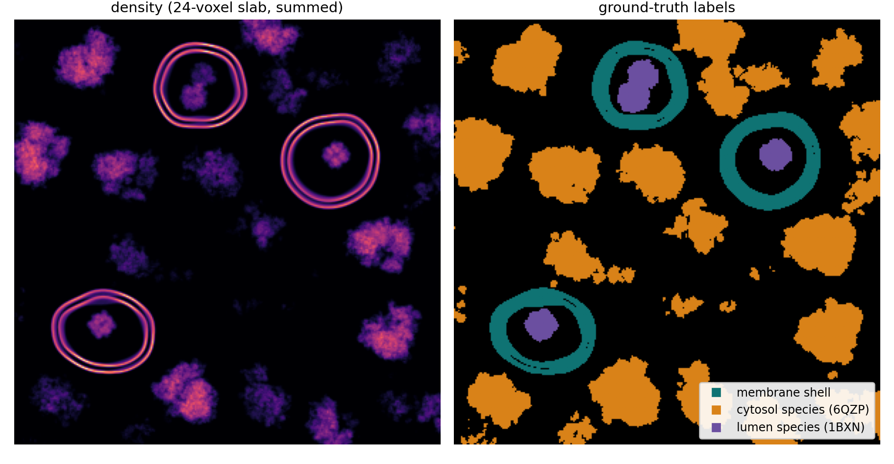
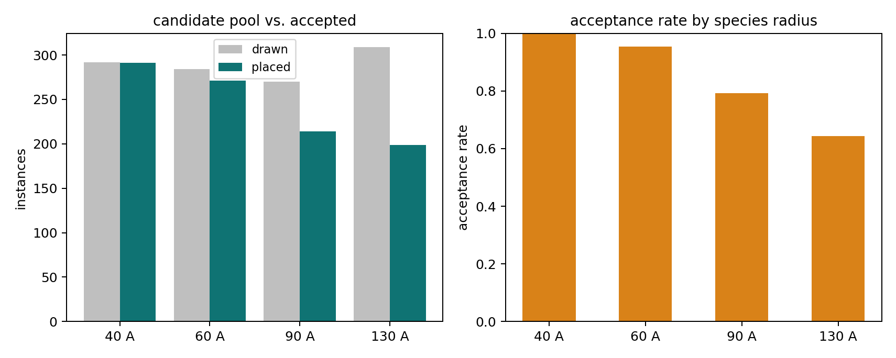
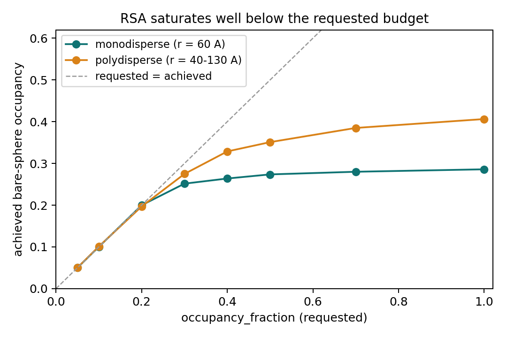
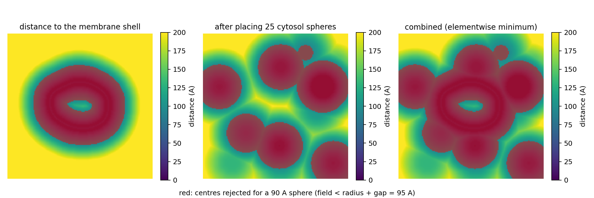
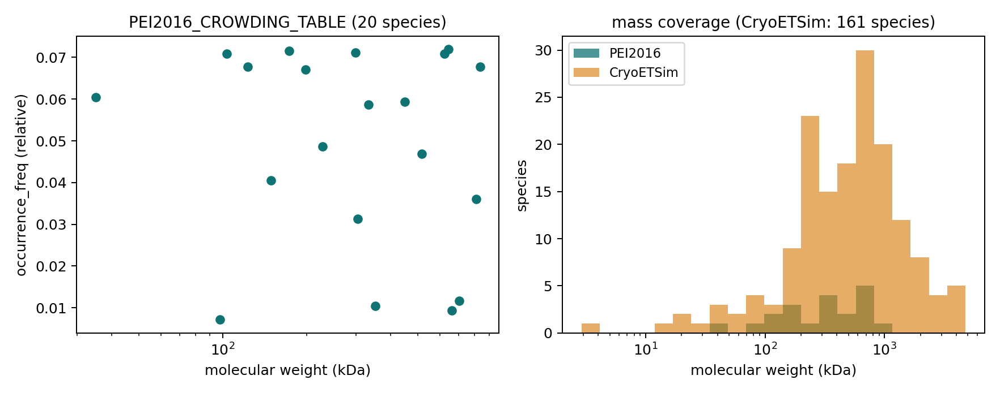

# Regions & protein packing

<div class="grid" markdown>

{ width="440" }

<div markdown>
Protein fill is the last and densest stage of specimen assembly. It
answers two questions per species: *where is this allowed to be*, and
*how many fit*.

The first is topology — classifying the volume into cytosol, lumen and
shell. The second is Random Sequential Addition of hard spheres, obstacle-
and region-aware through a single distance-field mechanism.
</div>

</div>

!!! info "Source"
    `specter.specimen.tomogram._regions`, `specter.specimen.packing`,
    `specter.specimen.cytosolic_filler`. Figures are produced by
    `docs-figures/cryoet_specimen_packing.py`.

## Regions from topology, not geometry

A membrane field's sign only distinguishes lipid-solid from
not-lipid-solid. It says nothing about which *side* of a closed shell a
given empty point is on — and that is exactly what a biologist means by
"in the lumen."

Recovering it needs real topology. The shell's complement is labelled with
connected components (full 26-connectivity, so thresholding noise doesn't
fracture one region into spurious pieces), and whichever component(s)
touch the volume's own boundary faces are called **cytosol** — by
construction that is the one region reachable from outside. Everything
else non-shell is enclosed, and therefore **lumen**.

```
shell   = density > threshold          (bilayer material, and carbon film)
cytosol = complement component(s) touching a boundary face
lumen   = everything else
```

The three masks partition the volume: every voxel belongs to exactly one.

This is deliberately shape-agnostic. It works for a single vesicle,
several disjoint vesicles from one instance or many, a sheet, or no
membrane at all — in which case shell and lumen are empty and the whole
box is cytosol, with no special-casing anywhere. Keying off the membrane
generator's internal shape state instead would have needed a branch per
backend, and would not have handled several disjoint compartments emerging
from one instance.

It also means the **carbon film lands in `shell`** for free. That is not a
misclassification: to this stage, "shell" means dense material nothing may
be packed into, and the film qualifies.

The classification runs **once**, on the composited volume, after every
membrane instance has been merged.

## Two priority tiers

Within each region, species are placed in two passes:

1. **Targets** — `n_copies` on a spec. An exact instance count, placed
   first, into a still-mostly-empty region. This is the annotated ground
   truth and is exported to picks by default.
2. **Filler** — `ratio` on a spec. Packed around the already-placed
   targets, with species drawn in proportion to their ratios, until the
   occupancy budget is reached or the packing jams. Excluded from picks by
   default.

Targets going first is what makes an exact count meaningful — ask for 25
ribosomes after filling the box to jamming with filler and you will not
get 25. Ratios only compare *within* a region: two locations are packed
independently, so a cytosol ratio and a lumen ratio have no relationship.

## RSA hard-sphere packing

Placement is Random Sequential Addition, fully vectorized across
candidates. Spheres are placed **largest-radius-first, in stages** — one
stage per unique radius, carrying accepted spheres forward. Within a
stage, every remaining candidate gets one trial position per pass;
positions are generated and conflict-checked simultaneously through a
`vesin` neighbour list, and candidates conflicting within the same pass
are resolved by a one-shot "local minimum priority wins" independent-set
selection rather than a Python loop over pairs.

That last point is what actually buys the speed: resolving many
candidates' accept/reject decisions per pass, rather than one at a time,
is ~90× faster than a naive one-at-a-time RSA loop at a few thousand
spheres, while still accepting ~99% as many.

{ width="900" style="display:block;margin:1.2em auto;" }

Staging by size matters because a large sphere has more potential conflict
partners than a small one at any given density. Mixing all sizes into one
pool measurably starves the large species; going largest-first gives each
its crack at the box while it is still open. Acceptance still falls with
radius, as above — that is geometry, not a scheduling failure.

### Where the ceiling is

RSA has a hard jamming limit well below random close packing, and
`occupancy_fraction` is therefore a **budget, not a promise**:

{ width="620" style="display:block;margin:1.2em auto;" }

Requested and achieved track each other up to ~0.2 and then part company.
A monodisperse pool saturates near 0.28; a polydisperse one reaches ~0.41,
because small spheres fit into gaps the large ones leave. Raising
`filler_occupancy_fraction` past ~0.5 does nothing but grow the candidate
pool. In practice this is a feature — set it high, let the packing jam,
and the density is whatever the geometry allows without hand-tuning.

If you want *more* achieved occupancy from a reference table, raise the
mass floor rather than the budget: tiny species consume placement slots
RSA jams on while adding almost no volume.

A denser periodic force-biased relaxation backend was benchmarked and
deliberately not used — its per-iteration Python-loop cost runs into hours
at production tomogram scale, and it has no obstacle-avoidance mechanism.
RSA's lower ceiling, reached in seconds, was the actual target.

## One field for obstacles and regions

Both "stay out of the membrane" and "stay inside the lumen" are handled by
the same input: a field giving the physical distance to the nearest
**forbidden** voxel. A candidate is rejected unless the field, sampled at
its centre, exceeds `radius + gap` — i.e. unless its whole sphere clears
the forbidden set.

{ width="900" style="display:block;margin:1.2em auto;" }

A caller wanting both obstacle avoidance and region restriction unions the
masks before taking the distance transform, which is the elementwise
minimum of the two fields — the third panel above. That is how the
protein-fill stage folds in the membrane shell, the carbon film, placed
filaments, placed beads, and already-placed targets, all as one field.

Note the first panel: the valid region includes the vesicle's *interior*.
The distance field alone cannot tell inside from outside — that is exactly
what the region masks are for, and why both mechanisms exist.

### Sampling where the region actually is

For a small compartment there is a second, separate problem. Uniform
box-wide sampling has to blindly get lucky before rejection filtering can
even engage: in a confirmed real case — packing into a small vesicle lumen
whose valid centre region was 0.008% of the box volume — zero of one
candidate was placed within the pass budget, purely from the odds of ever
landing a hit, despite an exactly-computed valid region genuinely
existing.

Passing a `sampling_mask` fixes this by construction: candidates are drawn
from a random `True` voxel of the allowed region (plus sub-voxel jitter)
instead of from the whole box.

The same tightness drives the pass budget. A region covering at least 25%
of the box behaves like an open box — it saturates fast, so the default
`stall_patience` of 15 is enough (verified directly: on a 200×600×600 box
it packed the same pool to within ~3% of `stall_patience=300`'s density in
roughly half the wall time). Below that threshold the much larger
`region_max_passes` (default 300) is used instead, since many consecutive
misses can separate two valid placements.

## Filler reference tables

Two bundled tables save you hand-listing background species. Both are
additive — with each other, and with your own `[[filler]]` entries.

{ width="900" style="display:block;margin:1.2em auto;" }

- **`PEI2016_CROWDING_TABLE`** — 20 species from Pei et al. (2016),
  transcribed from that paper's supplementary Table S1, carrying its own
  relative-abundance weighting. (The paper lists 21; its 2AWB entry was
  obsoleted by the PDB in 2014 and dropped rather than repointed, since it
  would only have duplicated a ribosome-class size range.)
- **`CRYOETSIM_PARTICLE_TABLE`** — broader and categorised, so you can
  select e.g. only distractors or only nucleosomes.

Both route through `build_filler_pool_specs`, which filters by mass range,
category or code and adapts either table to the flat filler spec format.

Treat these as *one reasonable published reference set* for "generic
crowded cytoplasm," not a claim about any specific specimen. There is no
universal answer — composition varies by organism and cell state, and most
of it sits below any real dataset's identification threshold. Swapping in
your own list breaks nothing downstream.

## Parameters at a glance

| Parameter | Meaning | Default |
|---|---|---|
| `location` | `cytosol` or `lumen`, per species | `cytosol` |
| `n_copies` | Exact instance count (target mode) | — |
| `ratio` | Relative abundance among filler species in the same region | 1.0 |
| `occupancy_fraction` | Bare-sphere volume budget, per region | 0.2 (`1.0` in the shipped TOML) |
| `gap` | Minimum surface-to-surface clearance, Å | 5.0 |
| `clip_axes` | Per axis (z, y, x): may an instance's body poke past that wall? | all `False` |
| `region_max_passes` | Pass/stall budget for a tight region | 300 |
| `region_density_threshold` | Shell threshold for classification | 5% of peak |

## Limitations

- **Spheres, not shapes.** Collision tests use each species' bounding
  sphere, so a long or concave molecule reserves more room than it
  occupies, and two of them can graze at the boundary.
- **No spatial structure within a region.** Placement is uniform
  throughout a region; there is no clustering, no gradient, no
  surface affinity. (The single-particle path's
  `MicrographSpecimenGenerator` does offer an air-water-interface
  adsorption bias — this generator has no equivalent. Its realism comes
  from region gating against real membrane geometry instead.)
- **Coarse-field bleed.** For very large boxes the exclusion field is
  built on a coarsened grid, and trilinear sampling near a boundary lets a
  candidate's distance run a couple of Å past the exact value.
- **Jamming, not equilibrium.** RSA densities are not thermodynamically
  meaningful; they are the outcome of an irreversible deposition process.

## References

- Pei, L., Xu, M., Frazier, Z., & Alber, F. (2016). Simulating cryo
  electron tomograms of crowded cell cytoplasm for assessment of automated
  particle picking. *BMC Bioinformatics* 17(1), 405.
- [vesin](https://github.com/Luthaf/vesin) — the neighbour list behind the
  vectorized conflict check.
