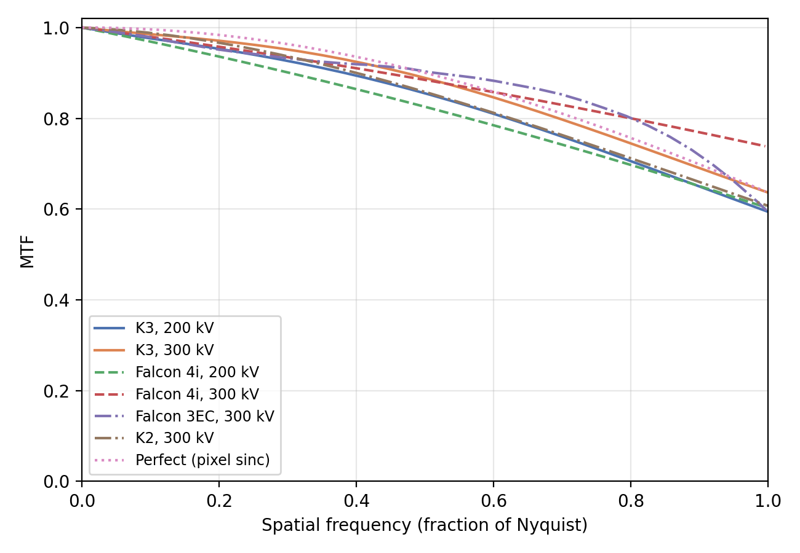
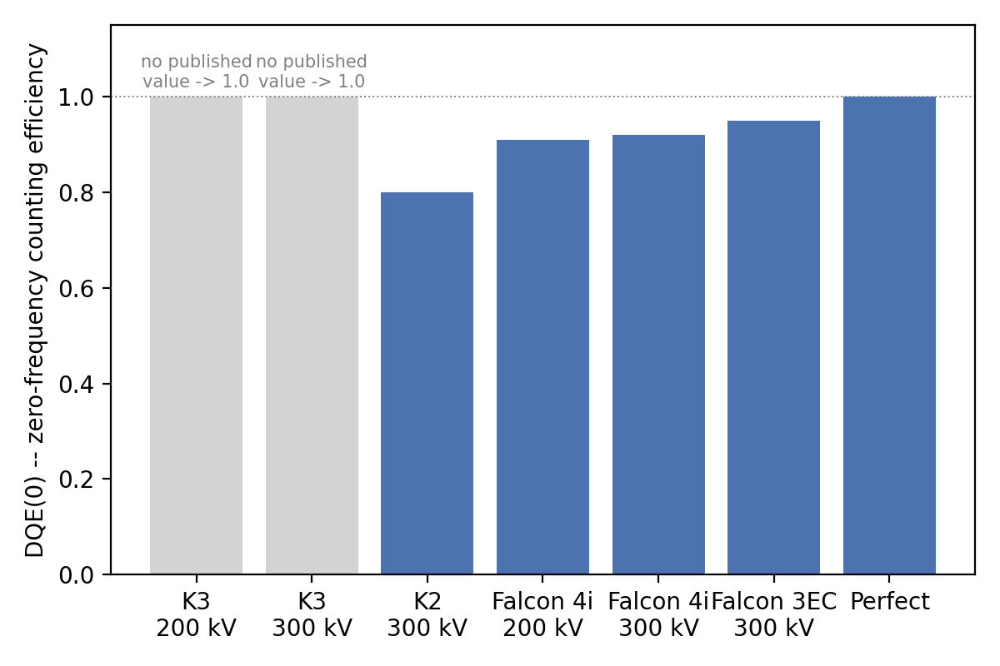
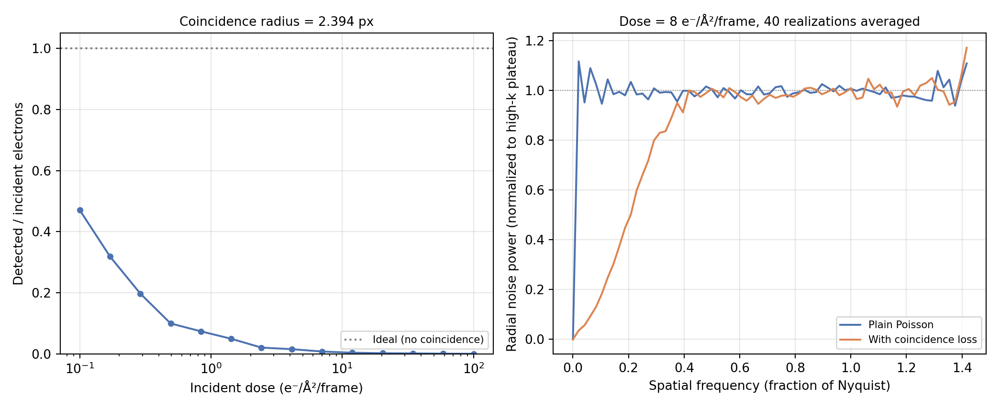

# Detector

The final stage of [forward simulation](forward-simulation.md) converts
the aberrated exit wave into a detector image: intensity formation, MTF
blur, zero-frequency counting efficiency, Poisson shot noise, and, for
direct electron detectors, coincidence loss.

!!! info "Source"
    `specter.microscope.Detector` (image formation, MTF, coincidence
    loss) and `specter.detectors` (bundled MTF/DQE curves per detector
    model). Figures are produced by `docs-figures/detector.py`, which
    calls both directly.

## Intensity formation

`Detector.image` converts the aberrated exit wave to an expected electron
count per pixel, with a model-dependent formula:

\[
\text{holography:}\quad I = D\cdot p^2\cdot d_0 \cdot |\psi|^2,
\qquad
\text{ctf:}\quad I = D\cdot p^2\cdot d_0 \cdot (\psi + 1)
\]

where \(D\) is dose (e⁻/Ų), \(p\) is pixel size, and \(d_0\) is
`dqe0` (below). The holography model takes the squared magnitude of a
genuinely complex exit wave; the CTF model instead adds the real-valued
projected-potential transfer function to a unit background, matching the
weak-phase-object convention `Scattering.ctf` and
`aberration_model="ctf"` share.

## MTF: a pure blur

Every bundled detector MTF (`specter.detectors`) is normalized so
\(\mathrm{MTF}(0) = 1\): applying it can only redistribute signal between
pixels, never destroy it, which is what `Detector.add_mtf`'s Fourier-space
multiply implements.

{ width="600" }
///caption
MTF vs. spatial frequency for every bundled detector model.
///

The K3 curves come directly from [Gatan](https://www.gatan.com/)'s
published MTF datasheets. The Falcon 4i (a
[Thermo Fisher Scientific](https://www.thermofisher.com/) detector) curves
are derived instead from three published DQE points (0,
0.5, and 1x Nyquist) under the white-noise approximation
\(\mathrm{DQE}(k) \approx \mathrm{MTF}(k)^2\), so the *shape* is
recovered as \(\mathrm{MTF}(k) = \sqrt{\mathrm{DQE}(k)/\mathrm{DQE}(0)}\),
normalized by the zero-frequency value so it comes out as a proper MTF,
with quadratic interpolation between the three points. `"perfect"`
is the ideal pixel-integration limit, \(\mathrm{sinc}(\pi k / 2 k_{Nyq})\),
limited only by the finite pixel aperture.

## DQE(0): a separate counting efficiency

\(\mathrm{DQE}(0)\), the fraction of incident electrons a detector
registers *at all*, is a distinct physical effect from the MTF's blur and
is deliberately kept separate: it is applied by scaling the expected
electron count (`dqe0` in `Detector.image`, above) rather than folded into
the MTF. Thinning a Poisson arrival process by a fixed probability leaves
a Poisson process with the scaled mean, so this reproduces both the
reduced signal *and* the correct (reduced) shot noise; folding
\(\mathrm{DQE}(0)\) into the MTF instead would scale counts by
\(\sqrt{\mathrm{DQE}(0)}\) and give the wrong noise statistics entirely.

{ width="500" }
///caption
DQE(0) per detector model.
///

Only Falcon 4i has a traceable low-dose-rate published value; K3's
datasheet publishes an MTF with no accompanying DQE(0) figure, so it
defaults to 1.0 (an ideal counter) rather than guessing. These values
must specifically be *low-dose-rate* DQE(0): published DQE falls with
dose rate largely because of coincidence loss, which specter already
models separately (below). Using a high-flux figure here would count
that loss twice.

## Coincidence loss

Direct electron detectors lose counts when two electrons arrive close
enough together, within one readout frame, that the detector cannot
resolve them as separate events. `Detector.apply_coincidence` models this
with a randomized square-cell exclusion grid (`apply_detector_physics`):
electrons are Poisson-sampled per pixel from the (already MTF-blurred,
dose-scaled) intensity map, jittered to continuous sub-pixel positions,
assigned to grid cells sized so cell area equals the exclusion disc area
\(\pi r^2\), and only the first electron landing in each cell per frame
survives. This is a deliberately simplified, *locally bounded* model
(exclusion cannot chain transitively across a frame the way a
connected-component pairwise model would); its fitted effective
exclusion area matches an exact pairwise disc calculation to within
0.4%.

{ width="900" style="display:block;margin:1.2em auto;" }
///caption
Left: detected/incident electron ratio vs. incident dose, at the Falcon 4i-calibrated coincidence radius. Right: radially averaged noise power spectrum with and without coincidence loss, at a fixed dose, both normalized to their own high-frequency plateau.
///

Two consequences of the same mechanism. On the left, detected efficiency
falls steeply with incident dose rate: more electrons arriving in the
same frame means more of them land within an already-occupied cell.
`coincidence_radius = 2.394` px is calibrated against real Falcon 4i
beam-only micrographs spanning 0.15-31.29 e⁻/px/s, reproducing the
measured detected-electron yield to ~2% RMSE. On the right, the exclusion
mechanism itself imprints a low-spatial-frequency dip in the noise power
spectrum relative to plain Poisson: an electron's presence briefly
excludes its own neighborhood, which suppresses variance at scales larger
than the exclusion radius while leaving the high-frequency (per-pixel)
noise floor essentially untouched. That is exactly the signature reported
for real DED coincidence loss.

`n_frames` controls dose fractionation: the total dose is split across
`n_frames` independent applications of the coincidence model rather than
one large-dose frame, matching how a real detector reads out multiple
frames per exposure.

## References

- Yeo, J., & Loh, N. D. (2026). Pursuing the physics of cryo-EM image
  formation. In *Current Approaches to Cryo-Electron Microscopy*,
  *Progress in Molecular Biology and Translational Science*. Elsevier.
  [doi:10.1016/bs.pmbts.2026.05.001](https://doi.org/10.1016/bs.pmbts.2026.05.001)
- Zambon, P. (2024). Modeling the impact of coincidence loss on count
  rate statistics and noise performance in counting detectors for imaging
  applications. *Frontiers in Physics*, 12, 1408430.
  [doi:10.3389/fphy.2024.1408430](https://doi.org/10.3389/fphy.2024.1408430).
  This is a closed-form treatment of the same phenomenon (Roach's
  statistical-overlap model), which `Detector.apply_coincidence`'s
  spatial simulation does not itself implement. It is useful for the
  DQE/SNR consequences of coincidence loss at the per-pixel statistics
  level, though closed-form per-pixel statistics alone do not reproduce
  the spatially correlated low-frequency power-spectrum dip shown above.
