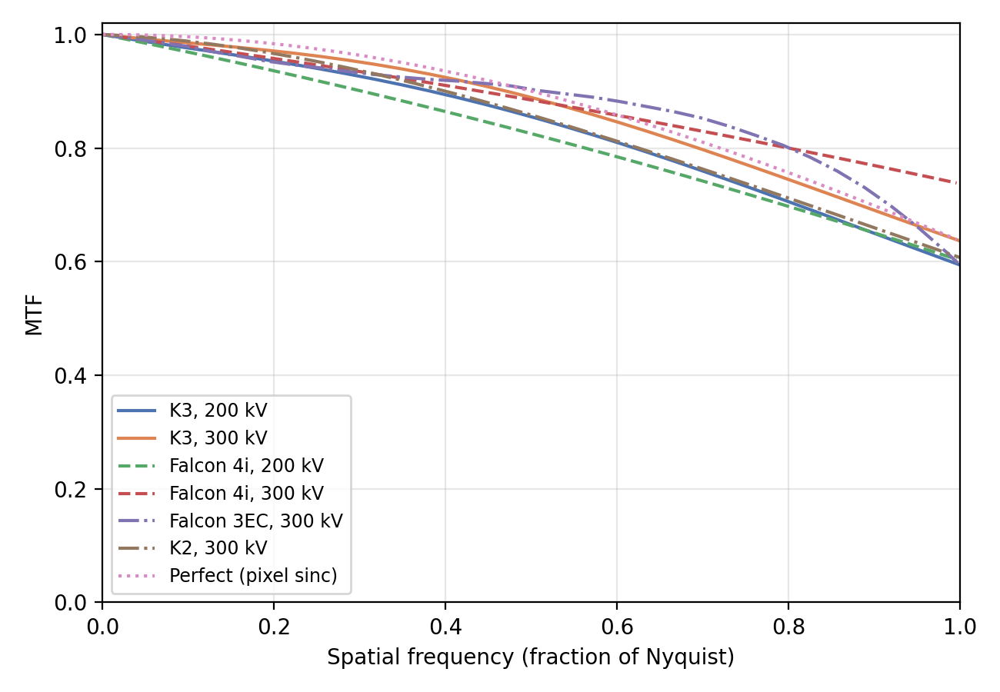
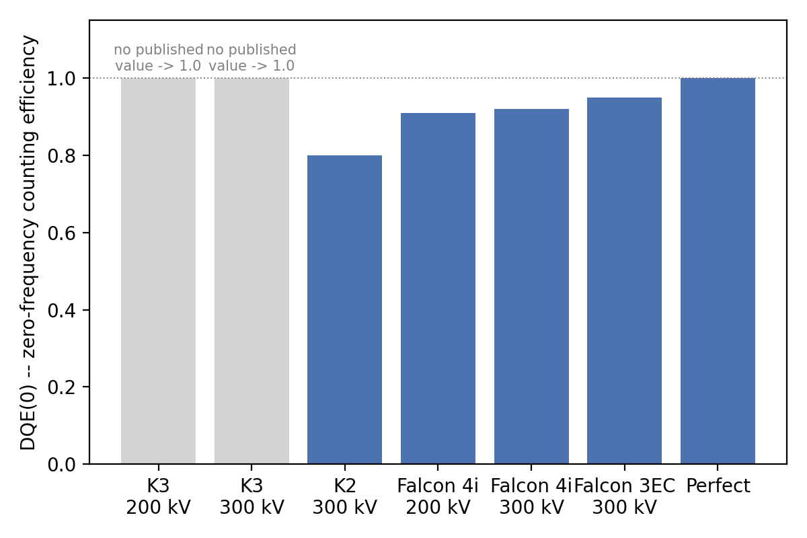
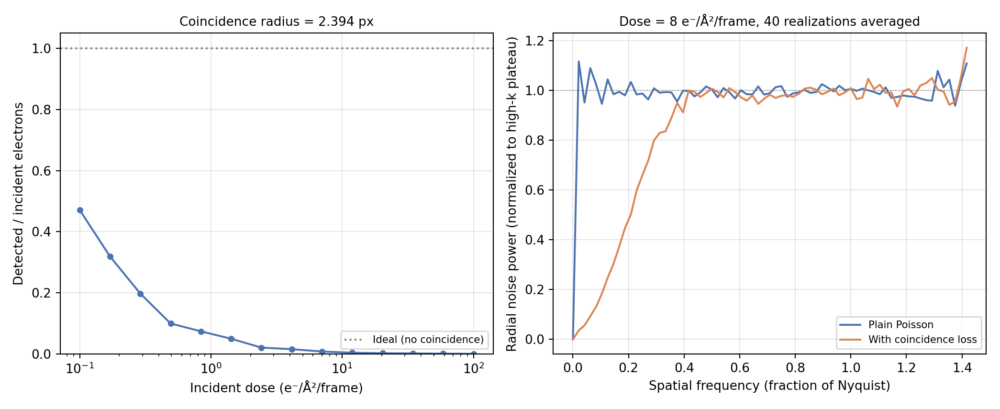

# Detector

The final stage of [forward simulation](forward-simulation.md) converts
the aberrated exit wave into a detector image: intensity formation, MTF
blur, zero-frequency counting efficiency, Poisson shot noise, and, for
direct electron detectors, coincidence loss.

!!! info "Source"
    `specter.microscope.Detector` (image formation, MTF, coincidence
    loss) and `specter.detectors` (bundled MTF/DQE curves per detector
    model). Figures are produced by `docs-figures/detector.py`, which
    calls both directly.

## Intensity formation

`Detector.image` converts the aberrated exit wave to an expected electron
count per pixel, with a model-dependent formula:

\[
\text{nonlinear:}\quad I = D\cdot p^2\cdot d_0 \cdot |\psi|^2,
\qquad
\text{linear:}\quad I = D\cdot p^2\cdot d_0 \cdot (\psi + 1)
\]

where \(D\) is dose (e⁻/Ų), \(p\) is pixel size, and \(d_0\) is
`dqe0` (below). The nonlinear model takes the squared magnitude of a
complex exit wave; the linear model instead adds the real-valued
projected-potential transfer function to a unit background, matching the
weak-phase-object convention `Scattering.ctf` and
`aberration_model="linear"` share.

## MTF: a pure blur

Every bundled detector MTF (`specter.detectors`) is normalized so
\(\mathrm{MTF}(0) = 1\): `Detector.add_mtf`'s Fourier-space multiply
can only redistribute signal between pixels, never destroy it.

{ width="600" }
///caption
MTF vs. spatial frequency for every bundled detector model.
///

The K3 curves come from [Gatan](https://www.gatan.com/)'s
published MTF datasheets. The K2 Summit curve (`k2_300kv`, counting mode at
300 kV) is Gatan's published MTF table on the same frequency grid as the K3
tables, evaluated at the K2's 5 µm physical pixel; supply super-resolution
data binned back to physical pixels. It falls to 0.86 at half Nyquist and
0.61 at Nyquist. The Falcon 4i (a
[Thermo Fisher Scientific](https://www.thermofisher.com/) detector) curves
are derived instead from three published DQE points (0,
0.5, and 1x Nyquist) under the white-noise approximation
\(\mathrm{DQE}(k) \approx \mathrm{MTF}(k)^2\), so SPECTER recovers the
*shape* as \(\mathrm{MTF}(k) = \sqrt{\mathrm{DQE}(k)/\mathrm{DQE}(0)}\),
normalized by the zero-frequency value so it comes out as a proper MTF,
with quadratic interpolation between the three points. The Falcon 3EC
(`falcon3ec_300kv`, High Quality electron-counting mode at 300 kV) uses the same
conversion on a full DQE curve rather than three points: the curve measured by
McMullan and Henderson and published in Thermo Fisher's Falcon 3EC datasheet,
digitised onto the K3 frequency grid. It falls steeply over the last fifth of
the Nyquist range, which three points would not capture. `"perfect"`
is the ideal pixel-integration limit, \(\mathrm{sinc}(\pi k / 2 k_{Nyq})\),
limited only by the finite pixel aperture.

### Images resampled after recording

An MTF is a property of the detector's physical pixel. A particle stack that
was Fourier-cropped or binned from its micrographs has a coarser pixel, and its
Nyquist frequency reaches only part of the detector's. Evaluating the MTF on
the image pixel would stretch the whole curve over the resampled range and
place the detector's Nyquist fall-off at the image's Nyquist. `detector_pixel_size`
(Angstrom) names the pixel the movies were recorded at; the curve is then
evaluated on that pixel and read off at the image's frequencies. For a stack
recorded at 0.514 Å and cropped to 0.703 Å, the image's Nyquist is 0.73 of the
detector's, where the Falcon 3EC MTF is 0.84 rather than the 0.59 it has at the
detector's Nyquist. `specter match particles` reads the recording pixel from the
particle metadata (`location/micrograph_psize_A` in a CryoSPARC `.cs` file,
`rlnMicrographOriginalPixelSize` in a RELION `.star` file) and sets it when it
differs from the particles'. Left unset, the image pixel is taken as the
physical pixel.

## DQE(0): a separate counting efficiency

\(\mathrm{DQE}(0)\), the fraction of incident electrons a detector
registers *at all*, is a distinct physical effect from the MTF's blur,
and stays separate: `Detector.image` applies it by scaling the expected
electron count (`dqe0`, above) rather than folding it into the MTF.
Thinning a Poisson arrival process by a fixed probability leaves a
Poisson process with the scaled mean, so this reproduces both the
reduced signal *and* the correct (reduced) shot noise; folding
\(\mathrm{DQE}(0)\) into the MTF instead would scale counts by
\(\sqrt{\mathrm{DQE}(0)}\) and give the wrong noise statistics.

{ width="500" }
///caption
DQE(0) per detector model.
///

Falcon 4i, Falcon 3EC and K2 have traceable low-dose-rate published values
(0.92, 0.95 and 0.80 at 300 kV); K3's datasheet publishes an MTF with no
accompanying DQE(0) figure, so it defaults to 1.0 (an ideal counter) rather
than guessing. These values
must be *low-dose-rate* DQE(0): published DQE falls with dose rate
largely because of coincidence loss, which SPECTER already models
separately (below). Using a high-flux figure here would count that
loss twice.

## Coincidence loss

Direct electron detectors lose counts when two electrons arrive close
enough together, within one readout frame, that the detector cannot
resolve them as separate events. `Detector.apply_coincidence` models this
with a randomized square-cell exclusion grid (`apply_detector_physics`):
it Poisson-samples electrons per pixel from the (already MTF-blurred,
dose-scaled) intensity map, jitters them to continuous sub-pixel
positions, assigns them to grid cells sized so cell area equals the
exclusion disc area \(\pi r^2\), and keeps only the first electron
landing in each cell per frame. This is a simplified, *locally bounded*
model (exclusion cannot chain by transitivity across a frame the way a
connected-component pairwise model would); its fitted effective
exclusion area matches an exact pairwise disc calculation to within
0.4%.

{ width="900" style="display:block;margin:1.2em auto;" }
///caption
Left: detected/incident electron ratio vs. incident dose, at the Falcon 4i-calibrated coincidence radius. Right: radially averaged noise power spectrum with and without coincidence loss, at a fixed dose, both normalized to their own high-frequency plateau.
///

Two consequences of the same mechanism. On the left, detected efficiency
drops fast with incident dose rate: more electrons arriving in the same
frame means more of them land in an already-occupied cell. The exclusion
radius of the Falcon 4i at 300 kV is calibrated at 2.0 physical pixels
against real beam-only micrographs spanning 0.15-31.29 e⁻/px/s, with the
counting efficiency DQE(0) = 0.92 modelled explicitly, reproducing the
measured detected-electron yield to ~3% RMSE. The K2 Summit's 2.54 physical
pixels is obtained by inverting the same model against Campbell et al.
(2015)'s measurement of a 25% loss at ~12 e⁻/px/s and 400 frames per second.
Both values are listed in `detectors.EXCLUSION_RADIUS_PX`; a radius belongs
to the camera unit and its counting configuration, so it is a prior for
other cameras of the same model, not a constant. On the right, the exclusion
mechanism itself imprints a low-spatial-frequency dip in the noise power
spectrum relative to plain Poisson: an electron's presence excludes its
own neighborhood for an instant, which suppresses variance at scales
larger than the exclusion radius while leaving the high-frequency
(per-pixel) noise floor nearly untouched. That matches the signature
reported for real DED coincidence loss.

### From a detector radius to a simulation radius

The calibrated radius and the `coincidence_radius` setting are in different
units. `EXCLUSION_RADIUS_PX` is in physical detector pixels and applies per
*hardware* frame, the rate at which the camera counts
(`detectors.HARDWARE_FRAME_RATE_HZ`: 320 Hz for the Falcon 4i, 400 Hz for the
K2, 1500 Hz for the K3). `coincidence_radius` is in pixels of the simulated
image and applies per simulated frame, of which there are `n_frames`. A
simulation usually runs at a coarser pixel and with far fewer frames than the
camera recorded, so the radius is converted at constant occupancy, the mean
number of electrons per exclusion cell per frame, on which the mean loss
depends alone:

\[
\lambda = \frac{\dot D_\text{px}}{f_\text{hw}}\,\pi r_\text{det}^2,
\qquad
r_\text{sim} = \sqrt{\frac{\lambda}{\pi\, D\, p^2 / n_\text{frames}}},
\]

with \(\dot D_\text{px}\) the dose rate in e⁻ per physical pixel per second,
\(f_\text{hw}\) the hardware frame rate, \(D\) the image dose in e⁻/Ų and
\(p\) the simulated pixel size (`detectors.coincidence_occupancy` and
`detectors.coincidence_radius_for_simulation`). A Falcon 4i at 4 e⁻/px/s gives
\(\lambda = 4/320 \cdot \pi \cdot 2.0^2 = 0.157\); simulated at 1 Å,
40 e⁻/Ų and 40 frames, that is 1 e⁻ per pixel per frame and
\(r_\text{sim} = 0.22\) px. The conversion preserves the mean loss and its
dependence on contrast, but not the spatial extent of the exclusion, which
only a detector stage run at the physical pixel and frame rate would
reproduce.

`n_frames` controls dose fractionation: it splits the total dose across
`n_frames` independent applications of the coincidence model rather than
one large-dose frame, matching how a real detector reads out multiple
frames per exposure. When `dose_weights_path` (on `Camera`) supplies a
motion-correction job's per-frame exposure-filter weights, their frame count
takes precedence over `n_frames`, since it records the fractionation the
weights were computed for; a mismatch is reported with a warning.

## References

- Yeo, J., & Loh, N. D. (2026). Pursuing the physics of cryo-EM image
  formation. In *Current Approaches to Cryo-Electron Microscopy*,
  *Progress in Molecular Biology and Translational Science*. Elsevier.
  [doi:10.1016/bs.pmbts.2026.05.001](https://doi.org/10.1016/bs.pmbts.2026.05.001)
- Campbell, M. G., Veesler, D., Cheng, A., Potter, C. S., & Carragher, B.
  (2015). 2.8 Å resolution reconstruction of the *Thermoplasma acidophilum*
  20S proteasome using cryo-electron microscopy. *eLife*, 4, e06380.
  [doi:10.7554/eLife.06380](https://doi.org/10.7554/eLife.06380)
- Zambon, P. (2024). Modeling the impact of coincidence loss on count
  rate statistics and noise performance in counting detectors for imaging
  applications. *Frontiers in Physics*, 12, 1408430.
  [doi:10.3389/fphy.2024.1408430](https://doi.org/10.3389/fphy.2024.1408430).
  This is a closed-form treatment of the same phenomenon (Roach's
  statistical-overlap model), which `Detector.apply_coincidence`'s
  spatial simulation does not itself implement. It is useful for the
  DQE/SNR consequences of coincidence loss at the per-pixel statistics
  level, though closed-form per-pixel statistics alone do not reproduce
  the spatially correlated low-frequency power-spectrum dip shown above.
