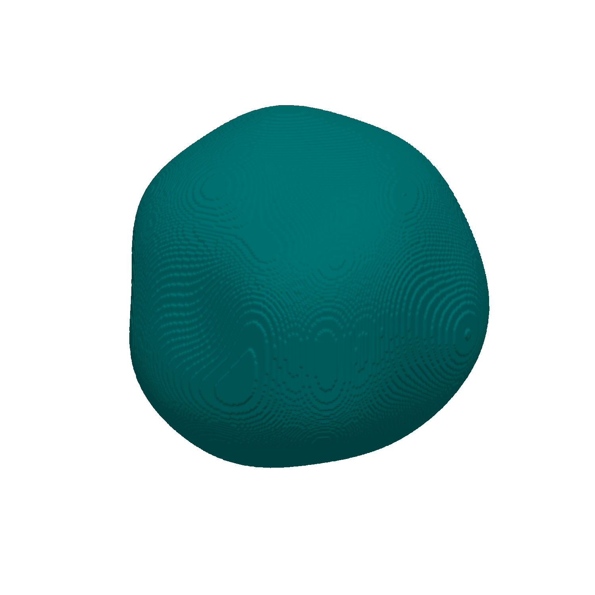
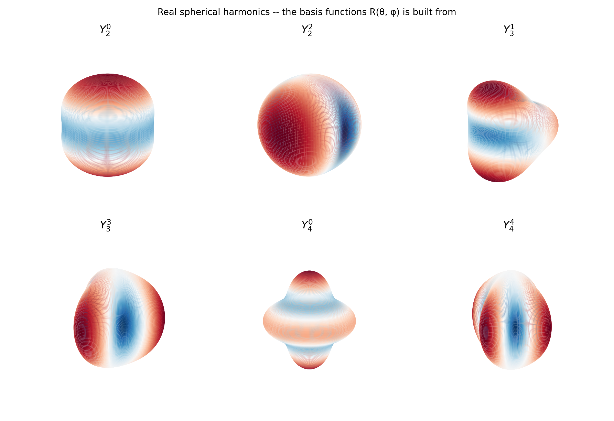
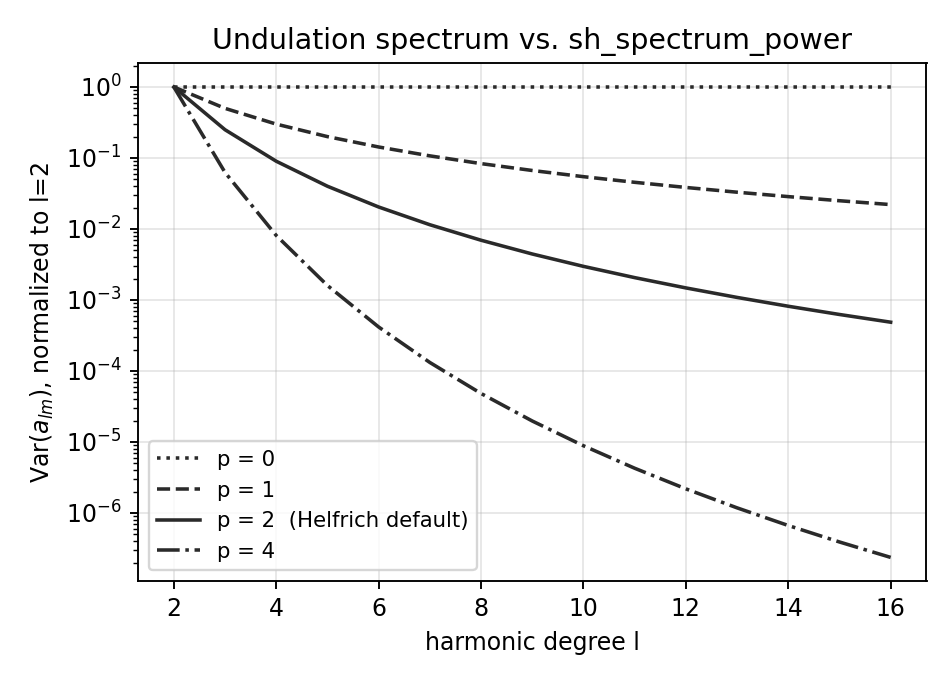
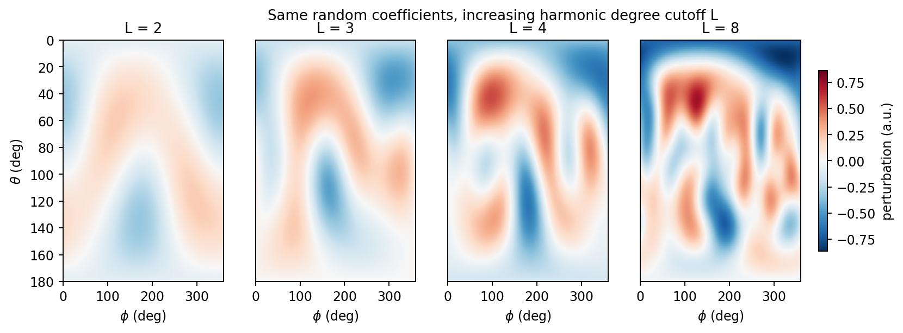
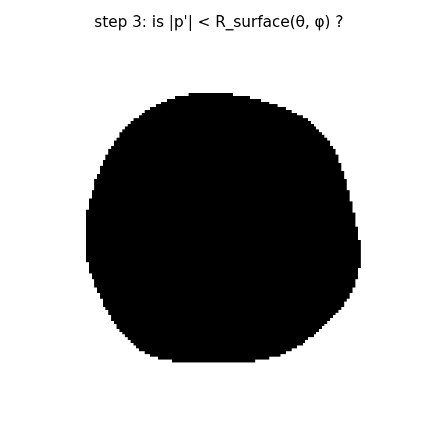
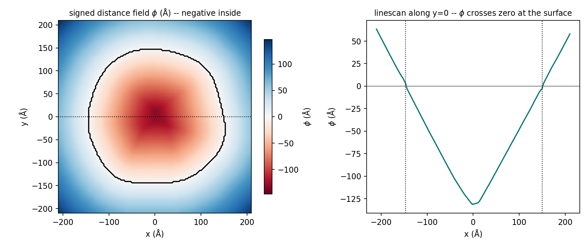
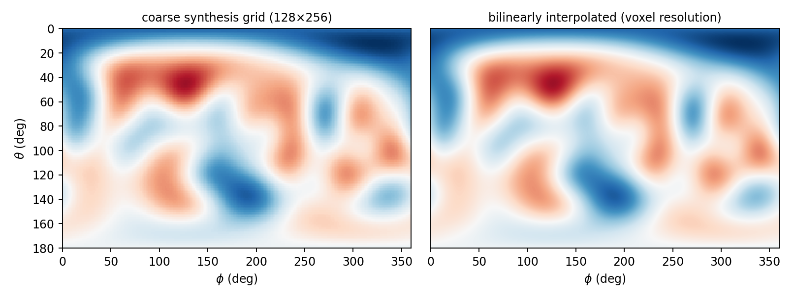
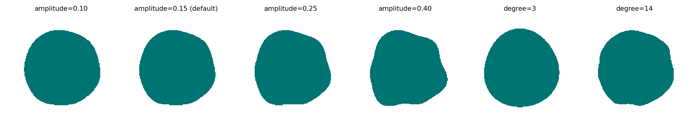
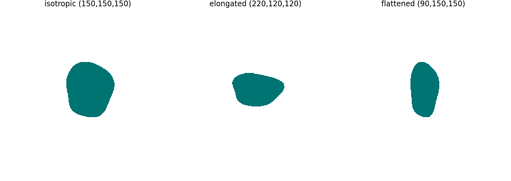

# Membrane shape: spherical harmonics

{ width="420" }

`MembraneGenerator` builds vesicles, nuclei, and mitochondria by perturbing
an ellipsoid with a random spherical-harmonic expansion
(`shape_backend="spherical_harmonics"`, the default). This page covers how
that shape is constructed.

!!! info "Source"
    Walks through `specter.specimen.membrane._field_spherical_harmonics`.
    Figures are produced by `docs-figures/membrane_shape.py`, which calls
    the same private helpers as the real code path.

## Star-convex surfaces

The method requires star-convexity: every ray from the organelle's center
crosses the surface exactly once. True for vesicles, nuclei, and most
mitochondria.

A star-convex surface reduces to one scalar function of direction:

\[
R(\theta, \phi)
\]

## Surface as a sum of harmonics

\[
R(\theta, \phi) = 1 + a \sum_{l=2}^{L} \sum_{m=-l}^{l} c_{lm}\, Y_l^m(\theta, \phi)
\]

- \(Y_l^m\): real spherical harmonics, degree \(l\), order \(m\).
- \(a\) = `sh_amplitude`: perturbation size, as a fraction of the base radius.
- \(L\) = `sh_max_degree`: highest degree included.
- \(l=0\) (uniform offset) and \(l=1\) (pure translation) carry no shape
  information and are excluded.

{ width="720"  style="display:block;margin:1.2em auto;" }

The organelle's shape is a sum of these patterns with random coefficients
\(c_{lm}\).

## Coefficient spectrum

\[
c_{lm} \sim \mathcal{N}\!\left(0,\ \big[l(l+1)\big]^{-p}\right)
\]

\(p\) is `sh_spectrum_power`. \(p = 2\) (default) reproduces the Helfrich (1973) thermal bending-mode
spectrum of a lipid bilayer: long-wavelength undulations dominate,
short-wavelength wrinkles are suppressed. Lower \(p\) shifts weight toward
finer, less membrane-like roughness.

{ width="420"  style="display:block;margin:1.2em auto;" }

Coefficients are rescaled so \(\sum_{l,m} c_{lm}^2 = 1\). Since the
\(Y_l^m\) are orthonormal, Parseval's theorem fixes the perturbation's RMS
to exactly \(1\) regardless of `sh_max_degree`/`sh_spectrum_power` --
`sh_amplitude` alone sets the overall scale.

{ width="900"  style="display:block;margin:1.2em auto;" }

Same random draw, increasing \(L\): more terms add finer wrinkles on top of
the same broad shape.

## Radius function to solid

For every voxel: transform its position into a frame scaled by the
organelle's semi-axes `sh_axes_a`, giving a local radius \(|p'|\) and
direction \((\theta, \phi)\). The voxel is inside if

\[
|p'| < R(\theta, \phi)
\]

{ width="380"  style="display:block;margin:1.2em auto;" }

## Solid to signed distance field

Protein placement and bilayer rasterization need distance to the surface,
not just inside/outside. SPECTER builds a signed distance field \(\phi\)
(negative inside, positive outside, zero at the surface) via two Euclidean
distance transforms:

\[
\phi = \mathrm{EDT}(\text{outside}) - \mathrm{EDT}(\text{inside})
\]

This is used instead of the radial residual \(|p'| - R(\theta,\phi)\): that
residual's error grows with local slope and would distort the bilayer's
calibrated thickness at high curvature.

{ width="900"  style="display:block;margin:1.2em auto;" }

Left: \(\phi\) over one slice (red = inside, blue = outside), zero contour
in black. Right: a linescan through the center, showing \(\phi\) crossing
zero at the surface.

## Fast harmonic synthesis

Evaluating the harmonic sum at every voxel's own direction is expensive
(~70s at a 10M-voxel grid). Since the perturbation is band-limited to
degree \(L\), it's instead synthesized once on a small \((n_\theta, n_\phi)\)
grid and bilinearly interpolated per voxel.

{ width="800"  style="display:block;margin:1.2em auto;" }

Interpolation error is ~0.17% of the perturbation's RMS -- well below the
distance-transform's own discretization noise -- for a 30-150x reduction in
wall time.

## Parameters

| Parameter | Meaning | Default |
|---|---|---|
| `sh_max_degree` | Highest harmonic degree \(L\) | 8 |
| `sh_axes_a` | Physical semi-axes \((a_x, a_y, a_z)\), Å | `(300, 300, 300)` |
| `sh_amplitude` | RMS fractional radius perturbation \(a\) | 0.15 |
| `sh_spectrum_power` | Exponent \(p\) in \(\mathrm{Var}(c_{lm}) \propto [l(l+1)]^{-p}\) | 2.0 |

{ width="900"  style="display:block;margin:1.2em auto;" }

`sh_amplitude=0.15`: 0.10 is close to spherical, 0.40 produces visible
concave dimples, 0.15 is the smallest value that reads as organic without
concavity artifacts.

{ width="700"  style="display:block;margin:1.2em auto;" }

`sh_axes_a` sets the base ellipsoid the perturbation rides on.

## Limitations

- **Star-convex only.** Branching tubules, self-occluding folds, or anything
  where a ray from the center crosses the surface more than once cannot be
  represented.
- **Grid resolution matters.** Below about 8 voxels per radius, surface
  sampling for protein placement may silently find zero sites; the
  generator warns explicitly when this happens.
- **The SDF has voxel-scale texture**, visible as a faint ripple under
  raking light (see the hero image) -- an expected consequence of computing
  distance to the nearest boundary voxel rather than the continuous
  surface. It's below the scale that affects the bilayer profile.
