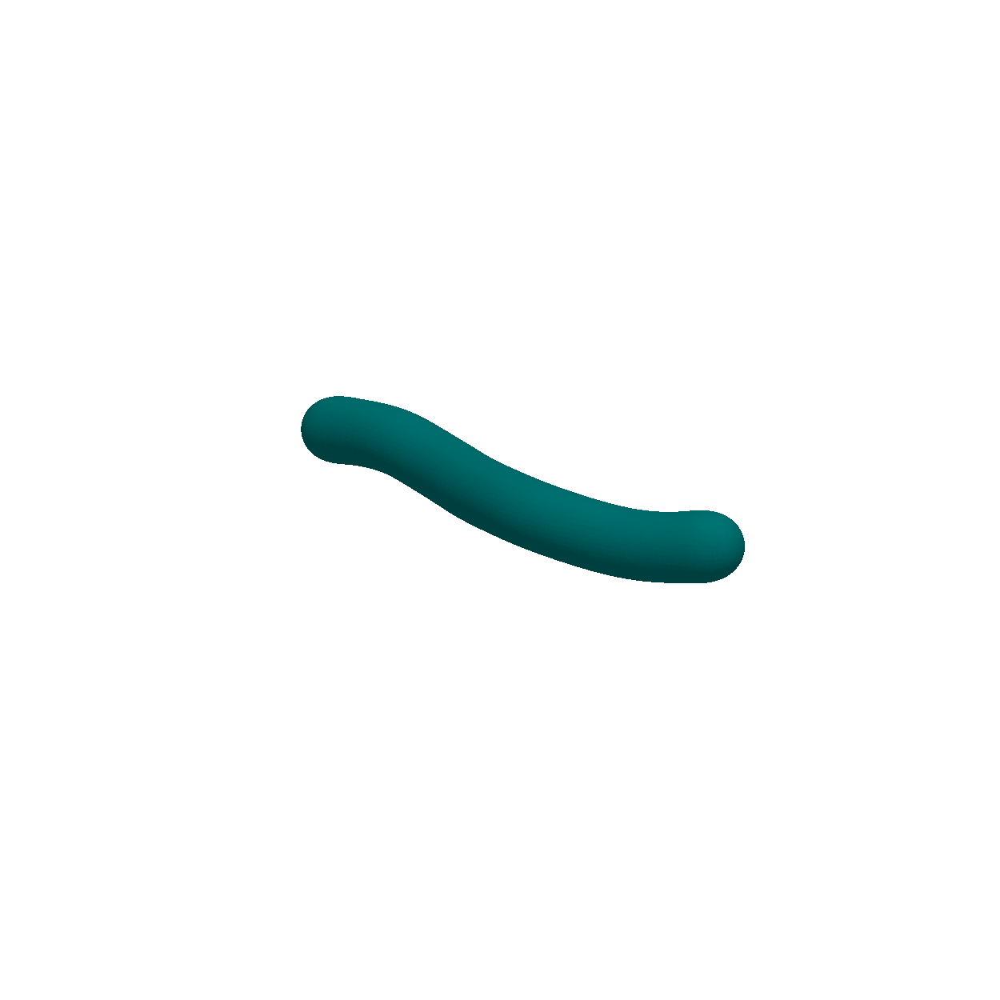
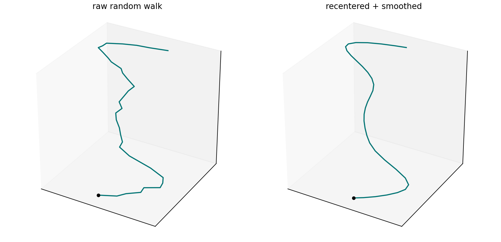
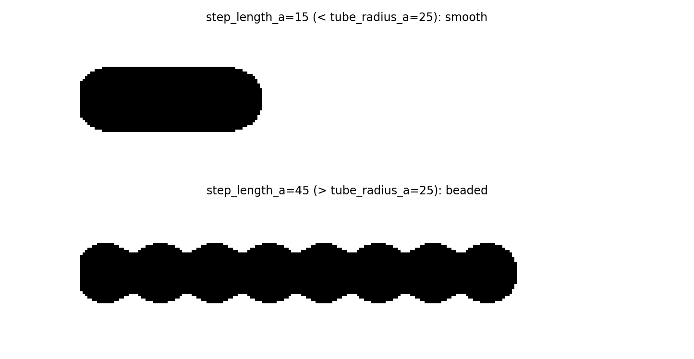
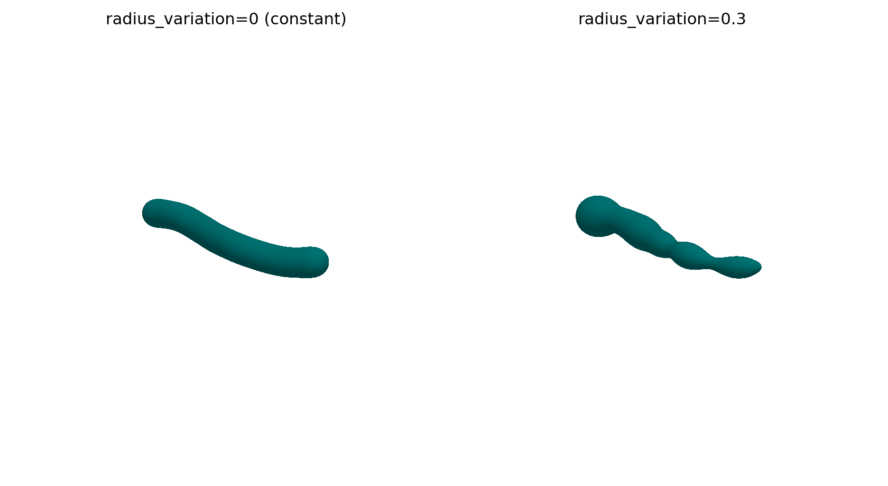
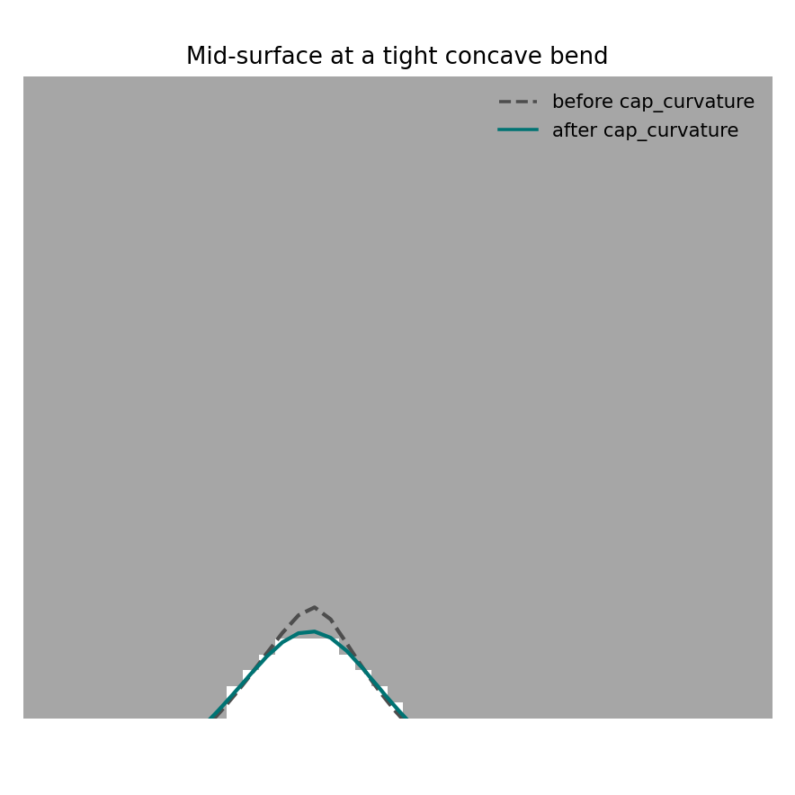
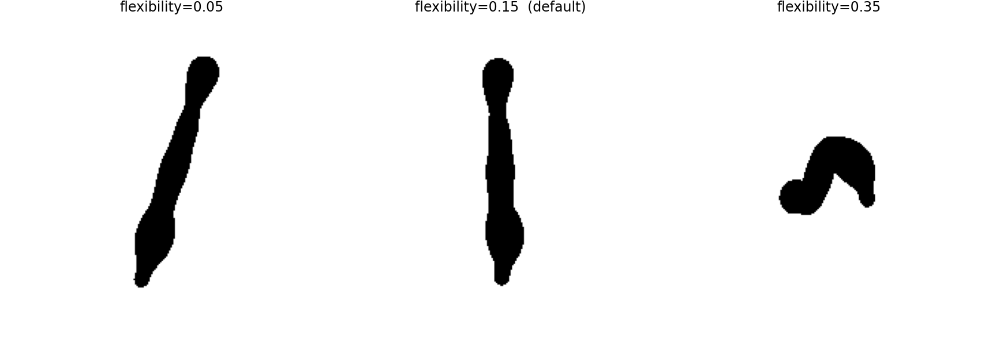

# Membrane shape: swept spline

{ width="620" style="display:block;margin:1.2em auto;" }
///caption
A random wandering tube, rendered as a shaded 3D isosurface.
///

`MembraneGenerator` builds elongated, wandering tubes
(`shape_backend="swept_spline"`) by sweeping a sphere along a smooth random
path. This is the complement to the
[spherical harmonics](spherical-harmonics.md) backend: when a tube curls
back near itself, rays from a single center cross it more than once, so
it cannot be star-convex.

!!! info "Source"
    Walks through `specter.specimen.membrane._field_swept_spline`. Figures
    are produced by `docs-figures/membrane_shape_swept_spline.py`, which
    calls the same private helpers as the real code path.

## Persistent random walk

The path is a persistent (direction-correlated) random walk. Each step's
direction blends the previous direction with a fresh random one:

\[
d_i = \frac{(1-f)\,d_{i-1} + f\,u_i}{\lVert(1-f)\,d_{i-1} + f\,u_i\rVert}
\]

\(f\) is `flexibility`, \(u_i\) a random unit vector. Low \(f\) gives long,
gentle curves; \(f\) near 1 gives a tight, wandering path.

SPECTER recenters the raw walk (bounding-box midpoint to the origin) and
smooths it along path order with a 1D Gaussian filter, not spatial
smoothing, since a sinuous path can curl close to itself and spatial
smoothing would then average together points that are near in space but far
apart along the path.

{ width="700" style="display:block;margin:1.2em auto;" }
///caption
Raw random walk next to the recentered, path-order-smoothed version used for sphere placement.
///

## Sweeping a tube

Each path point becomes a sphere of radius `tube_radius_angstrom`. SPECTER
combines the spheres with a polynomial [smooth-min](#references), the
same construction [metaballs](https://en.wikipedia.org/wiki/Metaballs)
use, applied to a chain instead of scattered blobs:

\[
h = \mathrm{clamp}\!\left(\tfrac12 + \tfrac{b-a}{2k},\ 0,\ 1\right), \qquad
\mathrm{smin}(a, b) = (1-h)\,b + h\,a - k\,h(1-h)
\]

where \(a, b\) are two spheres' signed distances and \(k\) is
`blend_sharpness_angstrom`. Because this is an analytic blend of exact sphere
SDFs, the result already satisfies the Eikonal property
(\(|\nabla\phi| \approx 1\)), so SPECTER needs no separate
distance-transform step here, unlike the EDT-derived backends.

Spacing consecutive spheres (`step_length_angstrom`) too far apart relative to
`tube_radius_angstrom` produces visible beading instead of a continuous tube:

{ width="700" style="display:block;margin:1.2em auto;" }
///caption
Longitudinal slice through a straight chain of spheres: smooth fusion vs. visible beading.
///

## Varying the radius

`tube_radius_angstrom` does not have to be constant. `radius_variation` draws a
per-sphere radius instead: SPECTER takes Gaussian noise, one value per
path point, smooths it along path order
(`radius_variation_sigma_points`), and applies it multiplicatively, the
same amplitude-normalized-perturbation pattern the
[spherical harmonics](spherical-harmonics.md) backend uses for its own
random radius function:

\[
r_i = \texttt{tube\_radius\_a} \cdot \max(1 + a\,n_i,\ 0.25)
\]

with \(n_i\) the smoothed, unit-RMS noise and \(a\) = `radius_variation`.
The radius noise is not a second persistent random walk like the path
direction: direction lives on a bounded sphere, so a persistent walk
there wanders in place, but radius is unbounded, and an actual random
walk in radius would drift over a long path. Smoothed noise stays
anchored to `tube_radius_angstrom` regardless of path length.

{ width="800" style="display:block;margin:1.2em auto;" }
///caption
Same random path, constant vs. varying radius.
///

Both tubes above come from the same seed. Path sampling happens before
the radius draw, so the underlying wander is identical; only the caliber
differs.

This changes what the beading check means, too: with `radius_variation >
0`, the local radius will occasionally dip below `step_length_angstrom` wherever
the noise is low. That's intentional: since the noise is smooth and
non-periodic, those dips land at irregular, uncorrelated points along the
tube, reading as sparse varicosities rather than the mechanical,
repeating beading pattern the check exists to catch. The check therefore compares
`step_length_angstrom` against the *mean* drawn radius, not the local minimum, so
it only fires when beading would be the norm rather than the occasional
exception.

## Curvature capping

A smooth-min blend can still have sharp concave curvature at tight bends,
which risks the bilayer's \(\pm\)half-thickness leaflet offset
self-intersecting. `cap_curvature` runs a cheap proxy for
[mean curvature flow](https://en.wikipedia.org/wiki/Mean_curvature_flow):
repeated diffusion steps nudge each voxel toward its local Laplacian,

\[
\phi \leftarrow \phi + s\,\nabla^2 \phi
\]

damping sharp features fastest while leaving already-smooth regions
nearly unchanged.

{ width="420" style="display:block;margin:1.2em auto;" }
///caption
Mid-surface contour at a tight concave bend, before and after cap_curvature.
///

The concave corner fills in slightly (surface pulled outward) and the
adjacent convex bulge is pulled inward; both reduce local curvature.

## Parameters at a glance

| Parameter | Meaning | Default |
|---|---|---|
| `flexibility` | Direction-correlation \(f\) of the random walk | 0.15 |
| `total_length_angstrom` | Path contour length, Å | 500.0 |
| `step_length_angstrom` | Spacing between sphere centers, Å | 15.0 |
| `tube_radius_angstrom` | Tube radius, Å | 25.0 |
| `radius_variation` | RMS fractional radius variation \(a\) | 0.0 |
| `radius_variation_sigma_points` | Path-order smoothing for the radius noise, points | 2.0 |
| `blend_sharpness_angstrom` | Smooth-min blend radius \(k\), Å | `0.5 * tube_radius_angstrom` |
| `curvature_iterations` | Number of Laplacian relaxation steps | 15 |

{ width="900" style="display:block;margin:1.2em auto;" }
///caption
Flexibility swept from a nearly straight rod to a tightly wandering, near-self-touching walk.
///

`flexibility=0.15`: 0.05 is nearly a straight rod, 0.35 produces a sharp,
near-self-touching bend (a good stress case, not a good default); 0.15
gives a soft, organic, non-straight tube with no beading at the other
defaults.

## Limitations

- **No branching.** The path is a single line; it cannot represent
  Y-junctions or networked tubule topology.
- **Beading if mis-tuned.** `step_length_angstrom` must stay well under
  `2 * tube_radius_angstrom`; the generator warns when it does not.
- **`cap_curvature` is an approximate proxy**, not exact mean curvature
  flow. An extreme enough bend can still leave a thin margin between
  leaflets even after relaxation.

## References

- Iñigo Quilez, [Smooth minimum](https://iquilezles.org/articles/smin/).
