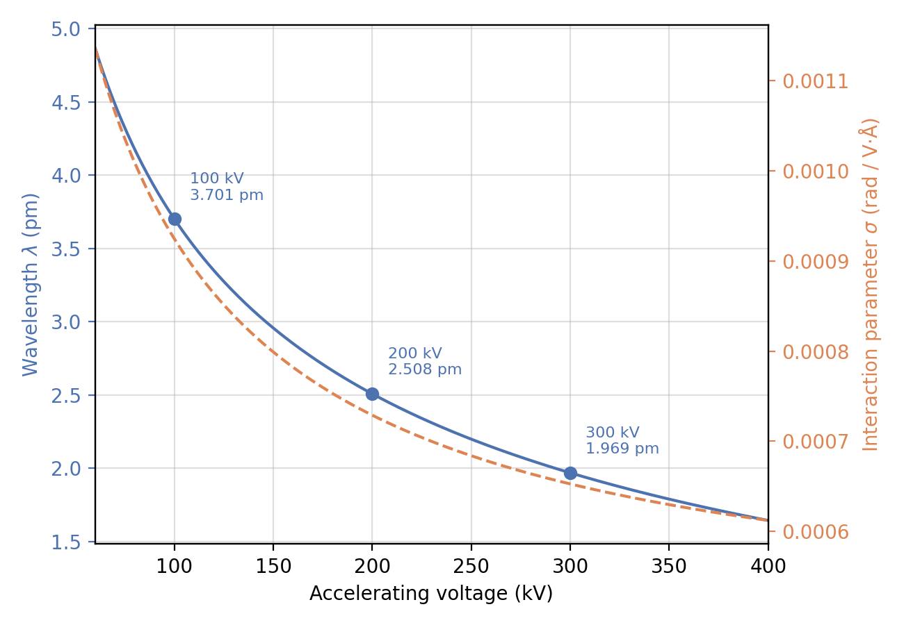

# Scattering

Once a [specimen](../specimens.md) potential volume \(V(x,y,z)\) exists,
[forward simulation](../forward-simulation.md) starts by propagating an
electron plane wave through it to obtain a complex-valued 2D exit wave
\(\psi(x,y)\) at the specimen's far face. `Scattering` (eager,
whole-volume) and `IterativeScattering` (on-the-fly slice sampling under
rotation, used by `TiltSeriesGenerator`) both implement this as one of
several propagation models, selected by `scattering_model`:
`"multislice"` (default, most accurate), `"rytov"`, `"firstborn"`,
`"kinematic"`, and `"projection"`, in roughly decreasing order of physical
accuracy and increasing order of speed. Every model shares the same two
physical quantities.

!!! info "Source"
    `specter.scattering.Scattering` / `IterativeScattering`.
    `docs-figures/scattering_overview.py` and
    `docs-figures/scattering_accuracy.py` produce the figures below,
    calling the same classes the real code path does.

## Two numbers set the whole propagation problem

An electron accelerated through voltage \(U\) (kV) has a relativistic de
Broglie wavelength (`energy_to_wavelength`, Kirkland Ch. 2):

\[
\lambda = \frac{hc}{\sqrt{eU\,(eU + 2 m_e c^2)}}
\]

and interacts with the specimen's electrostatic potential through the
interaction parameter (`interaction_parameter`, Kirkland Eq. 5.6):

\[
\sigma = \frac{2\pi}{\lambda\, eU}\cdot\frac{eU + m_e c^2}{eU + 2 m_e c^2}
\]

where \(m_e c^2 = 511\) keV is the electron rest mass energy. \(\sigma\)
turns a potential (in volts) into a phase (in radians): every
propagation model below multiplies \(V\) by \(\sigma\) before doing
anything else with it. `Scattering` evaluates both quantities once per
instance and reuses them for every slice and every particle.

{ width="600" }
///caption
Wavelength and interaction parameter vs. accelerating voltage, with the standard 100/200/300 kV checkpoints marked.
///

300 kV gives \(\lambda = 1.9687\) pm, matching the standard textbook
checkpoint (1.969 pm) used elsewhere in this documentation to validate
physics-critical code (see [Atomic potentials](../atomic-potentials.md)).
Both \(\lambda\) and \(\sigma\) fall monotonically with voltage: a faster
electron has a shorter wavelength and interacts more weakly per unit
potential, which is why higher-voltage microscopes penetrate thicker
specimens with less multiple scattering.

## Choosing a propagation model

| Model | Exit wave | Cost | Use |
|---|---|---|---|
| [`multislice`](multislice.md) | Full recursive transmit/propagate | \(O(n_z)\) sequential FFT pairs | Default; most accurate for thick specimens |
| [`rytov`](rytov.md) | Exponentiated, parallel sum over slices | \(O(n_z)\) parallel FFT pairs | `Ghostbuster`'s default reconstruction model |
| [`firstborn`](other-modes.md) | Linearized, parallel sum over slices | \(O(n_z)\) parallel FFT pairs | Thin, weakly scattering specimens |
| [`kinematic`](other-modes.md) | Un-linearized single-scattering sum | \(O(n_z)\) parallel FFT pairs | Rarely more accurate than `firstborn` in practice; see [Other propagation modes](other-modes.md) |
| [`projection`](other-modes.md) | Projected potential, no propagation | One FFT-free sum | Fastest; thin specimens or coarse previews |

All five agree closely for a thin specimen and diverge as thickness
grows, since `multislice` is the only one that repeatedly re-propagates
the wave between scattering events rather than approximating the whole
volume as a single scattering step. See
[Rytov](rytov.md#accuracy-vs-thickness) and [Other propagation
modes](other-modes.md#accuracy-vs-thickness) for the measured error curves.

## Two conventions shared by every model

**Ewald sphere curvature sign.** Before propagation, `ews_curvature_sign`
(`"negative"` by default, `"positive"` to match [CryoSPARC](https://cryosparc.com/)) determines
whether the volume's Z-slices traverse front-to-back or
back-to-front (`torch.flip(V, dims=(1,))`). Multislice, Rytov, and first
Born each propagate a slice's contribution a different net distance to
the exit plane, so reversing the traversal order changes which face of
the specimen accumulates the least propagation and which the most.

**Amplitude contrast.** `alpha` (0 by default) sets the fraction of the
potential treated as absorptive, via `potential.apply_amplitude_contrast`:
\(V \to V\,(\sqrt{1-\alpha^2} + i\alpha)\). `potential.apply_amplitude_contrast` applies
this once, upstream of every model except `"ctf"` (a projected-potential-only
mode that feeds directly into the aberration stage; see
[Aberrations](../aberrations.md)), so a single `alpha` value carries
through the whole propagation.

## `Scattering` vs. `IterativeScattering`

`Scattering` takes an already-rotated, already-padded volume and runs the
whole recursion eagerly. `IterativeScattering` instead samples Z-slices
on the fly from a volume under an arbitrary affine pose
(`VolumeRotator.sample_rotated_slices`), which is what
`TiltSeriesGenerator` uses: at large tilt angles the traversed slice count
`nz_new` exceeds the volume's own Z-extent, and resampling per-slice
avoids ever materializing a second full-size rotated copy of the volume.
Both classes implement the same five models with the same formulas; only
the source of each Z-slice differs.

## References

- Yeo, J., & Loh, N. D. (2026). Pursuing the physics of cryo-EM image
  formation. In *Current Approaches to Cryo-Electron Microscopy*,
  *Progress in Molecular Biology and Translational Science*. Elsevier.
  [doi:10.1016/bs.pmbts.2026.05.001](https://doi.org/10.1016/bs.pmbts.2026.05.001)
