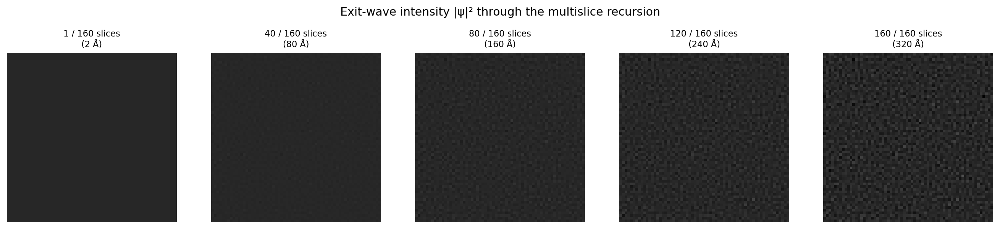
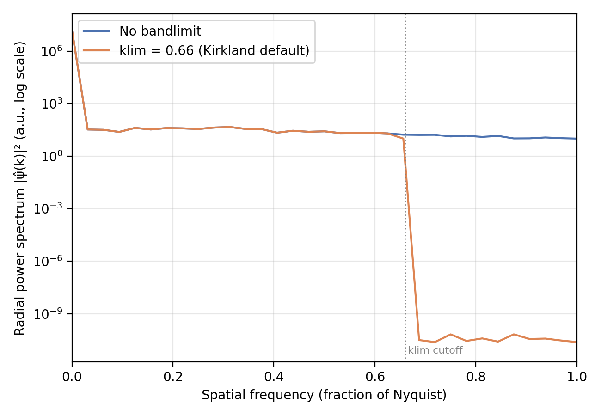

# Multislice

`scattering_model="multislice"` is the default and most accurate
propagation model. It follows Kirkland's multislice formalism (Kirkland,
Ch. 6; see References): alternate multiplying the wave by each slice's
transmission function with propagating it a fixed distance (one voxel of
Z) via a Fresnel propagator, repeated once per Z-slice of the potential
volume.

!!! info "Source"
    `Scattering.multislice` / `IterativeScattering.multislice`. Figures
    are produced by `docs-figures/scattering_accuracy.py`, which
    reproduces the same recursion `Scattering.multislice` runs internally
    (reading its registered Fresnel propagator and \(\sigma\) directly) so
    the traced intermediate states cannot drift from what the real
    implementation computes.

## The recursion

For slice index \(i\) with potential \(V_i\), the wave just after
transmission through that slice is

\[
\psi_i^{\,\mathrm{post}} = t_i \, \psi_{i-1}, \qquad
t_i = \exp\!\big(i\,\sigma\,\Delta z\, V_i\big)
\]

where \(\Delta z\) is the slice thickness (`Scattering` assumes
\(\Delta z = \) `pixel_size`, i.e. a cubic voxel) and \(\sigma\) is the
[interaction parameter](index.md#two-numbers-set-the-whole-propagation-problem).
The wave is then Fresnel-propagated one slice forward before the next
transmission:

\[
\psi_i = \mathcal{F}^{-1}\!\big[\mathcal{F}[\psi_i^{\,\mathrm{post}}]\cdot F\big],
\qquad
F(k) = \exp\!\big(i\pi\lambda\,\Delta z\,k^2\big)
\]

\(F\) is the paraxial (small-angle) Fresnel propagator for one slice
thickness; it depends only on \(\lambda\), \(\Delta z\), and spatial
frequency \(k\), so it is computed once at construction time and reused
for every slice and every particle in a batch. `Scattering` starts the
recursion at \(\psi_0 = t_0\) (a unit incident wave on the first slice)
and returns \(\psi_{n_z-1}\) after all \(n_z\) slices.

## Watching the recursion accumulate

The figure below traces this recursion through a real potential volume: a
320 Å-thick `RandomIcemaker` vitreous-ice slab (2 Å pixels, 300 kV),
showing the exit-wave intensity \(|\psi|^2\) after 1, 40, 80, 120, and all
160 slices.

{ width="900" style="display:block;margin:1.2em auto;" }

After a single slice the intensity is uniform: a thin phase object barely
perturbs \(|\psi|^2\), since a pure phase factor \(e^{i\phi}\) has unit
magnitude regardless of \(\phi\). Texture only appears after propagation
converts phase variation into amplitude variation (Fresnel diffraction),
and it grows with depth as more slices contribute scattered phase that
subsequent propagation steps continue to convert. This is the
mechanistic reason multislice, and not a single-step model, is needed for
a specimen thick enough that phase-to-amplitude conversion happens
*within* the specimen rather than only once at the detector.

## The Kirkland bandlimit (`klim`)

Each slice's transmission-then-propagation step is a circular
(FFT-based) convolution: content that would scatter to a spatial
frequency above the grid's Nyquist limit wraps around instead of being
lost, and because the same fixed-size grid is reused at every one of the
potentially thousands of slices in a thick specimen, this aliasing
compounds slice over slice. Kirkland's fix is to zero out the
outer, `klim`-controlled fraction of \(k\)-space after every propagation
step (`self.kmask`), sacrificing some legitimate high-frequency signal to
prevent it aliasing back in as low-frequency noise:

{ width="600" }

Content below the `klim`-scaled cutoff is untouched (the two curves
overlap); content above it is suppressed by roughly ten orders of
magnitude. `klim` is `None` by default (no bandlimiting) in every shipped
config, since the tradeoff (discarding real high-resolution signal to
suppress an aliasing artifact that is often negligible at typical pixel
sizes and specimen thicknesses) is specimen- and resolution-dependent and
therefore left to the caller.

## Ewald sphere curvature and the traversal order

`ews_curvature_sign="negative"` (the default, matching the convention
used elsewhere in this documentation) reverses the Z-slice traversal
order (`torch.flip(V, dims=(1,))`) before the recursion starts, so that
the face nearer the detector is transmitted through last. `"positive"`
matches CryoSPARC's own convention instead. This choice only matters
because each slice propagates a different net distance to the exit
plane; a projection-only model has no such asymmetry, since summing a
volume's slices is commutative regardless of traversal order.

## `IterativeScattering` and tilted volumes

`TiltSeriesGenerator` needs the exit wave along an arbitrary tilt axis,
not just along the volume's own Z axis. `IterativeScattering.multislice`
implements the identical recursion above, but fetches each Z-slice via
`VolumeRotator.sample_rotated_slices` under the requested affine pose
rather than indexing directly into `V`. Two extra mechanisms exist purely
to control cost, not to change the physics:

- **`pad_fft`** runs the entire recursion on a canvas padded by
  `fft_pad_margin` pixels on each side, cropping back to `nxy` only once
  at the end, rather than at every step. At high tilt the traversal runs
  for 1000+ slices; with zero padding, each step's circular convolution
  wraps slightly at the same fixed frame boundary, and that small
  per-step leakage compounds coherently into a visible artifact along all
  four frame edges. Padding once and cropping once avoids discarding
  genuinely-propagating field content at every intermediate step, which
  padding-and-cropping at every step was measured to make worse, not
  better.
- **`checkpoint_chunks`** wraps groups of slices in
  `torch.utils.checkpoint`, trading one extra forward pass per chunk
  during backpropagation for activation memory that scales with the
  chunk size rather than with the full slice count -- relevant only when
  multislice sits inside a differentiable pipeline (e.g.
  `TomogramReconstructor`).

## References

- Kirkland, E. J. (2010). *Advanced Computing in Electron Microscopy*, 2nd
  Edition. Springer. Ch. 6.
