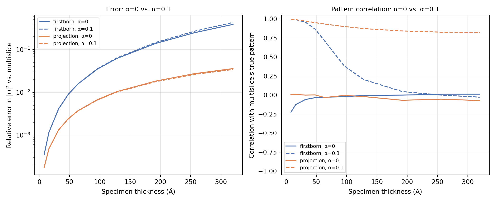
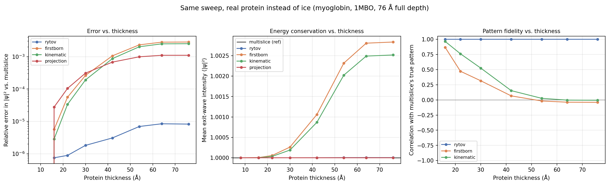

# Other propagation modes

Three more propagation modes trade accuracy for speed by different means
than [Rytov](rytov.md): `firstborn` and `kinematic` linearize or
simplify the per-slice scattering, and `projection` discards
slice-to-slice propagation entirely.

!!! info "Source"
    `Scattering.firstborn` / `.kinematic` / `.projection` / `.ctf` and
    their `IterativeScattering` counterparts. Figures are produced by
    `docs-figures/scattering_accuracy.py`.

## First Born

The weak phase object approximation: each slice's transmission function
\(\exp(i\sigma\Delta z V_z)\) is linearized to its first-order Taylor term
before being propagated and summed,

\[
\psi = 1 + i\sigma\Delta z \sum_{z} \mathcal{F}^{-1}\!\big[\mathcal{F}[V_z]\cdot F_z\big]
\]

using the same per-slice Fresnel propagator \(F_z\) as
[Rytov](rytov.md#the-exponentiated-born-series). This is the single-scattering
limit: valid only while the phase accumulated by any one slice is small.

## Kinematic

Kinematic keeps each slice's transmission amplitude exact,
\(\exp(i\sigma\Delta z V_z) - 1\), rather than linearizing it, but still
combines slices by addition rather than multiplication:

\[
\psi = 1 + \sum_{z} \mathcal{F}^{-1}\!\big[\mathcal{F}\big[\exp(i\sigma\Delta z V_z) - 1\big]\cdot F_z\big]
\]

This is the first-order term of the same multislice Born series
`multislice` sums exactly, so it is a strictly better single-scattering
approximation than `firstborn` in principle. In practice, at the ice
thicknesses in the sweep below, the two track each other closely: keeping
the per-slice amplitude exact matters less than the additive (rather than
multiplicative) combination shared by both.

## Where the linearization breaks down

It would be reasonable to expect `firstborn` to track `multislice`
closely at small thickness, since the weak-phase condition it needs is
easiest to satisfy there. It does not -- its *pattern* is already nearly
uncorrelated with the truth at the thinnest specimen tested, not just at
the thickest. The reason is a mismatch between what the linearization
throws away and what actually carries the physical signal.

`firstborn` and `rytov` share one underlying complex quantity, \(\Theta =
\sigma\Delta z\sum_z\mathcal{F}^{-1}[\mathcal{F}[V_z]\cdot F_z] = a+ib\)
(the same object [Rytov](rytov.md#the-exponentiated-born-series) calls
the accumulated phase): `rytov` is \(\exp(i\Theta)\), and `firstborn` is
its linearization, \(1+i\Theta\). Splitting \(\Theta\) into real and
imaginary parts exposes why linearizing first and squaring second is not
a safe order of operations:

\[
|\exp(i\Theta)|^2 = |\exp(i(a+ib))|^2 = \exp(-2b)
\qquad\text{depends only on } b=\mathrm{Im}(\Theta),
\]
\[
|1+i\Theta|^2 = 1 - 2b + a^2 + b^2
\qquad\text{picks up a spurious } a^2 \text{ term.}
\]

The true intensity is a pure rotation-then-attenuation: a real phase
shift (\(a\)) rotates the wave without changing its magnitude at all,
and only the imaginary part (\(b\), the part Fresnel propagation
converts into a genuine amplitude change) affects \(|\psi|\). `firstborn`
has no such structure -- squaring a truncated sum mixes \(a\) and \(b\)
together, and the resulting \(a^2\) term has no physical counterpart.

Whether this matters comes down to how \(a\) and \(b\) compare in
practice, and for a specimen like vitreous ice -- a predominantly
*phase* object, weakly absorptive -- \(a\) dominates \(b\) by
construction: at low spatial frequency the Fresnel propagator is close
to a real, unit-magnitude filter (\(F_z(k)\approx 1\) as \(k\to0\)), so
most of \(\Theta\)'s power lands in \(a\), and only the higher-frequency
content that genuinely diffracts leaks into \(b\).

{ width="600" }

{ width="600" }

At the thinnest slab tested (8 Å), \(\mathrm{Re}(\Theta)\) already has
50x the standard deviation of \(\mathrm{Im}(\Theta)\), so `firstborn`'s
intensity fluctuation is completely dominated by the spurious \(a^2\)
term rather than the physically correct \(-2b\) term -- hence a pattern
correlation of \(-0.22\), not close to \(+1\), at the thinnest slab
where the weak-phase condition should be at its easiest. The dominance
narrows as thickness grows (to \({\approx}2.6\times\) by 320 Å, as
diffraction has more distance to convert phase into genuine amplitude
contrast) but never reverses over this range, so the correlation never
recovers either. Averaged over the whole image, the same \(a^2+b^2 =
|\Theta|^2\) excess also explains the mean-intensity bias from the
[Accuracy vs. thickness](#accuracy-vs-thickness) figures below --
\(\langle|\Theta|^2\rangle \approx 0.387\) at 320 Å, matching the
measured +38.7% bias to three significant figures -- but that aggregate
number was always the smaller half of the story: even where the *mean*
bias looks minor, the *pattern* is already wrong, because it takes only
a modest imbalance between \(a\) and \(b\), not a large accumulated
phase, to swamp the one part of \(\Theta\) that is actually informative.
[Kinematic](#kinematic) inherits the same problem for the same
structural reason (additive slice combination, not multiplicative), not
because its per-slice linearization is any less exact.

## Projection

The thin-specimen limit: sum the potential over Z first, then apply a
single transmission function with no propagation step at all,

\[
\psi = \exp\!\left(i\sigma\Delta z \sum_{z} V_z\right)
\]

This is also what `scattering_model="ctf"` returns as a real-valued
projected potential (`2\sigma\Delta z \sum_z V_z`, without the complex
exponential), for use with `aberration_model="ctf"`'s separate CTF-based
intensity model — see [Detector](../detector.md) and
[Aberrations](../aberrations.md).

## Accuracy vs. thickness

The metric plotted below (`docs-figures/scattering_accuracy.py`'s
`_accuracy_sweep`) is the mean absolute error in exit-wave intensity
against `multislice`, normalized by `multislice`'s own mean intensity:

\[
E \;=\; \frac{\big\langle\,\lvert I_{\mathrm{model}} - I_{\mathrm{multislice}}\rvert\,\big\rangle}{\langle I_{\mathrm{multislice}}\rangle},
\qquad I = |\psi|^2,
\]

the average taken over every pixel of the image, using the same
`RandomIcemaker` ice slab, 300 kV, sweep as [Rytov's accuracy
figure](rytov.md#accuracy-vs-thickness):

{ width="600" }

Read at face value, this says `projection` beats `firstborn` and
`kinematic`, despite being the only mode here with no Fresnel diffraction
model at all. It is not measuring what it looks like it's measuring.
Split the difference field into a constant bias plus a zero-mean
residual, \(I_{\mathrm{model}} - I_{\mathrm{multislice}} = b + d(x,y)\)
with \(b = \langle I_{\mathrm{model}}\rangle - \langle
I_{\mathrm{multislice}}\rangle\) the mean-intensity bias from the figure
below. Whenever \(|b|\) dominates \(d\)'s spread, \(E \approx |b|\)
(a near-exact identity, not an approximation, once \(|b| \gg
\mathrm{std}(d)\)); whenever \(b=0\) exactly, \(E \approx
\mathrm{std}(d)\sqrt{2/\pi}\) for a roughly Gaussian residual -- just a
measure of how far the *reference* is from flat. Both limits are
realized here, for different models:

| Thickness | Model | \(E\) (measured) | \(\lvert b\rvert\) | \(\mathrm{std}(d)\) | \(\lvert b\rvert / \mathrm{std}(d)\) |
|---|---|---|---|---|---|
| 32 Å  | `firstborn`  | 0.0042 | 0.0042 | 0.0027 | 1.5 |
| 32 Å  | `projection` | 0.0013 | 0.0000 | 0.0017 | 0.0 |
| 128 Å | `firstborn`  | 0.0618 | 0.0618 | 0.0199 | 3.1 |
| 128 Å | `projection` | 0.0104 | 0.0000 | 0.0131 | 0.0 |
| 320 Å | `firstborn`  | 0.3866 | 0.3866 | 0.0744 | 5.2 |
| 320 Å | `projection` | 0.0359 | 0.0000 | 0.0452 | 0.0 |

For `firstborn` (and `kinematic`), \(E\) equals \(|b|\) to at least three
decimal places at every thickness tested, and the ratio \(|b|/\mathrm{std}(d)\)
only grows with thickness (1.5 -> 5.2). So this figure is, for these two
models, essentially a rescaled replot of the mean-intensity figure right
below -- the pattern-correlation collapse from [Where the linearization
breaks down](#where-the-linearization-breaks-down) is real, but it barely
registers *in this specific metric*, because the bias alone already
saturates it.

{ width="600" }

For `projection`, \(b=0\) *exactly* at every thickness: with `alpha=0`,
`projection`'s exit wave \(\exp(i\sigma\Delta z\sum_z V_z)\) is a pure
phase factor, so \(|\psi|=1\) at every pixel and \(\langle
I_{\mathrm{projection}}\rangle = 1 = \langle I_{\mathrm{multislice}}
\rangle\) identically. \(E\) therefore reduces to \(\langle
|I_{\mathrm{multislice}} - 1|\rangle\), matching the Gaussian-residual
estimate \(\mathrm{std}(d)\sqrt{2/\pi}\) closely (e.g. \(0.0452 \times
0.798 \approx 0.0361\) vs. the measured 0.0359 at 320 Å).
`projection` contributes *nothing* of its own to this number -- it is
purely a measurement of how far `multislice`'s own true contrast is
from flat, which stays small over this thickness/pixel-size range.

{ width="900" style="display:block;margin:1.2em auto;" }

So the plotted ordering is real, but it compares two unrelated
quantities that happen to share units: `firstborn`'s self-inflicted bias
against `multislice`'s own (still modest, at this thickness and pixel
size) true contrast. Neither curve actually tests "how well does this
model track `multislice`'s *spatial pattern*" -- that is a different
question, answered by the [pattern-correlation
figure](#where-the-linearization-breaks-down) above: `firstborn` and
`kinematic` do not track that pattern at any thickness tested here,
`projection` has none of its own to compare (at `alpha=0`), and only
`rytov` does. None of this makes `projection` a good general substitute
for `multislice`; it is blind to spatial structure by construction and
will read as "accurate" on this particular metric for exactly as long as
the true signal stays small enough for its bias-free flatness to win by
default.

## Is this specific to a pure phase object (α=0)?

Every figure on this page uses `alpha=0`, chosen deliberately to isolate
the failure mode in [Where the linearization
breaks down](#where-the-linearization-breaks-down) without a second
effect layered on top. Real specimens absorb a little (`alpha` typically
0.07-0.1), so it's worth checking whether that changes the picture.

{ width="900" style="display:block;margin:1.2em auto;" }

It doesn't change the ranking, and it clarifies *why* `projection` does
as well as it does. Adding absorption barely moves either model's
relative error (left panel: the solid and dashed curve for each model
nearly overlap) -- `firstborn` is, if anything, marginally worse with
`alpha` included, since the same \(a\)-vs-\(b\) mixing problem now also
folds the modest genuine absorption signal into the same spurious
channel.

The correlation panel (right) is more interesting. At the thinnest
specimens, absorption dominates the true signal almost completely, and
*both* models track it well (correlation \({\approx}1\)) -- not because
`firstborn`'s approximation got better, but because the true pattern is
now simple enough (nearly linear in the projected potential) that even a
biased, mixed-up prediction happens to point the right way. As thickness
grows, `projection`'s correlation stays healthy (0.82-0.97 throughout
this sweep): mass-thickness/amplitude contrast is a real, well-behaved
signal that a simple projected-potential model genuinely captures, not
merely "nothing there to get wrong." `firstborn`'s correlation collapses
back toward zero well before 320 Å regardless of `alpha` -- the \(a^2\)
artifact reasserts itself once the specimen is thick enough for it to
dominate again.

## Does this depend on using ice?

Every figure so far uses an amorphous `RandomIcemaker` slab -- diffuse,
roughly homogeneous density. Real single-particle targets are the
opposite: sparse, sharply peaked atomic density with large empty gaps.
Repeating the sweep on a real protein potential (myoglobin, PDB `1mbo`,
1601 atoms, built via the same `PotentialBuilder` path
`run_particle_stack` uses, principal axis aligned to Z, 76 Å full depth)
checks whether that matters:

{ width="900" style="display:block;margin:1.2em auto;" }

The pattern-fidelity result (right panel) reproduces exactly: `rytov`
stays at correlation 1.000 throughout, while `firstborn` and `kinematic`
collapse from \({\approx}0.9\) at the thinnest slice tested down to
\({\approx}0\) by the protein's full depth -- the \(a\)-vs-\(b\) mixing
argument in [Where the linearization
breaks down](#where-the-linearization-breaks-down) doesn't depend on the
specimen being ice; it only needs a predominantly-phase specimen, which
a protein is too.

The error ordering (left panel) does *not* reproduce as dramatically,
and the reason is the same bias/residual decomposition from [Accuracy
vs. thickness](#accuracy-vs-thickness) landing in the *other* regime this
time. At the protein's full 76 Å depth, `firstborn`'s bias is only
\(|b| \approx 0.0028\) (a 0.28% mean-intensity shift -- this protein
never accumulates the kind of phase the 320 Å ice slab did) while its
residual spread is \(\mathrm{std}(d) \approx 0.0093\), so
\(|b|/\mathrm{std}(d) \approx 0.3\): the *opposite* of ice's \(5.2\) at
320 Å. `firstborn`'s error is therefore no longer bias-dominated here --
it genuinely reflects the (real) pattern mismatch -- and `projection`'s
error, still exactly \(\mathrm{std}(d)_{\mathrm{ref}}\) (its bias is 0 at
every thickness regardless of specimen), is only \({\approx}2.6\times\)
smaller than `firstborn`'s rather than \({\approx}10\times\). The
dramatic gap on the ice-slab plot was specific to that slab having
accumulated enough phase for `firstborn`'s bias to swamp its own
residual; it is not a general property of `projection` being a
particularly strong approximation, or of `firstborn` being uniquely bad
at small scale. `rytov` remains 2-3 orders of magnitude more accurate
than every other approximate mode at every thickness tested, on both
specimen types.

## References

- Kirkland, E. J. (2010). *Advanced Computing in Electron Microscopy*, 2nd
  Edition. Springer. Ch. 5-6 (weak phase object and projection
  approximations).
