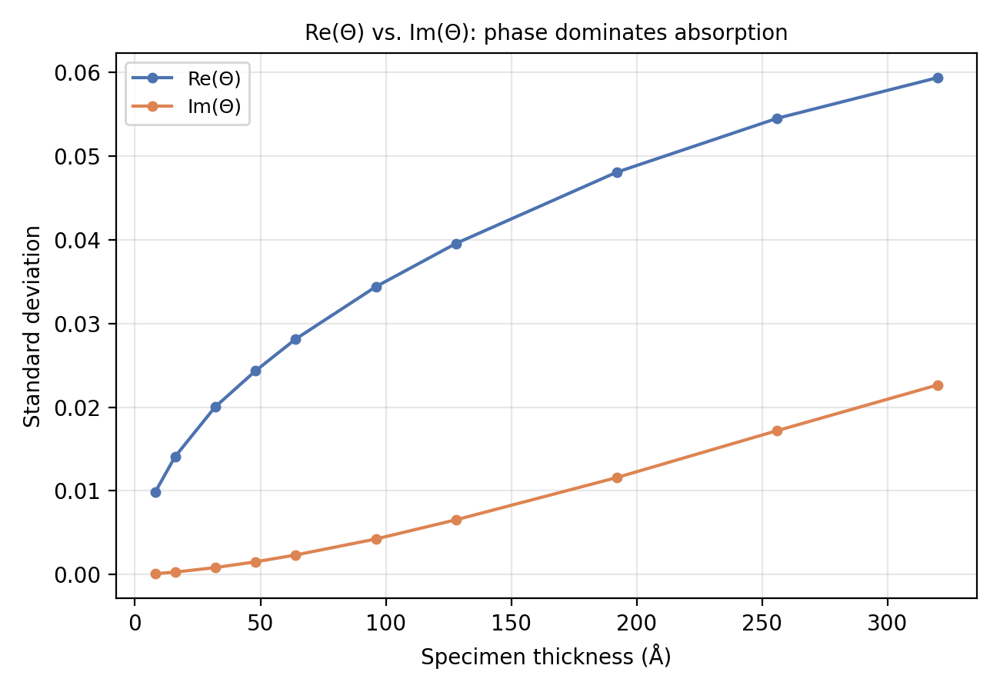
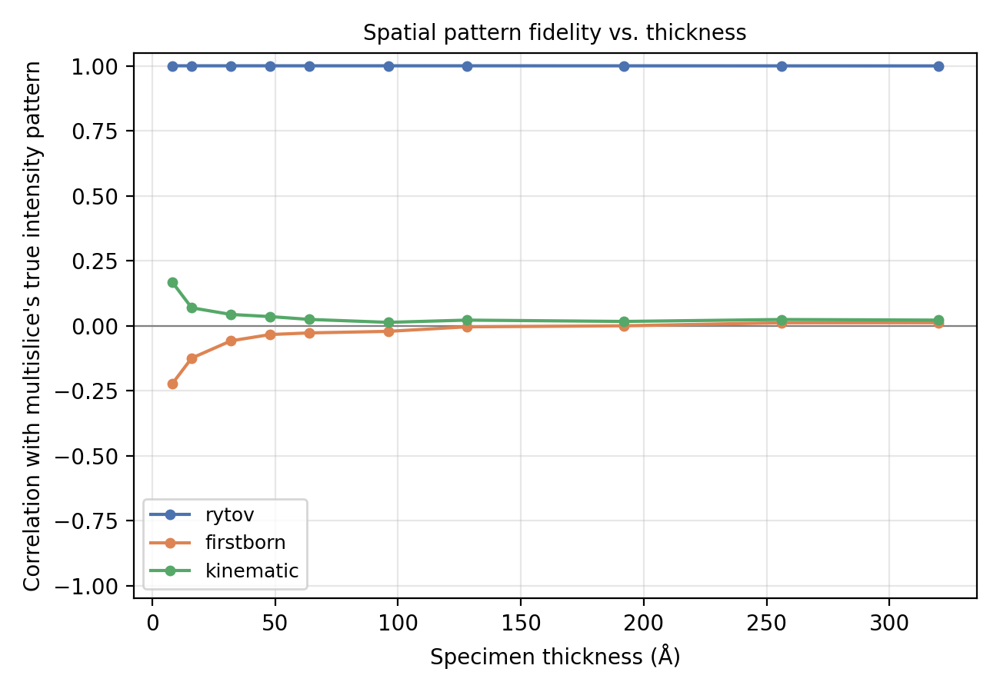
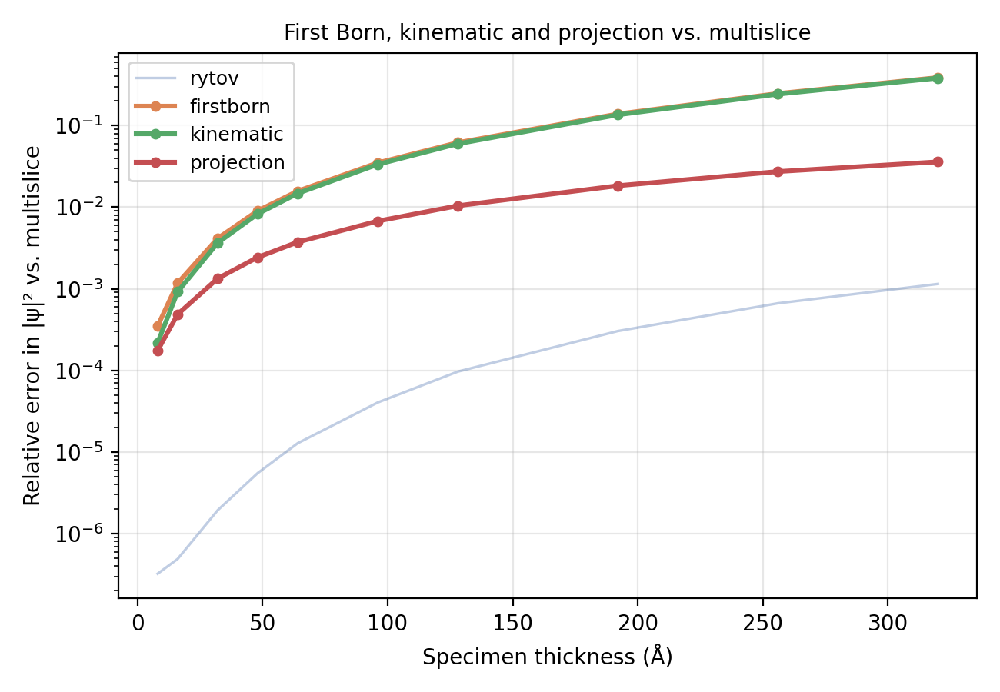
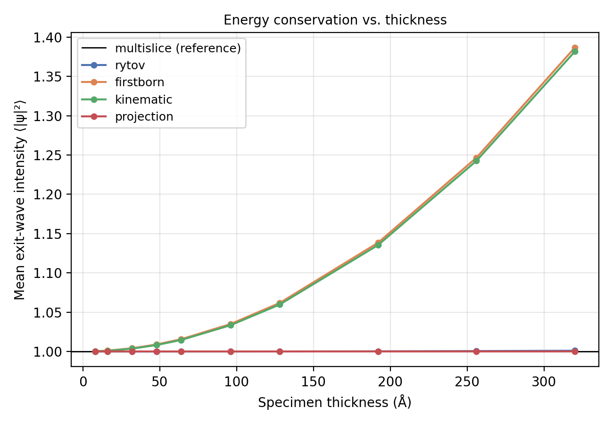
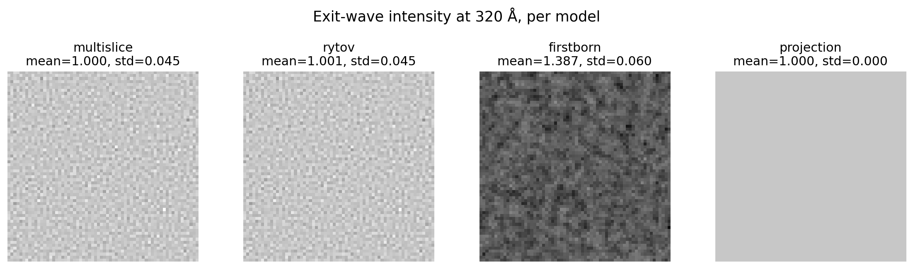

# Other propagation modes

Three more propagation modes trade accuracy for speed by different means
than [Rytov](rytov.md): `firstborn` and `kinematic` linearize or
simplify the per-slice scattering, and `projection` discards
slice-to-slice propagation entirely.

!!! info "Source"
    `Scattering.firstborn` / `.kinematic` / `.projection` / `.ctf` and
    their `IterativeScattering` counterparts. Figures are produced by
    `docs-figures/scattering_accuracy.py`.

## First Born

The weak phase object approximation: each slice's transmission function
\(\exp(i\sigma\Delta z V_z)\) is linearized to its first-order Taylor term
before being propagated and summed,

\[
\psi = 1 + i\sigma\Delta z \sum_{z} \mathcal{F}^{-1}\!\big[\mathcal{F}[V_z]\cdot F_z\big]
\]

using the same per-slice Fresnel propagator \(F_z\) as
[Rytov](rytov.md#the-exponentiated-born-series). This is the single-scattering
limit: valid only while the phase accumulated by any one slice is small.

## Kinematic

Kinematic keeps each slice's transmission amplitude exact,
\(\exp(i\sigma\Delta z V_z) - 1\), rather than linearizing it, but still
combines slices by addition rather than multiplication:

\[
\psi = 1 + \sum_{z} \mathcal{F}^{-1}\!\big[\mathcal{F}\big[\exp(i\sigma\Delta z V_z) - 1\big]\cdot F_z\big]
\]

This is the first-order term of the same multislice Born series
`multislice` sums exactly, so it is a strictly better single-scattering
approximation than `firstborn` in principle. In practice, the two track
each other closely: keeping the per-slice amplitude exact matters far
less than the additive (rather than multiplicative) slice combination
they share, which is the actual source of both models' error (see
below).

## Where the linearization breaks down

`firstborn` and `rytov` share one underlying complex quantity, \(\Theta =
\sigma\Delta z\sum_z\mathcal{F}^{-1}[\mathcal{F}[V_z]\cdot F_z] = a+ib\):
`rytov` is \(\exp(i\Theta)\), and `firstborn` is its linearization,
\(1+i\Theta\). Splitting \(\Theta\) into real and imaginary parts shows
why linearizing before squaring is not a safe order of operations:

\[
|\exp(i\Theta)|^2 = \exp(-2b) \quad\text{(depends only on } b=\mathrm{Im}(\Theta)\text{)},
\qquad
|1+i\Theta|^2 = 1 - 2b + a^2 + b^2 \quad\text{(picks up a spurious } a^2 \text{ term)}.
\]

A real phase shift (\(a\)) rotates the wave without changing its
magnitude at all; only the imaginary part (\(b\), the part Fresnel
propagation converts into a genuine amplitude change) affects
\(|\psi|\). Squaring a truncated sum mixes \(a\) and \(b\) together, and
the resulting \(a^2\) term has no physical counterpart. For any
predominantly-phase specimen (ice, protein, or any other weakly
absorptive material), \(a\) dominates \(b\): at low spatial frequency
the Fresnel propagator is close to a real, unit-magnitude filter
(\(F_z(k)\approx 1\) as \(k\to0\)), so most of \(\Theta\)'s power lands
in the real part, and only the higher-frequency content that genuinely
diffracts leaks into \(b\).

{ width="600" }
///caption
Standard deviation of Re(Θ) and Im(Θ) vs. thickness, for a RandomIcemaker ice slab. Re(Θ) dominates Im(Θ) at every thickness tested, by roughly 50x at the thinnest slab and still 2.6x at the thickest.
///

{ width="600" }
///caption
Correlation of each mode's intensity pattern with multislice's true pattern, vs. thickness. rytov stays at 1.000 throughout; firstborn and kinematic sit near zero across the entire range, including the thinnest specimen tested.
///

`firstborn`'s intensity fluctuation is dominated by the spurious \(a^2\)
term rather than the physically correct \(-2b\) term at every thickness
tested here, including the thinnest. Its pattern correlation with
`multislice` never exceeds \({\approx}0.02\) and briefly goes negative.
This is not specific to `RandomIcemaker` ice; the same collapse (from
\({\approx}0.9\) at the thinnest slice to \({\approx}0\) at full depth)
reproduces on a real protein potential (myoglobin, PDB `1mbo`). Averaged
over the whole image, the same \(a^2+b^2 = |\Theta|^2\) excess also
explains the mean-intensity bias in [Accuracy vs.
thickness](#accuracy-vs-thickness) below. [Kinematic](#kinematic)
inherits the same problem for the same structural reason (additive slice
combination, not multiplicative), not because its per-slice
linearization is any less exact.

## Projection

The thin-specimen limit: sum the potential over Z first, then apply a
single transmission function with no propagation step at all,

\[
\psi = \exp\!\left(i\sigma\Delta z \sum_{z} V_z\right)
\]

This is also what `scattering_model="ctf"` returns as a real-valued
projected potential (`2\sigma\Delta z \sum_z V_z`, without the complex
exponential), for use with `aberration_model="ctf"`'s separate CTF-based
intensity model (see [Detector](../detector.md) and
[Aberrations](../aberrations.md)).

## Accuracy vs. thickness

The metric plotted below is the mean absolute error in exit-wave
intensity against `multislice`, normalized by `multislice`'s own mean
intensity:

\[
E \;=\; \frac{\big\langle\,\lvert I_{\mathrm{model}} - I_{\mathrm{multislice}}\rvert\,\big\rangle}{\langle I_{\mathrm{multislice}}\rangle},
\qquad I = |\psi|^2,
\]

using the same `RandomIcemaker` ice slab, 300 kV, sweep as [Rytov's
accuracy figure](rytov.md#accuracy-vs-thickness):

{ width="600" }
///caption
Relative error in exit-wave intensity vs. multislice, as a function of ice thickness, for first Born, kinematic, and projection (highlighted) against Rytov (faint, for context).
///

`projection` scores lower than `firstborn`/`kinematic` here, but not
because it approximates thickness effects well. Writing
\(I_{\mathrm{model}} - I_{\mathrm{multislice}} = b + d(x,y)\) with
\(b = \langle I_{\mathrm{model}}\rangle - \langle
I_{\mathrm{multislice}}\rangle\) the mean-intensity bias: for
`firstborn`/`kinematic`, \(|b|\) dominates \(d\)'s spread at every ice
thickness tested (by a factor of 1.5 at 32 Å, growing to 5.2 at 320 Å),
so \(E \approx |b|\) almost exactly. This figure is essentially a
rescaled replot of the mean-intensity bias below. `projection`'s bias is
exactly 0 at every thickness (its exit wave is unit-modulus by
construction at `alpha=0`), so its \(E\) instead measures only how far
`multislice`'s own true contrast is from flat.

{ width="600" }
///caption
Mean exit-wave intensity vs. thickness, per model. A properly normalized exit wave conserves total intensity (multislice and projection stay pinned to 1.0); firstborn and kinematic drift up to +39% by 320 A.
///

{ width="900" style="display:block;margin:1.2em auto;" }
///caption
Exit-wave intensity maps at 320 A, side by side. multislice and rytov show fine, correlated speckle; firstborn is a different, coarser pattern riding on a strongly biased mean; projection is exactly flat.
///

Neither curve tests spatial pattern fidelity; that is the [pattern
correlation figure](#where-the-linearization-breaks-down) above, where
only `rytov` tracks the truth. `projection` is not a good general
substitute for `multislice`: it carries no spatial structure by
construction and will read as "accurate" on this particular metric for
exactly as long as the true signal stays small enough for its bias-free
flatness to win by default. That crossover point is specimen-dependent:
the bias-driven gap between `projection` and `firstborn` on this ice
slab (roughly 10x at 320 Å) shrinks to roughly 3x for a real
single-particle protein at typical imaging depths (tens of Å), where
accumulated phase, and therefore `firstborn`'s bias, is much smaller.
`rytov` remains 2-3 orders of magnitude more accurate than every other
approximate mode at every thickness tested, on both specimen types.

## References

- Kirkland, E. J. (2010). *Advanced Computing in Electron Microscopy*, 2nd
  Edition. Springer. Ch. 5-6 (weak phase object and projection
  approximations).
