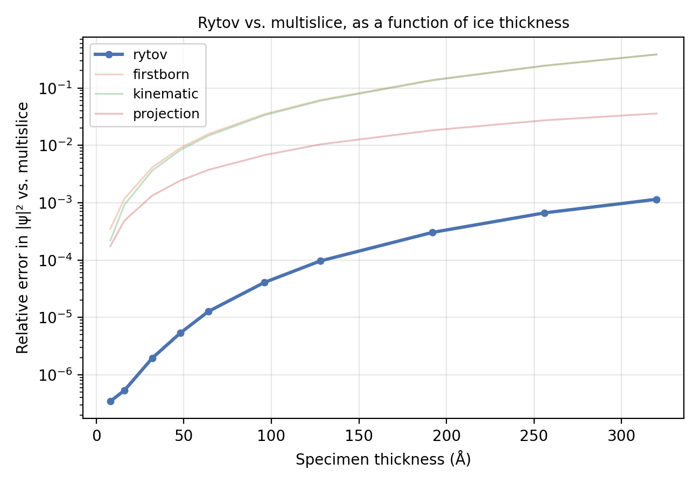

# Rytov

`scattering_model="rytov"` computes the exit wave as a single exponentiated
sum over all Z-slices rather than a sequential slice-by-slice recursion.
It is `Ghostbuster`'s default propagation model for single-particle
reconstruction, while `TomogramReconstructor` and every generation
pipeline default to [`multislice`](multislice.md).

!!! info "Source"
    `Scattering.rytov` / `IterativeScattering.rytov` /
    `IterativeScattering.parallel_rytov`. Figures are produced by
    `docs-figures/scattering_accuracy.py`.

## The exponentiated Born series

Each slice's contribution is Fresnel-propagated to the exit plane and
accumulated in the phase, then exponentiated once at the end:

\[
\psi = \exp\!\left(i\sigma\,\Delta z\sum_{z} \mathcal{F}^{-1}\!\big[\mathcal{F}[V_z]\cdot F_z\big]\right)
\]

where \(F_z\) is the same Fresnel propagator as
[multislice](multislice.md#the-recursion), evaluated at the distance from
slice \(z\) to the exit plane rather than a single slice thickness. This
is the Rytov approximation: the exponentiated first Born series. Expanding
the exponential to first order recovers
[`firstborn`](other-modes.md#first-born) exactly, so Rytov and first Born
agree wherever the linearization is valid and diverge only once the
per-slice phase \(\sigma\,\Delta z\,V_z\) is no longer small.

## A sum, not a recursion

Multislice's per-slice transmission depends on the *already-propagated*
wave from every previous slice — `psi_{i} = t_i * psi_{i-1}` — which is
why it must be evaluated sequentially. Rytov's sum over slices is
independent of any other slice's contribution before the final
exponentiation, so it parallelizes: `IterativeScattering.parallel_rytov`
computes every slice's contribution as one batched FFT pair rather than
`nz_new` sequential ones, with optional chunked gradient checkpointing to
bound memory. This is the practical reason Rytov is attractive inside an
iterative reconstruction loop like `Ghostbuster`, where the propagation
model is evaluated, and backpropagated through, on every training step:
a fully parallel forward pass is both faster and (via checkpointing)
cheaper to hold gradients for than replaying a sequential recursion
hundreds to a thousand slices deep.

## Accuracy vs. thickness

The tradeoff is accuracy at large thickness: Rytov has no per-slice
feedback, so it cannot represent multiple scattering the way multislice's
recursion can. The figure below sweeps specimen thickness for the same
`RandomIcemaker` ice slab used in the [multislice
page](multislice.md#watching-the-recursion-accumulate), measuring each
model's relative error in exit-wave intensity \(|\psi|^2\) against
`multislice` as the reference:

{ width="600" }

Across this thickness range (up to 320 Å, spanning typical single-particle
ice thickness), Rytov's error stays one to two orders of magnitude below
`firstborn`, `kinematic`, and `projection`'s. The exponentiated form
matters: even though Rytov shares first Born's linear-in-slices structure,
exponentiating the accumulated phase rather than adding \(1\) to it (as
`firstborn` does) keeps the *amplitude* of \(\psi\) correctly normalized
at every thickness, rather than only to first order. Rytov's own mean
intensity stays pinned to 1.0 (energy-conserving) at every thickness
tested, just like `multislice`'s -- unlike `firstborn`/`kinematic`, whose
mean intensity drifts substantially at large thickness. `projection`'s
placement on this plot has a separate explanation; see [Other
propagation modes](other-modes.md#accuracy-vs-thickness).

## References

- Yeo, J., & Loh, N. D. (2026). Pursuing the physics of cryo-EM image
  formation. In *Current Approaches to Cryo-Electron Microscopy*,
  *Progress in Molecular Biology and Translational Science*. Elsevier.
  [doi:10.1016/bs.pmbts.2026.05.001](https://doi.org/10.1016/bs.pmbts.2026.05.001)
  -- derives the Rytov approximation as specialized to slice-wise
  electron propagation, the form implemented here.
- Rytov approximation: standard in coherent wave optics; see e.g. J. W.
  Goodman, *Introduction to Fourier Optics*, for the general derivation.
