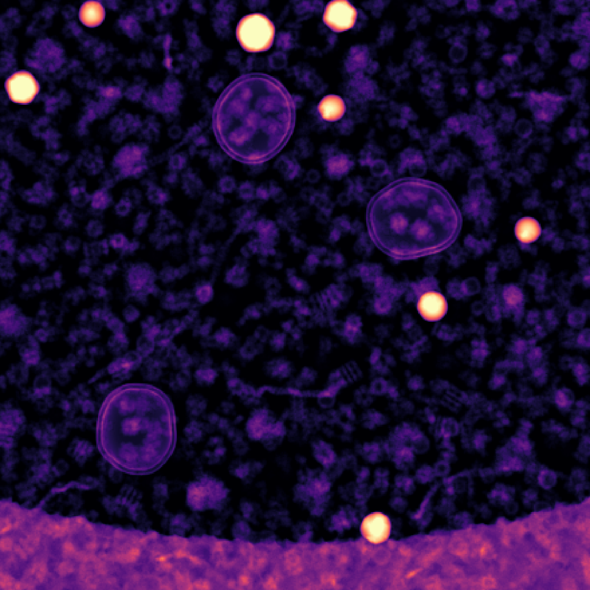

# SPECTER

  { width="220" }
  { width="220" }

<strong>S</strong>cattering & <strong>P</strong>ropagation of <strong>E</strong>lectrons in
<strong>C</strong>ryo-EM: <strong>T</strong>win <strong>E</strong>mulator &
<strong>R</strong>econstruction. A differentiable digital twin for cryo-EM and
cryo-ET.

{ width="560" style="display:block;margin:1.2em auto;" }
///caption
A simulated cryo-ET specimen
///

---

## Why SPECTER?

-   :material-snowflake:{ .lg .middle } **Structured ice**

    Ice comes from configurations optimised against a measured structure
    factor and a coarse-grained water potential, not from water molecules
    placed at random to the right bulk density.

    [:octicons-arrow-right-24: Ice structure](concepts/ice.md)

-   :material-camera-iris:{ .lg .middle } **Per-electron detector**

    Individual electrons are placed and merged when they land too close
    together, reproducing the low-frequency suppression that real
    counting detectors show.

    [:octicons-arrow-right-24: Detector](concepts/detector.md)

-   :material-check-decagram:{ .lg .middle } **Validated against experiment**

    Simulated particles pooled with real EMPIAR-11377 particles and run
    through a single [CryoSPARC](https://cryosparc.com/) 2D classification
    job sort into the same classes, in roughly the same proportion, across
    nearly all 50 classes.

    [:octicons-arrow-right-24: See the comparison](user-guide/particle-stack.md#example-matching-empiar-11377)

-   :material-swap-horizontal:{ .lg .middle } **One model, both directions**

    The forward model that generates images is the same model that drives
    reconstruction, so a change to the physics applies in both directions
    rather than to a simulator alone.

---

## Get started

-   :material-download:{ .lg .middle } **Installation**

    Set up SPECTER with `uv` and confirm it works with a small CPU run.

    [:octicons-arrow-right-24: Install](installation.md)

-   :material-rocket-launch:{ .lg .middle } **Quickstart**

    Simulate a particle stack from a PDB code in one command.

    [:octicons-arrow-right-24: Get started](quickstart.md)

---

## Guides

### CLI

Every workflow below is a `specter` subcommand driven by a TOML config.

-   :material-grid:{ .lg .middle } **Particle stack**

    `specter simulate particles` — a stack of single-particle images from
    a PDB code, with poses, defocus and dose sampled per particle.

    [:octicons-arrow-right-24: Generate a particle stack](user-guide/particle-stack.md)

-   :material-image-filter-hdr:{ .lg .middle } **Micrograph**

    `specter simulate micrograph` — a full field of view with many
    particles, crowding and ice.

    [:octicons-arrow-right-24: Generate a micrograph](user-guide/micrograph.md)

-   :material-angle-acute:{ .lg .middle } **Tilt series**

    `specter simulate tiltseries` — a cryo-ET tilt series through a
    specimen volume, with dose accumulation across tilts.

    [:octicons-arrow-right-24: Generate a tilt series](user-guide/tilt-series.md)

-   :material-cube-outline:{ .lg .middle } **Tomogram specimen**

    `specter build tomogram` — membranes, filaments, microtubules,
    fiducial beads and a carbon film, packed into one volume.

    [:octicons-arrow-right-24: Build a tomogram specimen](user-guide/build-tomogram.md)

-   :material-snowflake-variant:{ .lg .middle } **Ice cache**

    `specter build ice` — a replacement `IceBank` library at a pixel size
    the bundled cache does not cover.

    [:octicons-arrow-right-24: Using the ice cache](user-guide/ice-cache.md)

Any config field can be overridden on the command line; see
[Configure a run](user-guide/configuration.md). Runs can record themselves
as tracked jobs; see [Manage jobs](user-guide/jobs.md).

### Concepts

-   :material-sitemap:{ .lg .middle } **Pipeline overview**

    How potential, specimen, scattering, aberration and detector compose
    into one forward model.

    [:octicons-arrow-right-24: Read more](concepts/pipeline-overview.md)

-   :material-molecule:{ .lg .middle } **Specimens**

    Atomic potentials, ice, crowding, and the cryo-ET specimen
    components.

    [:octicons-arrow-right-24: Read more](concepts/specimens.md)

-   :material-waves:{ .lg .middle } **Forward simulation**

    Propagation modes, aberrations and envelopes, and detector physics.

    [:octicons-arrow-right-24: Read more](concepts/forward-simulation.md)

-   :material-compass-outline:{ .lg .middle } **Conventions**

    Axis order, rotation sense, units, and CTF sign conventions used
    throughout.

    [:octicons-arrow-right-24: Read more](concepts/conventions.md)

### Python API

-   :octicons-code-24:{ .lg .middle } **API overview**

    Generated from docstrings, one page per subpackage.

    [:octicons-arrow-right-24: Read more](api/index.md)

-   :material-camera:{ .lg .middle } **Image generation**

    `ImageGenerator`, `MicrographGenerator`, `TiltSeriesGenerator`.

    [:octicons-arrow-right-24: specter.imagegenerator](api/imagegenerator.md)

-   :material-cube-scan:{ .lg .middle } **Specimens**

    Membranes, filaments, microtubules, beads and packing.

    [:octicons-arrow-right-24: specter.specimen](api/specimen.md)

-   :material-pipe:{ .lg .middle } **Pipelines**

    The end-to-end functions the CLI calls, usable directly from Python.

    [:octicons-arrow-right-24: specter.pipelines](api/pipelines.md)

---

## Getting help

Open an issue on the [GitHub repository](https://github.com/joelyeois/specter).
