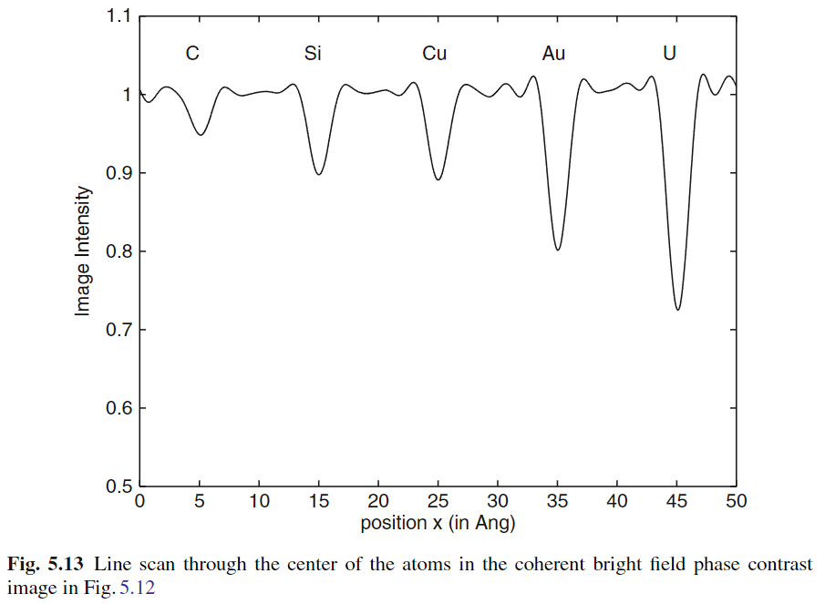
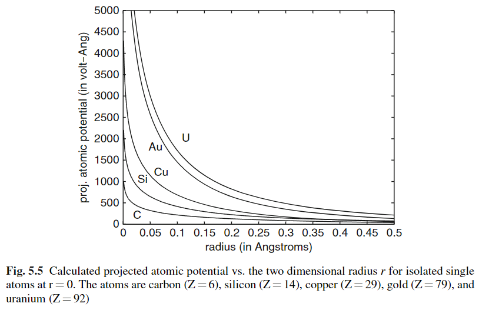

SPECTER
=======

**Scattering & Propagation of Electrons in Cryo-EM: Twin Emulator & Reconstruction**

A microscope you can run backwards. SPECTER simulates what a cryo-electron
microscope would record from a known molecule, and then uses that same
simulation in reverse to recover a molecule from real images. Both directions
run on one shared piece of physics.

If you are new to cryo-EM
--------------------------

A cryo-electron microscope fires electrons through a thin film of frozen
water holding copies of a protein, each frozen in a random orientation. The
resulting images are extremely noisy — the dose has to stay low or the
electrons destroy the very thing you are imaging. Recovering a 3D structure
means combining hundreds of thousands of these faint, randomly-oriented
shadows. SPECTER can both **fake** that data convincingly and **solve** it.

If you work in the field
--------------------------

Kirkland-parameterised atomic potentials on a soft-voxelised grid; full
multislice propagation with relativistic wavelength and energy-dependent
interaction parameter; a complex transfer function with spatial- and
temporal-coherence envelopes; per-electron detector modelling including
coincidence loss; and structurally optimised amorphous ice matched to a
target S(k) and an MLBOP water potential.

The two halves
--------------

Most simulators are one-way: they produce images and stop. The
distinguishing choice in SPECTER is that the forward model is written to be
**differentiable**, so the same code that generates an image can have
gradients pushed back through it to recover the structure that produced one::

    Atomic model (PDB/mmCIF)
            │
            ▼  simulate
    Forward model: potential → scatter → aberrate → detect   (differentiable)
            │
            ▼  record
    Images (.mrcs + .star)
            │
            ▲  gradients flow back
            │
    Ghostbuster — recovers the volume

One consequence worth stating plainly: improving the physics improves
generation and reconstruction at the same time, because there is only one
implementation of it.

What makes this package different
-----------------------------------

These are the properties that follow from reading the source, not a
competitive comparison. Each is unusual on its own; together they define
what SPECTER is for.

.. list-table::
   :widths: 20 80
   :header-rows: 0

   * - **Shared model**
     - Simulation and reconstruction are the same code. Ghostbuster
       instantiates the ordinary ``ImageGenerator`` and optimises through
       it — there is no separate, simplified reconstruction physics to
       drift out of sync.
   * - **Ice**
     - Water is structured, not scattered. Ice comes from configurations
       optimised against a measured structure factor and a coarse-grained
       water potential, not randomly placed molecules at the right bulk
       density. See :doc:`ice`.
   * - **Detector**
     - Coincidence loss is simulated per electron. Individual electrons are
       placed and then merged when they land too close together,
       reproducing the low-frequency suppression that real counting
       detectors show.
   * - **Dataset twins**
     - Poses can come from a real experiment. Reading a CryoSPARC ``.cs``
       file gives simulated data with the same poses, defoci and optics as a
       real dataset — with ground truth attached.
   * - **Propagation**
     - Multislice, not just a CTF multiply. The default propagates the wave
       slice by slice through the specimen, so thickness and multiple
       scattering are represented rather than assumed away.
   * - **Provenance**
     - Runs record themselves. Every job stores its complete effective
       configuration, the package version and the git commit, and refuses
       to resume under changed settings. See :doc:`jobs`.

How the physics is checked
-----------------------------

The atomic potential and imaging code are validated against the worked
examples in Kirkland's *Advanced Computing in Electron Microscopy*. The
figure below is SPECTER's own output for the standard five-element test
row, reproducing the textbook's coherent bright-field line scan.

Contrast deepens with atomic number, reaching roughly 0.73 at uranium.
Produced by ``compare-atomic-potentials-with-kirkland.ipynb``, which places
the corresponding textbook figure alongside it for direct comparison.

.. image:: ../images/atomic-potential-3d-kirkland.png
   :alt: 3D atomic potential against radius, per element.
   :width: 340px

Scattering factors are expressed as a sum of three Lorentzian and three
Gaussian terms in reciprocal space, with element-specific coefficients
tabulated by Kirkland. Lobato and Shtyrov parameterisations are also
implemented. The tables these come from live in ``src/specter/atom_data/``
and are treated as fixed physical constants — editing them silently changes
the accuracy of every simulation in the package.

.. toctree::
   :maxdepth: 1
   :caption: User guide

   installation
   quickstart

.. toctree::
   :maxdepth: 1
   :caption: Field guide

   pipeline
   ice
   configuration
   generation
   reconstruction
   jobs

.. toctree::
   :maxdepth: 1
   :caption: Reference

   autoapi/index
