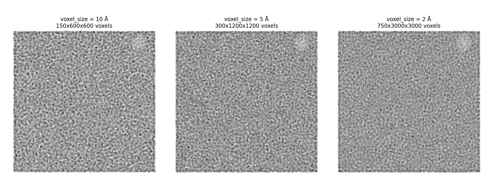

# Build a tomogram specimen

`specter build tomogram` composites a cryo-ET specimen volume from any
combination of: one or more organic membranes, filament species (e.g.
F-actin), gold fiducial beads, a carbon support film, and densely packed
protein species (region-gated to cytosol/lumen when a membrane is present).
It writes a `.mrc` density volume plus
copick-style `.ndjson` ground-truth picks and, by default, segmentation
label volumes. The `.mrc` is directly usable as `specter simulate
tiltseries`'s `--volume_path` — this is the specimen-building half of the
cryo-ET pipeline; see [Generate a tilt series](tilt-series.md) for the
imaging half.

## Basic usage

Every run loads a TOML config first, then applies any flags given on the
command line as overrides:

```bash
specter build tomogram --config configs/tomogram.toml
```

```bash
specter build tomogram \
    --config configs/tomogram.toml \
    --v_size 5.0 \
    --device cuda:0 \
    --output_dir specter-data/tomograms
```

`configs/tomogram.toml` is the canonical starting point — copy it and edit
for your own runs. It demonstrates every feature at once (composited
membranes, filaments, exact-count targets, ratio-based filler); run
`specter build tomogram --help` for the full field-by-field reference.

## What you'll usually tune

- **Box size** — `target_shape` (Z, Y, X voxels) and `v_size` (Å/voxel).
- **Protein species** — `[[targets]]` (exact `n_copies` each, always
  exported to picks) and `[[filler]]`/`filler_from_pei2016`/
  `filler_from_cryoetsim` (packed around targets up to
  `filler_occupancy_fraction`, excluded from picks by default). See
  [Placement order & regions](#placement-order-regions) below.
- **Membranes** — `[[membrane]]` entries: `shape_backend`
  (`spherical_harmonics` or `swept_spline`), size ranges
  (`sh_axes_range_a`/`swept_total_length_range_a`/etc., omit for realistic
  auto-sizing), and `n_copies` for multiple independently-placed copies
  of one template.
- **Filaments** — `actin` (quick built-in F-actin preset) or hand-written
  `[[filaments]]` entries for other species (e.g. microtubules).
- **Gold fiducial beads** — `[[beads]]` entries (`radius`, `n_copies`), one per
  bead radius population. Placed avoiding the membrane shell and already-
  placed filaments; not region-gated to cytosol/lumen.
- **Carbon support film** — at most one `[[grid]]` table
  (`hole_radius`/`edge_fraction`/`edge_side`/etc.). Painted into the volume
  before anything else is placed.

Everything else — picks/segmentation toggles, compute/scaling knobs, output
naming — lives under its own panel in `specter build tomogram --help`.

## Placement order & regions

Generation always proceeds carbon film → membranes → filaments → gold
fiducial beads → protein fill; each stage avoids the placements of the ones
before it (the carbon film is the one exception — placement is not carbon-
aware, matching the CryoTomoSim algorithm this feature was ported from; see
`MembraneTomogramGenerator`'s own docstring). Within the protein-fill stage,
species are placed in two priority tiers, independently per region:

1. **`[[targets]]`** — placed first, each at an exact `n_copies` instance
   count. This is the annotated ground truth, always exported to picks.
2. **`[[filler]]`** (plus `filler_from_pei2016`/`filler_from_cryoetsim`) —
   placed second, packed around the already-placed targets until
   `filler_occupancy_fraction` (a bare-sphere volume fraction, per region)
   is reached or the packing jams — whichever comes first, so this rarely
   needs hand-tuning. Excluded from picks by default (`write_picks` still
   controls this; see the CLI help for the exact rule).

`location = "cytosol"` (default) or `"lumen"` on a `targets`/`filler` entry
only matters when a `[[membrane]]` is present — without one, the whole box
is "cytosol." `filler_from_pei2016`/`filler_from_cryoetsim` pull from
bundled reference tables (Pei et al. 2016 generic crowding, and the
CryoETSim dataset table respectively) instead of hand-listing PDB codes;
both are additive and can be combined with each other and with hand-written
`[[filler]]` entries.

## Compute & scaling flags

For anything past a small smoke-test box, rendering dozens of species and
packing hundreds of filler instances can be slow or OOM — which is why
`configs/tomogram.toml` already sets `render_workers = "auto"`,
`accumulator_device = "auto"`, and `chunk_size = 64`. Most runs can just
keep those `"auto"` defaults rather than hand-tuning:

- **`device`** — `cpu | cuda | cuda:0 | 0,1,2 | auto`. A comma-separated
  list of GPU indices (or `"auto"`, every visible GPU) pools those GPUs for
  concurrent per-species rendering instead of a single device; the first
  entry becomes the primary device for everything else (packing itself
  always runs on CPU regardless).
- **`render_workers`** — how many PDB species render/fetch concurrently.
  `"auto"` picks `min(n_species, 8)`, the measured sweet spot from a
  production-scale sweep (TOML/Python config only — the `--render_workers`
  CLI flag stays integer-only). Device choice was measured to barely
  matter at this worker count.
- **`accumulator_device`** — device for the shared canvas tensors,
  decoupled from `device` (which stays the compute device regardless).
  `"auto"` estimates the canvas' memory footprint and falls back to CPU
  RAM if it wouldn't fit half of `device`'s free VRAM — useful once a
  large field of view at fine `v_size` needs tens of GB.
- **`chunk_size`** — instances rotated per GPU batch for a single species.
  Only matters once a filler species' instance count reaches the hundreds
  (a single unchunked batch has been measured at 8+ GB); leave unset for
  small runs.

## Benchmarks: resolution vs. time and memory

To give a concrete feel for how `v_size` trades off against runtime and
memory, a specimen was built at `configs/tomogram.toml`'s own
**production-scale field of view** (1500 × 6000 × 6000 Å) at three voxel
sizes, so only the voxel grid resolution changes between runs, not the
physical amount of specimen content. The specimen itself: one
`spherical_harmonics` membrane, target species `1bxn` × 20, and
`filler_from_pei2016` (20 species sharing a 0.5 occupancy-fraction budget,
same filler approach as the canonical config) — a single hand-picked
filler species was tried first and rejected, since at this box size it
packed ~109,000 instances of that one small species to hit occupancy,
both unrepresentative of real configs and, at v_size=2, dominated by
per-instance rendering cost:

{ width="900" style="display:block;margin:1.2em auto;" }

| `v_size` (Å/voxel) | Shape (Z, Y, X voxels) | Wall time | GPU peak (allocated) | RAM peak |
|---|---|---|---|---|
| 10 | 150 × 600 × 600 | 118 s | 3.40 GB | 12.81 GB |
| 5  | 300 × 1200 × 1200 | 94 s | 9.94 GB | 6.13 GB |
| 2  | 750 × 3000 × 3000 (~6.75B voxels) | 344 s (5m 44s) | 6.51 GB | 154.04 GB |

The numbers don't move in a clean monotonic line at 10→5 Å — wall time and
RAM both bounce around within roughly a factor of 2, since at this scale
species fetch/render/packing overhead (fixed per-run, not per-voxel)
dominates over the canvas itself. What's unambiguous is the step change at
2 Å: wall time roughly triples versus 5 Å, and RAM jumps to **154 GB**.
That RAM spike is `accumulator_device="auto"` doing exactly what [Compute &
scaling flags](#compute-scaling-flags) above says it does — at ~6.75
billion voxels the density volume alone is ~27 GB, comfortably past half
of this GPU's free VRAM, so the shared canvas tensors get pushed to system
RAM instead of failing with a CUDA OOM. That's also why **GPU peak
actually drops** from 5 Å (9.94 GB) to 2 Å (6.51 GB): the single biggest
consumer (the canvas) has moved off the GPU entirely, leaving only
per-instance rendering buffers behind. Take the exact numbers with a grain
of salt — one run on one machine, not a statistically averaged sweep — but
the *shape* (noisy at coarse resolution, a sharp RAM/time step once the
canvas stops fitting in VRAM) is the useful, likely-to-generalize part.

**Hardware**: single NVIDIA L40 (46 GB VRAM, `device="cuda:3"`,
`accumulator_device="auto"`, `render_workers="auto"`, `chunk_size=64`), on
a host with an AMD EPYC 7763 64-Core Processor (128 threads) and 503 GB
system RAM. Wall time is the `run_build_tomogram()` call only (a one-time
CUDA context init immediately before it is excluded, since it's a constant
~1-2s regardless of resolution); GPU peak is
`torch.cuda.max_memory_allocated()`; RAM peak is `/usr/bin/time -v`'s
"Maximum resident set size" for the whole process, each resolution run in
its own fresh subprocess so peaks don't carry over between runs. Picks and
segmentation output were disabled for these runs specifically (at
v_size=2, those label volumes alone would add ~40 GB of writes on top of
the ~27 GB density volume — real runs at this scale should budget disk
space accordingly). Reproduce with
[`docs-figures/build_tomogram_benchmark.py`](https://github.com/joelyeois/specter/blob/main/docs-figures/build_tomogram_benchmark.py)
(writes its scratch output outside the repo — the 2 Å volume alone is
larger than many systems' per-user home-directory quota).

## Output: picks & segmentation

Alongside `{filename}.mrc`, by default you get:

- **Picks** (`write_picks`) — one copick-style
  `{species}-{annotation_version}_orientedpoint.ndjson` file per species.
- **Segmentation** (`write_segmentation`) —
  `{filename}_protein_labels.mrc` (always), plus
  `{filename}_membrane_labels.mrc` and `{filename}_regions.mrc`
  (`0=cytosol`/`1=shell`/`2=lumen`) when a `[[membrane]]` is set. This is
  the intended ground truth for membrane geometry specifically — a
  membrane surface has no single natural "position" the way a protein
  does, so it isn't represented in the picks files.

## Multiple tomograms

`--n_tomograms` generates several independent tomograms in one run. Beyond
the first, each is written into its own numbered subdirectory of
`output_dir` (`0001/`, `0002/`, ...) and, if `seed`/`--seed` is set, gets
its own incrementing seed — so runs don't collide but stay reproducible.

## Using it from Python instead of the CLI

`run_build_tomogram(config)` (`specter.pipelines`) is the same function the
CLI calls — build a `TomogramConfig` directly in Python (or load one with
`specter.config.load_config`) instead of going through the command line.

## See also

- [`configs/tomogram.toml`](https://github.com/joelyeois/specter/tree/main/configs) —
  the canonical, heavily-commented example config.
- [Specimens](../concepts/specimens.md) — how cryo-ET specimen assembly
  differs from single-particle.
- [Membrane shape](../concepts/membrane-shape/index.md) — the
  `spherical_harmonics`/`swept_spline` geometry backends.
- [Generate a tilt series](tilt-series.md) — imaging the volume this page
  builds.
- [Configure a run](configuration.md) — general TOML/CLI field reference
  conventions shared across all `specter` commands.
