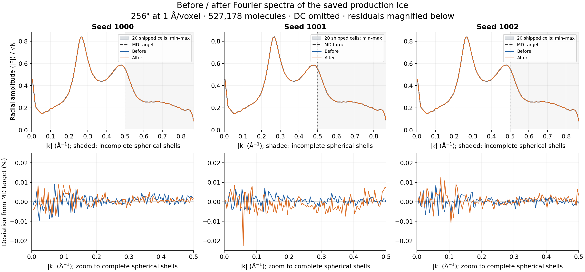
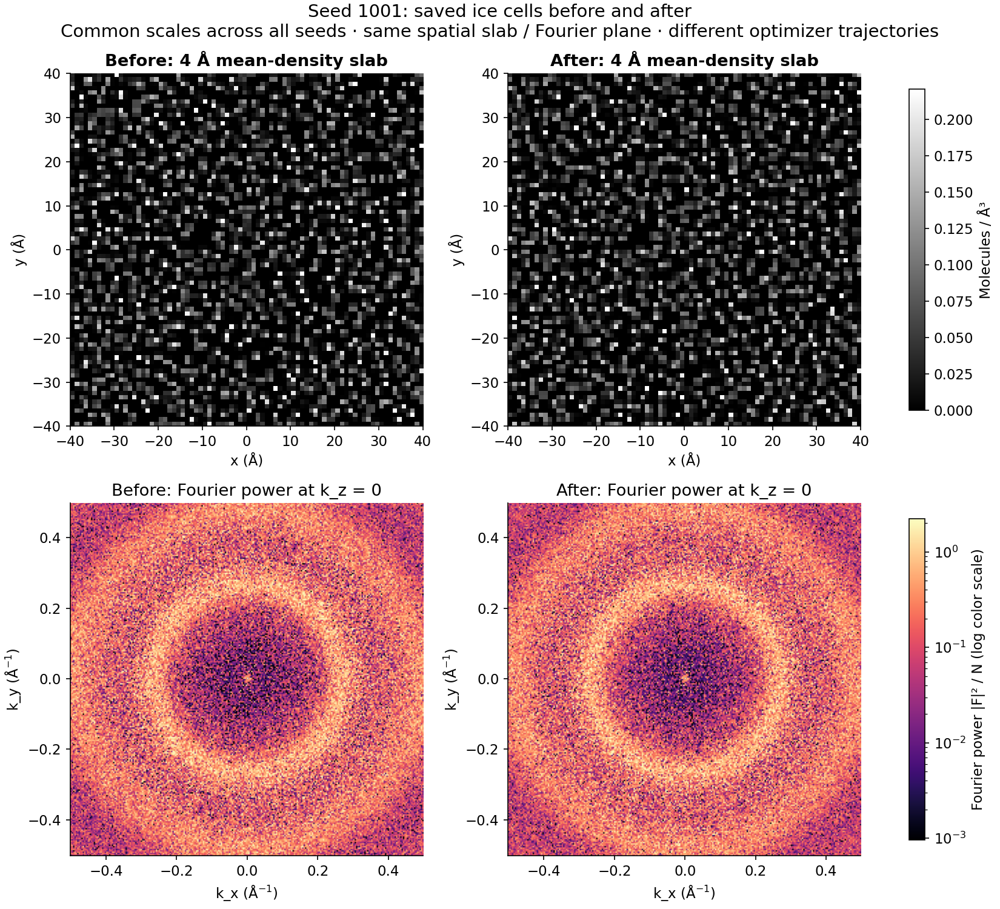
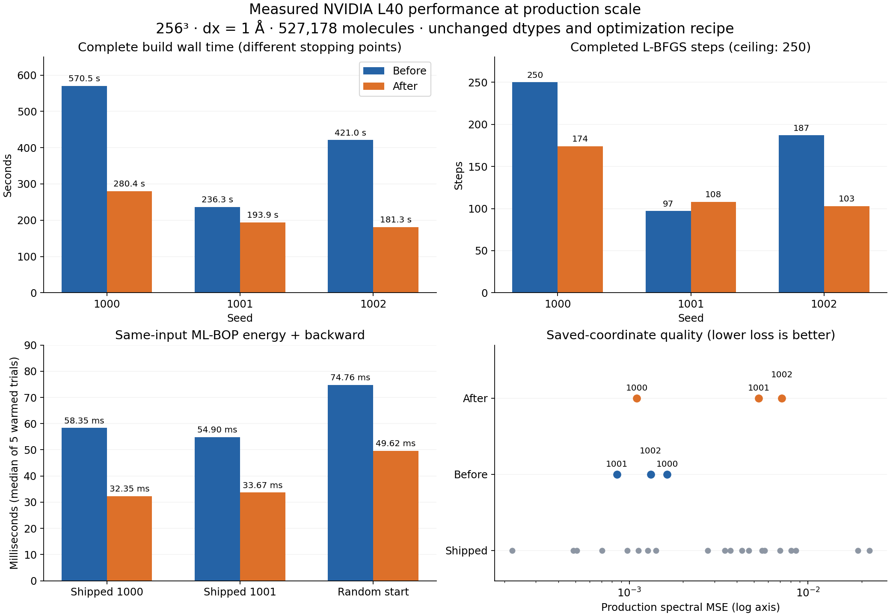

# Using the ice cache

For the underlying physics, see [Ice structure](../concepts/ice.md).

`GradientSKIcemaker` generates amorphous ice by optimising water positions
against the structure factor $S(k)$ and ML-BOP energy of real low-density
amorphous ice. That optimisation costs several minutes for a
production-scale cell (see [Cost](#cost)), far too much to repeat per
simulation. `IceBank` therefore separates the two: it optimises and stores
each configuration once, and a simulation draws a randomly rotated,
randomly translated crop from one of them in single-digit milliseconds.

SPECTER ships such a library inside the package, at
`specter/ice_data/ice_cache`: 20 independent
configurations, each a 256 Å periodic cell sampled at 1 Å/voxel. Every
simulation uses it by default, and most users never need another one.

## When to generate your own

A cached configuration is a set of continuous coordinates in Å, not a
voxel grid, and `IceBank` builds the voxelization kernel for whatever `dx` a
request asks for. So the voxel size is *not* fixed by the cache: the bundled
library serves requests at 0.5, 1.0 or 2.0 Å/voxel alike. Two things do
constrain it:

- **Physical cell size.** A request larger than the 256 Å cell in any
  dimension cannot be served by one crop, so `IceBank` draws several,
  places them side by side, and relaxes the seams between them. That path is
  correct, but a cell large enough to serve the request outright is cheaper
  and seam-free.
- **The $S(k)$ target's frequency range.** `GradientSKIcemaker` optimises a
  configuration against a target on a k-grid set by its own `n` and `dx`,
  so its structure is constrained only up to the Nyquist frequency of that
  sampling: 0.5 Å$^{-1}$ for the bundled `dx = 1.0`. Voxelizing it more
  finely than that will run, but the structure it reports above 0.5
  Å$^{-1}$ was never constrained by the optimisation. Generate at the `dx`
  you intend to simulate at if the fine structure matters to your result;
  [Cost of a finer voxel size](#cost-of-a-finer-voxel-size) is what that
  costs.

A third reason is wanting more independent configurations than the
20 bundled ones, for a large dataset where crop reuse would otherwise become
visible.

## Generating a library

```bash
specter build ice --n_configs 8 --n 256 --dx 1.0 --device 0,1,2,3
```

This writes `config_000.pt` … `config_007.pt` plus a `manifest.json` into
`ice`. Point a simulation at the result with `ice_cache_dir`:

```toml
[ice]
ice_model = "gd"
ice_cache_dir = "ice"
```

Defaults come from `configs/ice.toml`, and every flag overrides one field of
it. The [command reference](../api/cli/build.md#specter-build-ice) lists them all.

## Cost

### Filtering inactive ML-BOP neighbours

ML-BOP evaluates only neighbours whose cutoff weight is positive. The Verlet
cache retains its extra 1 Å skin, so a neighbour can become active again without
a new search, but each evaluation filters skin-only pairs **before** enumerating
three-body triplets. This saves work without changing the physical cutoff,
optimisation recipe, float64 positions, float32 kernels or fixed-point storage.

GPU validation on NVIDIA L40 cards with PyTorch 2.5.1+cu121 used the geometry and
250-step ceiling from `configs/ice.toml`: 256³ voxels, `dx = 1.0`, 527,178 beads,
and the normal plateau stopping rule. Three complete builds compared the old
enumeration with the filtered enumeration (four CPU threads per process):

| seed | seconds, old → filtered | steps, old → filtered | peak allocated GiB, old → filtered | saved $S(k)$ loss, old → filtered |
|-----:|------------------------:|----------------------:|----------------------------------:|----------------------------------:|
| 1000 | 570.5 → 280.4 | 250 → 174 | 6.01 → 4.76 | 0.00163 → 0.00110 |
| 1001 | 236.3 → 193.9 | 97 → 108 | 7.37 → 4.76 | 0.000853 → 0.00532 |
| 1002 | 421.0 → 181.3 | 187 → 103 | 6.01 → 4.77 | 0.00132 → 0.00714 |

Peak **reserved** memory across these builds fell from 10.14 to 5.70 GiB.
Whole-build speedups were 1.22–2.32x, including different stopping iterations.
To isolate kernel cost, five warmed, synchronized energy-and-backward trials
on each of two bundled cells and a full-size random start measured 1.51–1.80x
speedup and 1.06–1.26 GiB less peak allocated memory. Relative energy differences
were at most $2.3\times10^{-7}$ and gradient L2 differences $1.2\times10^{-8}$.

There is no reduction in numerical dtype precision, but CUDA accumulation and
floating-point reduction changes can alter the L-BFGS trajectory and stopping
point. The filtered builds' median saved-coordinate loss was 0.00532, versus
0.00132 for the fresh controls. Recomputing all 20 shipped cells gave a median
of 0.00356 and range 0.000222–0.0221; all three filtered builds fell within that
range. Their energies, −0.232, −0.222 and −0.202 eV/atom, also fell within the
shipped −0.270 to −0.193 range. These runs demonstrate comparable quality to the
shipped library, with a higher median error than the fresh controls; they do
not establish identical results for individual seeds.

The following figures use the saved coordinates from those six builds.
Blue is the original enumeration, orange is the filtered enumeration, and
the grey envelope contains the radial spectra of all 20 shipped cells.



The lower panels magnify the amplitude residual below 0.5 Å⁻¹, where the
spherical frequency shells are complete. Across the filtered cells, the
largest target-relative amplitude deviation in that range is 0.0224%.
About 98–99.6% of their squared radial residual is in the incomplete shells
above 0.5 Å⁻¹, including the sparsely populated corner bins. This describes
the existing production loss; the loss still includes every bin.



The upper images show the same central 4 Å water-density slab; the lower
images show the central plane of the full 3D Fourier power spectrum.
Display scales match across all seeds. Different optimizer trajectories
produce different molecular arrangements, despite closely matching radial
spectral shapes.



Download the [six-page figure comparison](../assets/ice-active-pairs/ice_comparison.pdf),
[build timings](../assets/ice-active-pairs/timings.csv),
[radial spectra](../assets/ice-active-pairs/spectra.csv), or
[measurement notes](../assets/ice-active-pairs/README.md).
Render all figures from the committed measurements on CPU with
`uv run python docs-figures/ice_active_pairs.py`. Its `--recompute` option
recomputes spectra from the original saved validation cells on a GPU.

A fourth cell exercised the implemented code through the actual CLI:

```bash
specter build ice --config configs/ice.toml --n_configs 1 --seed_start 1003 --device cuda:1 --output_dir ice-validation
```

It completed in 143.5 seconds (77 steps), with 4.78 GiB allocated / 5.46 GiB
reserved, saved-coordinate loss 0.01026 and energy −0.1953 eV/atom, also within
the shipped ranges. It wrote 527,178 fixed-point coordinates and the manifest.

### Scaling with cell size

The scaling tables below were measured before filtering skin-only pairs.
Use the comparison above for current default-size costs, and rerun
`docs-figures/ice_cache_timing.py` to budget another geometry or GPU.

Generating a configuration is expensive, and how expensive depends steeply on
the cell size. Each row below is three complete configurations on one NVIDIA
L40 at `dx = 1.0`, one per seed, reporting the mean wall time and the range
across them (`docs-figures/ice_cache_timing.py --sweep cell`):

| `--n` | cell | water beads | steps | wall time | range | **peak reserved** |
|------:|-----:|------------:|------:|----------:|------:|------------------:|
| 64  | 64 Å  | 8,237   | 196 | 1m 19s | 1m 17s – 1m 21s | 0.15 GiB |
| 96  | 96 Å  | 27,800  | 212 | 1m 13s | 1m 07s – 1m 26s | 0.39 GiB |
| 128 | 128 Å | 65,897  | 210 | 1m 26s | 1m 23s – 1m 32s | 0.91 GiB |
| 192 | 192 Å | 222,403 | 206 | 2m 44s | 2m 16s – 3m 09s | 3.16 GiB |
| 256 | 256 Å | 527,178 | 180 | 6m 43s | 6m 16s – 7m 04s | **7.54 GiB** |

**Size a GPU against the reserved column.** Reserved is what the process
holds from the driver and what a new allocation fails against, and the figure
quoted is the worst of the three repeats rather than their mean. Bead count
grows as $n^3$, and the ML-BOP three-body term over those beads grows with
the number of neighbour triplets, so both time and memory rise steeply with
cell size.

**Budget the mean, expect the range.** A run stops when its loss plateaus, so
how many steps it takes is part of what it costs, and that depends on the
random initialisation. The three repeats above understate the spread if
anything: the 20-configuration bundled library, all at `n = 256`, took
between 75 and 250 steps and between 3m 08s and 9m 33s per configuration,
averaging 6m 04s. Its `manifest.json` records every configuration's step
count, wall time, S(k) loss and ML-BOP energy.

The two sweeps on this page share the `n = 256`, `dx = 1.0` geometry, which
makes them a check on each other: 6m 43s against 6m 46s mean, and 7.54
against 7.53 GiB reserved.

Absolute times are hardware-specific; re-run the script above rather than
trusting these numbers on different silicon. The scaling with `n` is the part
that transfers.

### Cost of a finer voxel size

`--dx` sets the grid the $S(k)$ loss is evaluated on, and every loss
evaluation transforms that whole grid. Holding `--n` at 256 and varying `--dx`
therefore changes the physical cell, and with it the bead count, while the
transform stays the same size
(`docs-figures/ice_cache_timing.py --sweep dx`):

| `--dx` | cell | water beads | steps | wall time | range | **peak reserved** |
|-------:|-----:|------------:|------:|----------:|------:|------------------:|
| 0.25 Å | 64 Å  | 8,237   | 250 | 2m 44s | 2m 39s – 2m 55s | 1.13 GiB |
| 0.50 Å | 128 Å | 65,897  | 224 | 2m 33s | 2m 19s – 2m 54s | 1.57 GiB |
| 1.00 Å | 256 Å | 527,178 | 181 | 6m 46s | 5m 23s – 9m 18s | 7.53 GiB |

The first two rows cost about the same despite an eightfold difference in
bead count: at `n = 256` the grid transform dominates, and the beads are not
what a step is spent on until there are enough of them. Only the 1.0 Å row,
with 64x the beads of the first, is bead-bound. The 0.25 Å row is also the
one geometry here that never plateaus — all three repeats used the whole
250-step budget, because a 0.25 Å grid constrains $S(k)$ out to 2 Å$^{-1}$
and there is still structure to improve at the ceiling.

What the finer grid costs is visible by reading the two tables against each
other, at matched cell size and bead count. A 64 Å cell of 8,237 beads takes
1m 19s to generate on a 64³ grid and 2m 44s on a 256³ one; a 128 Å cell of
65,897 beads takes 1m 26s against 2m 33s. So generating at a finer `dx` than
the cell needs roughly doubles the wall time at these sizes, and raises
memory in proportion to the grid, rather than scaling with the voxel count
outright.

A cell small enough to be cheap at 0.25 Å is also too small to serve a
request without tiling, which is the trade to weigh: the 64 Å cell in the
first row is a quarter of the bundled library's 256 Å in each dimension.
Reaching 256 Å at `dx = 0.25` means `--n 1024`, a 64x larger transform than
any row here.

### Managing the cost

Three properties of the command exist to make a multi-hour run practical:

- **Configurations shard across devices.** `--device 0,1,2,3` runs one worker
  process per GPU, each taking a disjoint slice, so four GPUs finish a library
  roughly four times faster. `--device auto` uses every visible GPU. Size the
  pool against the measured reserved peak with room for variation: one
  configuration per GPU at a time, on **each** device in the pool.
- **Runs resume.** A configuration whose file already exists is skipped, so
  re-running the same command after an interruption generates only what is
  missing. Pass `--overwrite True` to regenerate regardless.
- **Libraries extend.** Each configuration is named after the seed that
  produced it, so `--seed_start 8 --n_configs 8` adds eight new
  configurations to an existing library rather than overwriting the first
  eight.

Every configuration records its own `wall_time` and `n_steps_actual`, both
collected into `manifest.json`, so what a finished library actually cost
stays recoverable without re-measuring it.

The output directory is never the bundled `specter/ice_data/ice_cache`, which
ships with the package and must not be modified.

## Checking what was generated

Each configuration records the $S(k)$ loss and ML-BOP energy per atom it
reached, and `manifest.json` collects them for the whole library. Both are
measurements rather than pass/fail criteria, and neither has a threshold
that can be quoted in isolation:

- SPECTER measures the $S(k)$ loss on the coordinates **as they will be read
  back**, so it includes the cost of storing them (see
  [Coordinate storage](#coordinate-storage)) and is a property of the file
  rather than of convergence alone. At $n = 256$, $dx = 1.0$ the bundled
  library spans $2\times10^{-4}$ to $0.02$, median $4\times10^{-3}$.
- The ML-BOP energy per atom is a structural diagnostic, not a distance
  from the $-0.413$ eV/atom figure in each configuration's `recipe`: that
  value is one weighted term in the combined loss, and the optimisation
  isn't expected to reach it. Bundled configurations settle between
  $-0.19$ and $-0.27$ eV/atom, median $-0.23$.

`stopped_early` is directly interpretable: it says whether the
loss plateaued within the step budget or the budget ran out first, and so
is the spread of $S(k)$ loss across a library, which the command prints
when it finishes. An outlier against its own library is meaningful; an
absolute cutoff is not.

### Coordinate storage

Every configuration wraps its atoms into $[-L/2, L/2)$ for a cell of side
$L$, so SPECTER bounds coordinates and stores them as **signed 16-bit
fixed-point indices onto a uniform grid** across that interval, two bytes
per coordinate, giving $L / 65534$ resolution everywhere (0.0039 Å at
$L = 256$ Å).

This replaced raw `float16`, which spends 5 of its 16 bits on an exponent
covering a dynamic range these values never use, and gives *relative*
precision to an absolute quantity: its spacing between representable values
grows with distance from the origin, reaching 0.0625 Å across the outer
octave of a 256 Å cell. Since volume grows as $r^3$, half of all coordinates
sit in that octave. Measured on one converged 256 Å configuration:

| stored as | coordinate RMS error | $S(k)$ loss | rendered potential, rel. RMS |
|---|---|---|---|
| float32 (never written) | — | 1.2e-4 | — |
| float16 (previous encoding) | 0.0137 Å | 0.456 | 3.7% |
| fixed-point (current) | 0.0011 Å | 0.0016 | 0.3% |

The rendered difference is well below shot noise at any realistic dose: the
float16 encoding perturbs the projected phase by 2.9 mrad against a
158 mrad noise floor at 40 e⁻/Ų. This was never a visible image-quality
problem. Rather, raw `float16` discarded most of the $S(k)$ fidelity each
configuration spends minutes earning, in the one quantity the generator
exists to reproduce, at no saving in file size.

`IceBank` reads both encodings, keyed on a `coord_encoding` field, so a
library written before this change keeps loading. Such configurations cannot
be upgraded in place: SPECTER discards float32 coordinates at write time,
so only regeneration recovers the difference.

The bundled library was last regenerated on 2026-09-02, from the same seeds
under the same recipe, after the optimiser began carrying its positions in
float64 (see [Amorphous ice](../concepts/ice.md#the-optimisation)). Every
earlier library had stalled near $-0.10$ eV/atom at the float32 resolution
of the coordinates; the current one reaches a median of $-0.23$ eV/atom in
a median of 156 steps, 16 of 20 configurations plateauing before the
250-step ceiling, for 2.0 GPU-hours in total. A library is one convergence
level: `manifest.json` records the optimiser settings under `optimizer`,
and configurations generated under different settings should not share a
directory.

`--diagnostics True` also saves energy and $S(k)$ figures for the
whole library, equivalent to calling `IceBank.plot_diagnostics`.

## Limitations

- **Cells are cubic.** `IceBank` stores a single box length per configuration
  and filters candidates against it, so a non-cubic periodic cell has no
  representation. Anisotropic *requests* are fine, since those are crops out
  of a cubic cell.
- **The optimisation recipe is fixed.** The $S(k)$ target, the ML-BOP weight,
  and the $-0.413$ eV/atom energy target are properties of the phase of ice
  being reproduced rather than tuning parameters, so you cannot configure
  them. A library whose members were optimised under different recipes
  would have `IceBank` drawing from several different phases of ice
  interchangeably.
- **One directory per library.** `IceBank` reads a single `cache_dir` and
  treats every `.pt` file in it as a member. To combine generated
  configurations with the bundled ones, copy them into a common directory:
  `IceBank` handles mixed cell sizes correctly (a request is
  only served by a configuration large enough for it).

## References

- Chan, H., Cherukara, M. J., Narayanan, B., Loeffler, T. D., Benmore, C.,
  Gray, S. K., & Sankaranarayanan, S. K. R. S. (2019). Machine learning
  coarse grained models for water. *Nature Communications*, 10, 379.
  <https://doi.org/10.1038/s41467-018-08222-6>
