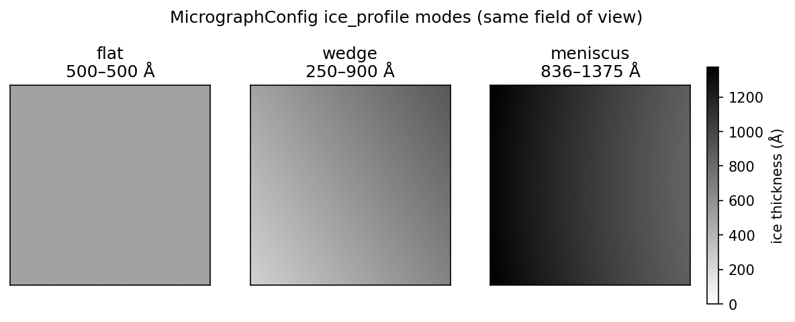

# Generate a micrograph

`specter simulate micrograph` builds a physics-based cryo-EM micrograph:
one or several particles (and, optionally, crowding neighbours) embedded in
amorphous ice, propagated through the forward model and detector at full
micrograph scale, rather than the single-particle boxes `specter simulate
particles` writes. It shares the same forward model as particle-stack
generation; the difference is the field of view and what fills it.

## Basic usage

Every run loads a TOML config first, then applies any flags given on the
command line as overrides:

```bash
specter simulate micrograph --config configs/micrograph.toml
```

```bash
specter simulate micrograph \
    --config configs/micrograph.toml \
    --pdb_source 6bdf \
    --n_micrographs 5 \
    --device cuda:0 \
    --output_dir micrographs
```

`configs/micrograph.toml` is the canonical starting point. Copy it and edit
for your own runs. See [Configure a run](configuration.md) for the full
TOML/CLI field reference.

## What you'll usually tune

- **Structure & Potential**: `pdb_source`, `assembly`, `n_pixels` (the 3D
  particle potential box), `pixel_size`.
- **Field of view**: `micrograph_size`, the output image size in pixels
  (square), independent of `n_pixels`. A single particle's potential is
  built at `n_pixels`, then many copies are placed across a
  `micrograph_size` field via crowding.
- **Microscope**: `voltage`, `dose` (total dose for the whole micrograph,
  not per particle), `cs`, `alpha`.
- **Dataset**: `n_micrographs`, how many independent micrographs to
  generate in one run.
- **Models**: `scattering_model`, `noise_model`, `detector_model`, same
  choices as [particle generation](particle-stack.md#what-youll-usually-tune).

Everything else lives under "Advanced" in both the TOML and
`specter simulate micrograph --help`.

## Ice thickness profiles

Unlike particle-stack generation, where each box is small enough that a
uniform ice slab is a reasonable approximation, a micrograph spans a large
enough field that real ice geometry becomes visible across it. Real
vitrified ice is a meniscus pinned to a foil hole's rim, not a flat slab,
and a micrograph taken off-centre in that hole sees a thickness ramp across
its field. `ice_profile` selects among three shapes:

- **`flat`** (default): a uniform slab, the same behaviour as setting a
  bare `ice_thickness` with no profile.
- **`wedge`**: thickness ramps linearly across the field, from
  `ice_thickness_range`'s low value to its high value, along the direction
  set by `ice_profile_angle`.
- **`meniscus`**: the radial thickness profile of a real foil hole; place
  the field of view anywhere in it via `ice_hole_offset`. Near the
  hole's centre the film is nearly flat; near the rim it thickens sharply.
  A micrograph is a small patch of a much larger hole, so `ice_hole_offset`
  decides whether a given field looks flat, wedged, or strongly curved.

{ width="700" style="display:block;margin:1.2em auto;" }
///caption
Ice thickness profiles for the three `ice_profile` modes over the same field of view: a uniform 500 Å slab (`flat`), a 250-900 Å ramp (`wedge`), and the radial thickness of a 1.2 µm foil hole sampled 4500 Å off-centre (`meniscus`).
///

`ice_tilt` is independent of all three modes: it slopes the ice slab's
mid-plane while leaving thickness unchanged. That's what a tilted specimen
looks like, distinct from a wedge, which only changes thickness on one
side. `ice_tilt` and `ice_profile` compose, so you can express a tilted
meniscus.

Enabling a profile costs you two things:

- **The thickest column sets the box size, everywhere.** `nz` has to
  hold the deepest part of the film, and multislice runs one full-plane FFT
  per slice regardless of what that slice contains, so a 250-900 Å wedge
  costs the same as a uniform 900 Å slab over the whole field, not the
  250-900 Å average.
- **SPECTER measures defocus from the specimen's entry face, and that face
  moves.** Under a profile the box contains vacuum above and below the
  film everywhere except its thickest column, so the two surfaces separate
  from the box boundary. `IceProfile` handles this automatically through
  its `entry_face_shift`, so you don't need to correct for it. But it means
  a nominal `defocus` value doesn't land at the box's geometric centre the
  way it does for a flat slab.

## Chunking and memory

`specimen_chunk_size` limits how many Z-slices of the specimen (ice plus
crowded particles) are generated at once, trading wall time for peak GPU
memory. Lower it if specimen generation runs out of memory before scattering
even starts; leave it unset for a small box or a large GPU. This only
affects specimen construction. `Scattering`'s own multislice chunking
(unrelated, and not a `MicrographConfig` field) handles memory during wave
propagation.

## Single-device only

`specter simulate micrograph` does not accept a comma-separated device list
the way `specter simulate particles`/`specter simulate tiltseries` do.
Each micrograph needs its own freshly regenerated ice and crowding
specimen between forward passes
(`MicrographGenerator.regenerate_specimen`), and a single micrograph at
`micrograph_size` resolution is already the GPU-memory-bound unit of work,
so there is no batch to shard across multiple devices the way many small
particle boxes can be. Generating several micrographs faster means running
separate `specter simulate micrograph` invocations, one per device, by
hand.

## Output

Results land in `output_dir` as `<filename>.mrcs` (an `(n_micrographs, H,
W)` stack) and `<filename>.star` (one row per micrograph: voltage, pixel
size, CTF parameters, dose, coincidence radius). `save_exitwaves` /
`save_clean_exitwaves` additionally write the pre-detector exit wave, the
same as [particle-stack
generation](particle-stack.md#inspecting-the-forward-model-exit-waves).

## Using it from Python instead of the CLI

`run_micrograph(config)` (`specter.pipelines`) is the same function the CLI
calls. Build a `MicrographConfig` directly in Python (or load one with
`specter.config.load_config`) instead of going through the command line.

## See also

- [Generate a particle stack](particle-stack.md): the single-particle-box
  counterpart to this page, sharing the same forward model.
- [Ice structure](../concepts/ice.md): the physics behind `ice_model` and
  the amorphous ice generator.
- [Configure a run](configuration.md): complete TOML/CLI field reference.
- [Manage jobs](jobs.md): recording runs under a project name.
