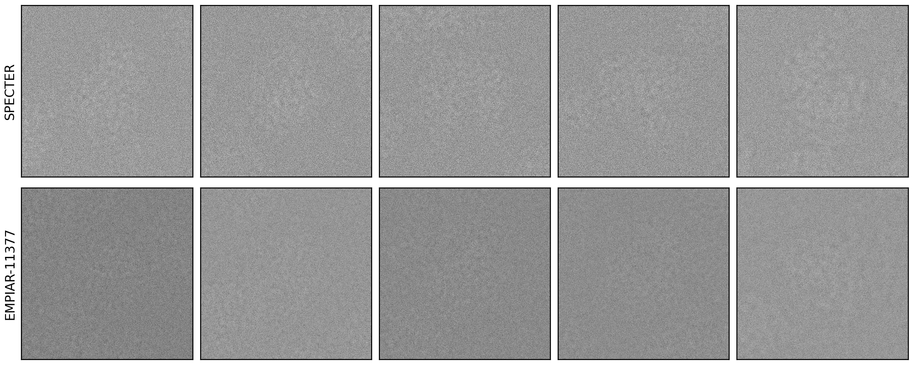
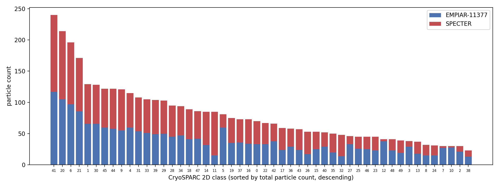

# Generate a particle stack

`specter simulate particles` builds a physics-based cryo-EM particle stack
from a single PDB/mmCIF structure: it samples a scattering potential,
applies pose/CTF/dose sampling, propagates through the forward model
(multislice by default), and writes a `.mrcs` + RELION `.star` file pair.
It's the fastest way to get simulated data out of SPECTER.

## Basic usage

Every run loads a TOML config first, then applies any flags given on the
command line as overrides:

```bash
specter simulate particles --config configs/particle.toml
```

```bash
specter simulate particles \
    --config configs/particle.toml \
    --pdb_code 6bdf \
    --n_particles 200 \
    --device cuda:0 \
    --output_dir specter-data/particles
```

`configs/particle.toml` is the canonical starting point — copy it and edit
for your own runs. See [Configure a run](configuration.md) for the full
TOML/CLI field reference.

## What you'll usually tune

- **Structure & Potential** — `pdb_code` (fetched and cached under
  `specter-data/pdb/`), `assembly` (biological assembly vs. asymmetric unit),
  `num_pixels`/`pixel_size` for the simulation box.
- **Microscope** — `voltage`, `dose`, `cs`, `alpha` (amplitude contrast).
- **Sampling** — `defocus`, `shift` (max in-plane shift), `n_particles`.
- **Models** — `scattering_model` (`multislice` is the accurate default;
  `firstborn`/`projection` trade accuracy for speed), `detector_model`
  (`none` skips detector effects entirely; `k3_300kv`/`k3_200kv`/
  `falcon4i_*` apply a real detector's MTF/noise).
- **Post-processing** — `normalize_particles`, and `save_exitwaves` /
  `save_clean_exitwaves` if you want the pre-detector signal too (see
  below).

Everything else — ice model, crowding, aberration richness, potential
building method, and so on — lives under "Advanced" in both the TOML and
`specter simulate particles --help`, and is documented field-by-field on
[Configure a run](configuration.md).

## Per-particle sampling ranges

`dose`, `defocus`, `coincidence_radius`, `potential_scale`, `astigmatism`,
and `astigmatism_angle` each take either a single value or a `"low,high"`
string, sampled uniformly per particle:

```toml
[sampling]
defocus = "5000,15000"   # Å, sampled per particle
```

```toml
[microscope]
dose = "20"               # e⁻/Ų, constant for every particle
```

This is the main gotcha when hand-editing a config: these fields are
strings, not floats/ints, even for a single fixed value.

## Output: .mrcs + .star

Results land in `output_dir` as `<filename>.mrcs` (the image stack) and
`<filename>.star` (a RELION-format star file with one row per particle):
pose (`rlnAngleRot`/`rlnAngleTilt`/`rlnAnglePsi`, `rlnOrigin{X,Y}Angst`),
CTF (`rlnVoltage`, `rlnSphericalAberration`, `rlnAmplitudeContrast`,
`rlnDefocus{U,V}`, `rlnDefocusAngle`, `rlnPhaseShift`), plus SPECTER-specific
physics parameters not covered by the RELION spec
(`specterDosePerAngstrom`, `specterCoincidenceRadius`,
`specterPotentialScale`). Import the `.star` file directly into RELION, or
read it with [`starfile`](https://github.com/teamtomo/starfile) /
[`mrcfile`](https://github.com/ccpem/mrcfile) from Python.

## Example: matching EMPIAR-11377

As a check against real data, the config below drives
`specter simulate particles` from a real CryoSPARC passthrough `.cs` file
instead of randomly-sampled poses — pixel size, voltage, alpha, pose, and
CTF are read straight from the `.cs` file via `cs_path`, matching a real
experimental dataset particle-for-particle:

```bash
specter simulate particles \
    --pdb_code 8b0x \
    --num_pixels 512 \
    --cs_path docs-figures/data/empiar-11377-passthrough-5particles.cs \
    --n_particles 5 \
    --dose 40 \
    --ice_model gd \
    --coincidence_radius 0.8 \
    --potential_scale 0.5 \
    --detector_model none \
    --device cuda:0
```

`docs-figures/data/empiar-11377-passthrough-5particles.cs` is a 5-row slice
of a real passthrough `.cs` file from
[EMPIAR-11377](https://www.ebi.ac.uk/empiar/EMPIAR-11377/), a translating
70S ribosome dataset (PDB [8b0x](https://www.rcsb.org/structure/8B0X)) —
committed to the repo so this exact command is reproducible without access
to the original dataset. Running it and comparing the output against the 5
matching real particle images
(`docs-figures/data/empiar-11377-real-5particles.mrcs`) gives:

{ width="900" style="display:block;margin:1.2em auto;" }

That's a qualitative check on 5 particles. The stronger, quantitative check
comes from CryoSPARC itself: 2000 real EMPIAR-11377 particles and 2000
SPECTER particles (same `pdb_code`/physics parameters, generated in bulk
offline) were pooled into one stack and run through a single CryoSPARC 2D
Classification job. If the simulated particles are physically realistic,
CryoSPARC should sort them into the same classes as the real particles
they're mixed with, in roughly the same proportion per class — which is
what happens across nearly all 50 classes:

{ width="900" style="display:block;margin:1.2em auto;" }

This second figure isn't reproducible from the repo alone — it requires
actually running CryoSPARC — but the per-particle class assignments behind
it are committed as
`docs-figures/data/empiar-11377-mixed-2dclasses.csv`. Both figures are
regenerated by
[`docs-figures/particle_stack_empiar_11377.py`](https://github.com/joelyeois/specter/blob/main/docs-figures/particle_stack_empiar_11377.py).
For the full 2000-particle `.cs`-driven workflow (not just the 5-row
demo slice), see [Generate a CryoSPARC dataset twin](dataset-twin.md).

## Inspecting the forward model (exit waves)

Set `save_exitwaves = true` (post-detector-free signal) or
`save_clean_exitwaves = true` (noiseless) to also write
`<filename>_exitwave.mrcs` / `<filename>_clean_exitwave.mrcs` alongside the
usual output — useful for debugging the forward model or comparing signal
before detector effects are applied, without re-running the whole pipeline.

## Multi-GPU

`device` accepts a comma-separated list of GPU indices (e.g. `"0,1,2,3"`) to
split particle generation across multiple GPUs via Lightning's DDP
launcher; a single index (`"cuda:0"`) or `"cpu"` runs on one device.

## Using it from Python instead of the CLI

`run_particle_stack(config)` (`specter.pipelines`) is the same function the
CLI calls — build a `ParticleStackConfig` directly in Python (or load one
with `specter.config.load_config`) instead of going through the command
line. For composing the forward model's individual modules by hand (e.g. to
swap in a custom aberration model), see
[`demo-notebooks/create_particle_stack_modular/`](https://github.com/joelyeois/specter/tree/main/demo-notebooks/create_particle_stack_modular).
For the plain end-to-end notebook version of this page, see
[`demo-notebooks/create_particle_stack/`](https://github.com/joelyeois/specter/tree/main/demo-notebooks/create_particle_stack).

## See also

- [Generate a CryoSPARC dataset twin](dataset-twin.md) — the full
  `.cs`-driven workflow this page's example is a slice of.
- [Using the ice cache](ice-cache.md) — `ice_model` options and `IceBank`.
- [Configure a run](configuration.md) — complete TOML/CLI field reference.
- [Manage jobs](jobs.md) — recording runs under a project name.
- [Pipeline overview](../concepts/pipeline-overview.md) — how this fits
  into the rest of the forward model.
