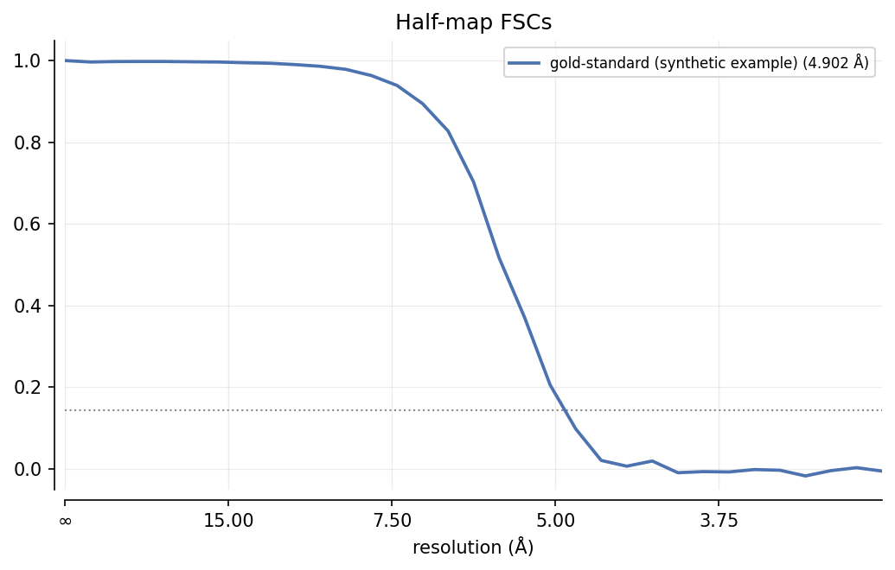

# Reconstruct a volume

Ghostbuster is the inverse of the forward simulator: it refines a 3D
scattering potential (and, optionally, per-particle rotations, translations,
and defocus) so that the same forward model `specter simulate particles`
uses reproduces a stack of experimental images. The forward pipeline goes
coordinates &rarr; images; `specter reconstruct particle` goes the other
way, images &rarr; volume. See [Pipeline overview](../concepts/pipeline-overview.md)
and [Forward simulation](../concepts/forward-simulation.md) for the model it
fits against.

`specter reconstruct particle` is also reachable as `specter ghostbuster
particle`: the two names run the same command, so it answers to whichever
one you or the docs use.

This covers single-particle reconstruction. Cryo-ET tilt-series
reconstruction (`TomogramGhostbuster`/`TomogramReconstructor`) exists in the
Python API and mirrors the same `run`/`test_run` pattern, but is not yet
wired into the CLI as `specter reconstruct tomogram`.

## Basic usage

Every run loads a TOML config first, then applies any flags you pass on the
command line as overrides:

```bash
specter reconstruct particle --config configs/reconstruct.toml
```

`configs/reconstruct.toml` has no runnable default: unlike the simulator
configs, its `[data]` section must name a real CryoSPARC dataset. Copy it
and fill in the two paths reconstruction reads from:

```toml
[data]
cs_file = "path/to/particles.cs"
mrc_file = "path/to/particles.mrcs"
dose_per_angstrom = 40.0
```

`cs_file` supplies poses, CTF parameters, and per-particle scale; `mrc_file`
is the particle stack it indexes into. `dose_per_angstrom` sets the Poisson
statistics that weight the loss, so match it to the dataset's real fluence,
not a placeholder. Reconstruction currently reads CryoSPARC `.cs` only:
there is no RELION `.star` equivalent yet, unlike the [CryoSPARC dataset
twin](dataset-twin.md) path on the forward side (see [Generate a particle
stack](particle-stack.md#example-matching-empiar-11377) for a worked
`.cs`-driven example).

Before committing to a full run, exercise every code path on a fraction of
the cost:

```bash
specter reconstruct particle --config configs/reconstruct.toml --test_run
```

`--test_run` fits one epoch on `--bin_factor`-binned images (default 8) and
stops. It touches every `.cs` field, every physics setting, and the output
layout a full run would, so a config mistake surfaces in seconds instead of
after a multi-hour job. The
[command reference](../api/cli/reconstruct.md#specter-reconstruct-particle) documents
every field.

## The gold-standard workflow

`--halfset gold` is the default, not `--halfset all`. A bare `specter
reconstruct particle` run splits the particle stack into two halves, A and
B, reconstructs each independently, and computes the FSC between the two
resulting half-maps. This is the same independent-validation idea CryoSPARC
and RELION use to report resolution without a model bias. `--halfset all`
reconstructs every particle into a single volume, ignoring the split;
`--halfset A` or `--halfset B` reconstructs one half alone, useful for a
quick look at a single volume before committing to a paired run.

The two halves run as separate worker processes: in parallel across
devices when `--device` names at least two, sequentially on one device
otherwise. Only the first two devices are ever used, since there are only
two halves to run.

### Sharing a reference between halves

`--fsc_ref` and `--cryosparc_ref` log a map-to-model FSC against a known
reference on every epoch, for reporting only. The reconstruction never
optimises against it. `--cryosparc_ref` accepts a comma-separated
`"<A>,<B>"` pair as well as a single path. The pair matters for a
gold-standard run: it reconstructs both halves from one config, so without
the pair both halves would be plotted against the same CryoSPARC half-map,
silently mislabelling one of the two overlays. A single path works for
`--halfset A`/`B`/`all`, where you compare only one half (or the whole
stack).

### Outputs

A gold-standard run writes, into its job directory:

- `volume_A.mrc` / `volume_B.mrc`: the two half-map reconstructions.
- `epochs/<NNN>_A.mrc` / `epochs/<NNN>_B.mrc`: per-epoch snapshots of each
  half.
- `fsc_gold_standard.png`: the final half-map FSC, written once both
  halves finish.
- `epochs/fsc_halfmap_<NNN>.png`: the half-map FSC recomputed after
  *every* epoch, not only at the end. Whichever worker finishes an epoch
  second finds its sibling's volume already on disk and computes the pair;
  the one that finishes first has nothing to compare against yet and skips.
- `epochs/fsc_<NNN>_A.png` / `epochs/fsc_<NNN>_B.png`: per-epoch
  map-to-model FSC against `--fsc_ref`, if you passed one.

{ width="620" style="display:block;margin:1.2em auto;" }
///caption
A gold-standard half-map FSC curve, drawn from a synthetic band-limited pair for illustration, not a real reconstruction.
///

Reconstruction records four resolution numbers per epoch in `job.json`:
map-to-model and half-map, each masked and unmasked. Map-to-model needs
`--fsc_ref` to exist at all; the masked entries additionally need
`--fsc_mask`, and skip if a `--test_run`'s binning leaves the mask's shape
mismatched against the volume. Each of the four degrades independently
rather than failing the run: a config with no reference map has no
map-to-model entries; it doesn't crash the run. The masked
numbers come from a separate computation, not read off the figures: the
plotting helpers always report the *unmasked* crossing even when the curve
they draw is masked.

### Reconstructing halves separately

The two halves don't have to run in the same process invocation. Passing
the same `--job_id` across two separate calls, `--halfset A` first, then
`--halfset B`, reconstructs them independently into the same job
directory. This is useful for running each half on a different machine or
at a different time:

```bash
specter reconstruct particle --config configs/reconstruct.toml \
    --halfset A --job_id J004
specter reconstruct particle --config configs/reconstruct.toml \
    --halfset B --job_id J004
```

The second call's `job.json` update folds in what the first call already
recorded rather than overwriting it, so `results` ends up with the same
shape (`{"A": ..., "B": ..., "epochs": [...]}`) it would have from a single
`--halfset gold` run.

## Job tracking

`specter jobs` tracks every reconstruction run the same way it tracks
every other `specter` pipeline. See [Manage jobs](jobs.md) for the
directory layout, `job.json` contents, and the `specter jobs`
list/show/diff CLI. `--project` and `--job_id` behave as documented there.

## Compute

`--device` accepts `cpu`, `cuda`, `cuda:N`, a bare GPU index, or a
comma-separated list (`0,1`), which trains across them via Lightning DDP,
all-reducing gradients every step. For a gold-standard run, a
comma-separated list instead splits the two halves across devices (see
above) rather than sharding one half's batches across them. `--precision`
controls Lightning's training precision (`16-mixed` by default, forced to
`32` on CPU); `--num_workers` sets dataloader worker processes.

## Symmetry

`--symmetry` enforces a point-group symmetry (e.g. `C3`, `D7`, `I1`) on the
volume every epoch, in real space or Fourier space, selected via
`--symmetry_mode`. `--symmetry_batchsize` lowers memory use when symmetry
expansion is the bottleneck. Omit `--symmetry` for C1 (no symmetry).

## Limitations

Pose, translation, and defocus refinement (`--lr_R`/`--lr_T`/`--lr_D`) are
wired in but **unverified**: no test currently checks recovered rotations,
translations, or defocus against ground truth. Treat a run with any of
these set as an experiment, not a validated result, until that
verification lands.
